# 그래픽스/물리엔진 개발자를 위한 수학·물리 핸드북 개정판

> **목표:** 수학 공식을 외우는 책이 아니라, 그래픽스와 물리엔진 개발에서 “왜 이 공식이 나오는지” 감으로 이해하고 다시 꺼내 볼 수 있는 책.

이 핸드북은 기존의 삼각함수·회전·행렬 내용을 바탕으로, 개발할 때 자주 헷갈리는 **벡터, 내적, 외적, 투영, 반사, 속도/속력/가속도, 힘, 충돌**까지 하나의 흐름으로 다시 구성했습니다.


## 그림 읽는 법

이 책의 그림은 대부분 ASCII 그림입니다. 정확한 미술 그림이 아니라 **방향과 관계를 빠르게 기억하기 위한 약도**라고 생각하면 됩니다.

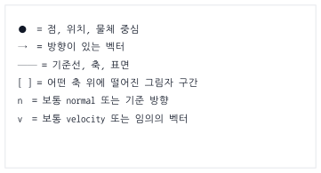


특히 주의할 점은 이겁니다.

```txt
점 position은 “어디에 있나?”를 나타낸다.
벡터 vector는 “어느 방향으로 얼마나 가나?”를 나타낸다.
```

예를 들어 `mouse - player`는 점 하나가 아니라, **player에서 mouse로 향하는 화살표**입니다.

---

# 0. 이 책의 전체 지도

개발에서 수학과 물리는 따로 떨어져 있지 않습니다.

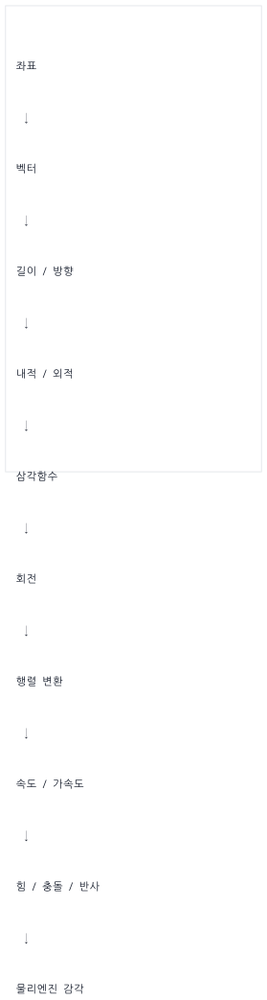


 가장 중요한 큰 흐름은 이겁니다.

```txt
모양은 로컬 좌표로 만들고,
행렬로 월드에 배치하고,
속도와 힘으로 움직이고,
충돌하면 법선 방향으로 반응한다.
```

이 문장 하나가 그래픽스와 물리엔진의 큰 뼈대입니다.

## 0.1 독자별 추천 학습 경로

이 책은 모든 절을 한 번에 읽는 교과서라기보다, 공통 기초에서 출발해 목적에 맞는 길을 고르는 핸드북입니다. 처음 읽을 때는 아래 순서를 권장합니다.

```txt
공통 기초       좌표·벡터 → 내적·외적 → 삼각함수 → 행렬 → 미분·적분
그래픽스        변환 → 보간·쿼터니언 → 렌더링 파이프라인 → 현대 렌더링 → 3D 기하
애니메이션      변환 계층 → 쿼터니언 → 스켈레탈 애니메이션과 IK
물리엔진        힘·적분 → 충돌 판정 → 임펄스 → 회전 역학 → 3D 제약 풀이
게임플레이      이동 레시피 → 곡선·Steering → 길 찾기·난수
엔진 통합       자원·Asset·Job System → 완성 프로젝트 → 자동 검증
```

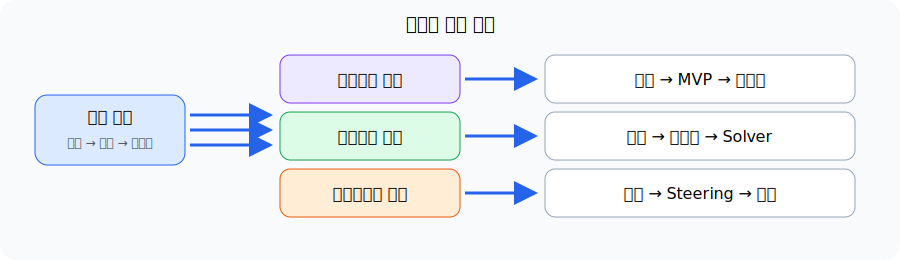

각 심화 절은 앞 절의 용어를 사용합니다. 모르는 함수나 기호가 나오면 해당 절을 억지로 끝내기보다 위 경로의 앞 단계로 돌아가 확인하세요. PBR은 131절, GJK/EPA는 163~164절에서 구현에 필요한 골격까지 다루며, 상용 수준의 모든 확장은 각 절의 후속 학습 항목으로 남겨 둡니다.

## 0.2 실무 수학·물리 용어 대조표 (Glossary)

이 책을 보기 전에 수학, 물리, 그리고 실제 개발 코드에서 사용하는 용어들이 매치되지 않아 헷갈리는 경우가 많습니다. 아래 대조표를 참고하면 개념이 더욱 뚜렷해집니다.

| 수학적 용어 | 물리학적 용어 | 코드 표기 (JS / GLSL) | 실무적 비유 및 의미 |
| --- | --- | --- | --- |
| **스칼라 (Scalar)** | 시간, 질량 ($m$), 계수 | `number` / `float` | 방향이 없고 크기만 있는 일반 수치 |
| **벡터 (Vector)** | 변위, 속도, 가속도 | `{x, y}` / `vec2`, `vec3` | 방향과 크기를 모두 가진 화살표 |
| **정규화 (Normalize)** | 단위 방향 벡터 | `normalize(v)` | 화살표의 길이를 1로 만들고 방향만 남기기 |
| **내적 (Dot Product)** | 일 (Work), 투영량 | `dot(a, b)` | 두 화살표의 방향 일치율 (그림자 겹침 길이) |
| **외적 (Cross Product)** | 토크 (Torque), 면 법선 | `cross(a, b)` | 두 화살표에 수직인 축 (2D에서는 좌/우 판정) |
| **행렬 (Matrix)** | 선형 변환 공간 | `Float32Array` / `mat4` | 로컬 좌표를 월드/화면으로 옮기는 차원이동 묶음 |
| **미분 (Differentiation)** | 순간 변화율 | `(pos - prevPos) / dt` | 한 프레임($dt$) 동안 변화한 속도/기울기 계산 |
| **적분 (Integration)** | 상태 누적 | `pos += vel * dt` | 프레임마다 미세한 속도/가속도 변화량을 누적하기 |

---

# Part 1. 좌표와 벡터

## 1. 좌표는 “위치”다

좌표는 점의 위치입니다.

```txt
p = (x, y)
```

예를 들어 화면에서 캐릭터가 `(300, 200)`에 있다면:

```js
const player = {
  x: 300,
  y: 200
};
```

이건 “플레이어가 어디에 있는가?”를 나타냅니다.

## 2. 수학 좌표계와 화면 좌표계

수학에서는 보통 y가 위로 갈수록 커집니다.

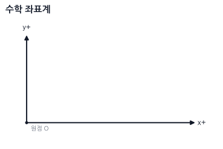


하지만 브라우저 Canvas, DOM, 많은 2D 게임 화면은 y가 아래로 갈수록 커집니다.

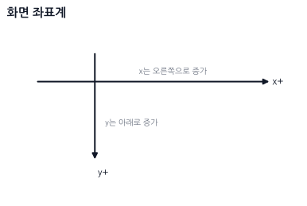


그래서 수학책에서 말하는 “반시계 방향 회전”이 화면에서는 반대로 느껴질 수 있습니다.

> **기억 문장:** 화면 좌표계에서는 y가 아래로 자라서, 회전 방향이 수학책과 다르게 보일 수 있다.

---

## 3. 벡터는 “이동량” 또는 “방향+크기”다

점이 위치라면, 벡터는 이동량입니다.

```txt
위치: 어디에 있는가?
벡터: 어디로 얼마나 가는가?
```

예:

```js
const position = { x: 300, y: 200 };
const velocity = { x: 50, y: 0 };
```

`velocity = { x: 50, y: 0 }`은 오른쪽으로 초당 50만큼 움직인다는 뜻입니다.

```txt
position ●────────→ velocity
```

## 4. 두 점 사이의 방향 벡터

플레이어에서 마우스를 향하는 방향을 알고 싶으면, **도착점인 마우스 위치에서 시작점인 플레이어 위치를 뺍니다.**

```txt
방향 벡터 = 도착점 - 시작점
```

코드로 쓰면 이렇게 됩니다.

```js
const dx = mouse.x - player.x;
const dy = mouse.y - player.y;

const toMouse = { x: dx, y: dy };
```

그림으로 보면 `toMouse`는 점이 아니라 **플레이어에서 마우스로 향하는 화살표**입니다.

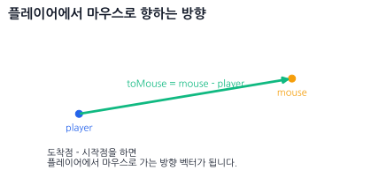


`dx`, `dy`의 부호를 보면 마우스가 어느 쪽에 있는지도 알 수 있습니다.

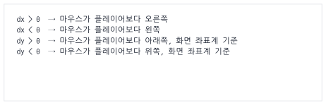


> **기억 문장:** `목표 - 현재 = 현재에서 목표로 가는 벡터`

---

## 5. 벡터의 길이

벡터의 길이는 피타고라스 정리입니다.

```txt
length = sqrt(x² + y²)
```

코드:

```js
function length(v) {
  return Math.sqrt(v.x * v.x + v.y * v.y);
}
```

예:

```js
length({ x: 3, y: 4 }); // 5
```

그림:

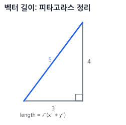

## 6. 거리 계산

두 점 사이의 거리는 `도착점 - 시작점`으로 만든 벡터의 길이입니다.

```js
function distance(a, b) {
  const dx = b.x - a.x;
  const dy = b.y - a.y;
  return Math.sqrt(dx * dx + dy * dy);
}
```

게임 예:

```js
if (distance(player, enemy) < 100) {
  console.log("적이 가까움");
}
```

---

## 7. 정규화: 방향만 남기기

벡터에는 방향과 크기가 같이 들어 있습니다.

```txt
velocity = 방향 + 속력
```

정규화는 벡터의 길이를 1로 만들어서 **방향만 남기는 것**입니다. 이렇게 길이가 1이 된 벡터를 <strong>단위 벡터(Unit Vector)</strong>라고 부릅니다.

```js
function normalize(v, epsilon = 1e-8) {
  const len = Math.sqrt(v.x * v.x + v.y * v.y);

  if (len < epsilon) {
    return { x: 0, y: 0 };
  }

  return {
    x: v.x / len,
    y: v.y / len
  };
}
```

`(0, 0)`에는 방향이 없으므로 정규화할 수 없습니다. 위 함수는 계산을 안전하게 계속하기 위해 영벡터를 반환하지만, 이 결과는 길이가 1인 단위 벡터가 아닙니다. 조준이나 충돌처럼 방향이 반드시 필요한 코드에서는 영벡터가 나온 원인을 별도로 처리해야 합니다.

예:

```js
normalize({ x: 10, y: 0 }); // { x: 1, y: 0 }
normalize({ x: 0, y: 5 });  // { x: 0, y: 1 }
```

> **기억 문장:** 정규화는 “화살표 길이를 1로 맞추는(단위 벡터로 만드는) 것”이다.

### 7.1 실무에서 정규화를 쓰는 구체적인 상황들

개발할 때 "언제 정규화를 해야 하지?" 헷갈린다면 아래의 4가지 대표적인 사례를 기억하세요.

1. **방향 벡터에 일정한 속력/힘을 곱해 새로운 물리량을 만들 때**
   - **예시**: 캐릭터가 걷는 속도, 총알이 날아가는 속도, 넉백 힘 적용 등.
   - **이유**: 도착점까지의 거리에 상관없이 매 프레임 일정한 속도로 이동시키려면, 크기가 1인 순수한 '방향' 벡터에 원하는 '속력(Speed)'을 곱해주어야 합니다.
2. **두 벡터 사이의 순수한 각도 차이를 비교할 때 (내적 연산 전)**
   - **예시**: 적이 내 시야각($45^\circ$) 내에 있는지 판단하기, 조명 계산 등.
   - **이유**: 내적 공식 $A \cdot B = |A||B|\cos\theta$에서 두 벡터의 길이($|A|, |B|$)를 1로 만들어야 내적 결과가 온전히 코사인 값($\cos\theta$)이 되므로 각도 비교가 쉬워집니다.
3. **3D 그래픽스에서 셰이딩(조명) 연산을 수행할 때**
   - **예시**: 표면이 빛을 받는 양을 결정하는 램버트 디퓨즈(Lambertian Diffuse) 계산.
   - **이유**: 표면 수직 벡터($N$)와 빛의 방향 벡터($L$)가 각각 정규화되어 있어야 빛의 세기가 왜곡 없이 $0.0 \sim 1.0$ 사이의 올바른 밝기로 계산됩니다.
4. **투영(Projection)이나 반사(Reflection)를 연산할 때**
   - **예시**: 빗면에 미끄러지는 힘 구하기, 벽이나 바닥에 튕기는 물리 반응.
   - **이유**: 반사 공식 $R = V - 2(V \cdot N)N$ 등에서 기준이 되는 법선 벡터 $N$이 반드시 크기 1인 단위 벡터여야 공식의 배율 왜곡 없이 정확한 튕김 벡터가 도출됩니다.

## 8. 캐릭터가 마우스 방향으로 일정한 속도로 이동하기

> **실무 맥락 (Mental Hook) - 마우스 클릭 이동 속도 폭발 버그:**
> 만약 2D 탑다운 게임에서 마우스로 클릭한 곳으로 캐릭터를 초당 100픽셀의 일정한 속도로 움직이고 싶다고 합시다. 이때 정규화를 거치지 않고 아래와 같이 코드를 짠다면 심각한 버그가 발생합니다.

잘못된 코드 예시 (정규화 없음):
```js
const dx = mouse.x - player.x; // 거리차
const dy = mouse.y - player.y;
player.x += dx * speed * dt; // 클릭한 거리가 멀수록 속도가 100배, 1000배로 폭증함!
```

> 위 코드는 마우스를 캐릭터와 가까운 5픽셀 옆을 누르면 천천히 가지만, 500픽셀 떨어진 화면 끝을 누르면 눈 깜짝할 사이에 텔레포트하듯 순간이동해 버립니다. 왜냐하면 방향 벡터인 `dx`, `dy` 안에 **"거리(크기)"** 정보가 필터링되지 않고 섞여서 들어갔기 때문입니다.
> 따라서 화살표 방향의 힘만 남겨서 1픽셀짜리 표준 나침반 화살표로 만들어 주는 <strong>정규화(Normalize)</strong>가 필수입니다.

```js
// [JavaScript - CPU 메인 루프 연산]

// 1. 캐릭터에서 마우스로 향하는 상대 거리 벡터를 계산
const toMouse = {
  x: mouse.x - player.x,
  y: mouse.y - player.y
};

// 2. 정규화를 통해 크기를 1로 고정하여 순수한 "방향" 나침반 벡터만 획득
const dir = normalize(toMouse);

// 3. 방향에 프레임 독립적인 속력(speed * dt)을 곱하여 최종 이동 적용
player.x += dir.x * speed * dt;
player.y += dir.y * speed * dt;
```

---

# Part 2. 내적과 외적

## 9. 내적은 “같은 방향으로 얼마나 겹치는가”다

> **실무 맥락 (Mental Hook) - 조명(Shading)과 시야 판정:**
> 3D 그래픽스 게임에서 어두운 동굴 속 횃불을 켰을 때 벽면의 밝기가 어떻게 시시각각 달라질까요? 바로 **내적**을 사용합니다.
> 빛이 내리쬐는 방향(벡터 $A$)과 벽면이 바라보는 수직 방향(벡터 $B$)을 내적하면 벽이 빛을 정면으로 받는지(내적 = 1), 빗겨 받는지(내적 > 0), 완전히 등지고 있는지(내적 <= 0) 알 수 있습니다. 정면으로 받을수록 밝게, 비스듬히 받을수록 어둡게 명암을 조절하는 셰이더 조명 연산의 핵심이 내적입니다.
> 2D/3D AI 캐릭터의 시야 판정도 마찬가지입니다. 내가 바라보는 앞 방향과 적이 위치한 방향의 일치도(내적)를 비교해 시야 내 감지 여부를 알아냅니다.

내적 공식:
```txt
dot = ax * bx + ay * by
```

코드:
```js
// [JavaScript/GLSL 공통 - 내적 공식]
function dot(a, b) {
  return a.x * b.x + a.y * b.y;
}
```

내적을 어렵게 외우기보다 이렇게 기억하세요.

> **내적은 두 벡터가 같은 방향을 얼마나 보고 있는지 알려준다. (즉, 두 화살표의 겹침/그림자 길이)**

## 10. 내적 결과의 의미 (두 벡터가 정규화되어 있을 때)

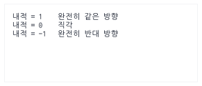

그림:
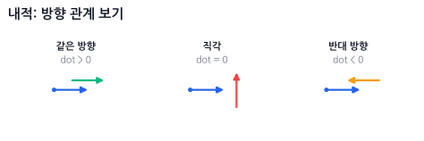

### 🔴 실시간 인터랙티브 시각화 (웹 캔버스)
아래 캔버스에서 마우스를 드래그하여 두 벡터의 각도 변화에 따라 내적 값과 정사영 그림자(초록색 선)가 어떻게 변화하는지 확인해보세요.

<div id="interactive-dot-product"></div>

---

## 11. 적이 내 앞에 있는지 판단하기

> **[참고] 각도(rotation)에서 방향 벡터(x, y)를 만드는 이유:**
> 삼각함수에서 캐릭터의 회전각이 $\theta$일 때, 반지름이 1인 원(단위원) 상의 좌표는 항상 $(x: \cos\theta, y: \sin\theta)$가 됩니다. 즉, 코사인($\cos$)은 가로 방향 크기, 사인($\sin$)은 세로 방향 크기를 의미하므로 이 둘을 조립하면 그 각도가 가리키는 방향의 크기 1짜리 화살표(단위 방향 벡터)를 얻을 수 있습니다. (자세한 삼각함수와 원 좌표의 원리는 뒤쪽 **8. 삼각함수는 원 위의 좌표다**에서 다시 다룹니다.)

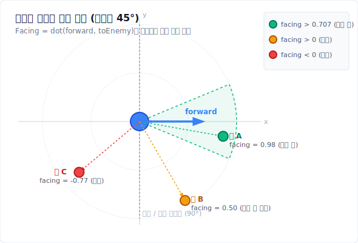

```js
// [JavaScript - CPU 인공지능 시야 연산]

// 1. 캐릭터가 바라보는 앞 방향 벡터 (각도로부터 방향 벡터 생성)
const forward = {
  x: Math.cos(player.rotation),
  y: Math.sin(player.rotation)
};

// 2. 캐릭터에서 적을 향하는 상대 위치 방향 벡터 구하기 및 정규화
const toEnemy = normalize({
  x: enemy.x - player.x,
  y: enemy.y - player.y
});

// 3. 내적 수행 (두 방향의 겹침 정도)
const facing = dot(forward, toEnemy);

if (facing > 0) {
  console.log("적이 앞쪽에 있음 (각도 < 90도)");
} else {
  console.log("적이 뒤쪽에 있음 (각도 > 90도)");
}
```

더 좁은 시야를 만들고 싶으면 기준값을 높여주면 됩니다. 이때 코드에서 비교하는 각도는 <strong>정면에서 한쪽 가장자리까지의 반각(half-angle)</strong>입니다. 예를 들어 정면 기준 좌우 각각 $45^\circ$, 즉 전체 폭 $90^\circ$인 부채꼴은 $\cos 45^\circ \approx 0.707$을 사용합니다.

```js
// 정면에서 좌우 각각 45도(전체 시야각 90도) 안에 들어왔는가?
if (facing > 0.707) {
  console.log("시야 범위 내에 있음");
}
```

## 12. 내적과 각도

일반적인 두 벡터의 내적 공식은 다음과 같습니다.

```txt
a · b = |a| * |b| * cosθ
```

만약 두 벡터 `a`, `b`가 정규화(길이가 1)되어 있다면, 벡터의 크기인 `|a|`와 `|b|`가 모두 1이 되므로 내적 결과가 곧 두 벡터 사이의 각도에 대한 코사인 값이 됩니다.

```txt
dot(a, b) = cosθ
```

그래서 두 벡터가 정규화된 상태에서 각도가 필요하면:

```js
const cosine = Math.max(-1, Math.min(1, dot(a, b)));
const angle = Math.acos(cosine);
```

수학적으로 정규화된 두 벡터의 내적은 `-1..1`이지만, 컴퓨터의 반올림 오차로 `1.00000001` 같은 값이 생길 수 있습니다. `acos`에 범위 밖 값을 넣으면 `NaN`이 되므로 먼저 clamp합니다.

하지만 실전에서는 각도 자체보다 `dot > 0.7`처럼 비교만 하는 경우가 많습니다. `acos`는 상대적으로 계산 비용이 비싸므로, 굳이 각도로 바꾸지 않고 코사인 값 자체로 비교하는 것이 성능상 유리합니다.

> **실무 팁 (그래픽스 조명):** 3D 그래픽스의 가장 기초적인 조명 모델(Lambertian Diffuse)은 표면의 법선 벡터(Normal)와 빛을 향하는 벡터(Light)의 내적값(`dot(N, L)`)을 밝기로 사용합니다. 이때 두 벡터가 정규화되어 있지 않으면 조명이 비정상적으로 어둡거나 밝아지므로 내적 전 반드시 정규화를 해야 합니다.

## 13. 3D 내적: 차원만 늘어날 뿐 의미는 같다

내적의 좋은 점은 **차원이 늘어나도 규칙이 그대로**라는 것입니다. 각 축의 성분끼리 곱해서 전부 더하면 됩니다. 외적이 2D와 3D에서 결과의 타입 자체가 달라졌던 것(스칼라 vs 벡터)과 대조적입니다.

```txt
2D: dot = ax*bx + ay*by
3D: dot = ax*bx + ay*by + az*bz
```

```js
// [JavaScript/GLSL 공통 - 3D 내적 연산]
function dot3D(a, b) {
  return a.x * b.x + a.y * b.y + a.z * b.z;
}

function length3D(v) {
  return Math.sqrt(dot3D(v, v)); // 자기 자신과의 내적 = 길이의 제곱
}

function normalize3D(v) {
  const len = length3D(v);
  if (len === 0) return { x: 0, y: 0, z: 0 };
  return { x: v.x / len, y: v.y / len, z: v.z / len };
}
```

$a \cdot b = |a||b|\cos\theta$라는 의미도, 정규화하면 결과가 곧 $\cos\theta$가 된다는 것도, 부호로 앞/뒤를 판정하는 것도 3D에서 똑같이 성립합니다. 앞의 조명 계산 `dot(N, L)`이 바로 이 3D 내적입니다.

> **기억 문장:** 내적은 차원이 늘어나도 "성분끼리 곱해서 전부 더한다"가 전부다. `dot(v, v)`는 길이의 제곱이다.

---

## 14. 투영: 그림자를 떨어뜨리는 것

투영은 어떤 벡터를 다른 방향 위에 **그림자처럼 내려놓는 것**입니다.

중요한 점은 이겁니다.

```txt
투영 결과는 “점”이 아니라, 기준 방향 위에 놓인 “새 벡터”입니다.
```

아래 그림에서 `v`는 원래 벡터이고, `n`은 기준 방향입니다.
`proj`는 `v`를 `n` 방향으로만 봤을 때 남는 성분입니다.

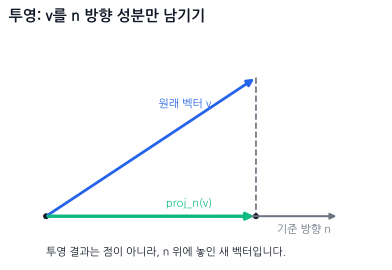


즉, `v` 전체가 점으로 사라지는 게 아닙니다.
`v`에서 **n 방향으로 작용하는 부분만 남긴 벡터**가 `proj`입니다.

공식:

```txt
projection = n * dot(v, n)
```

단, `n`은 길이가 1인 정규화 벡터여야 합니다. 만약 `n`이 정규화되어 있지 않다면 아래와 같은 공식으로 투영해야 합니다.

```txt
projection = n * (dot(v, n) / length(n)²)
```

정규화되지 않은 벡터 위에 투영하는 경우, `length(n)²`으로 나누어 크기 왜곡을 보정해야 합니다. 따라서 보통은 기준 벡터 `n`을 먼저 정규화한 뒤 투영하는 것이 간편하고 실수를 줄이는 방법입니다.

코드 (정규화된 `n` 기준):

```js
function project(v, n) {
  const d = dot(v, n);
  return {
    x: n.x * d,
    y: n.y * d
  };
}
```

예를 들어 `n = (1, 0)`이면 x축 방향만 남습니다.

```txt
v = (3, 4)
n = (1, 0)
project(v, n) = (3, 0)
```

그림:

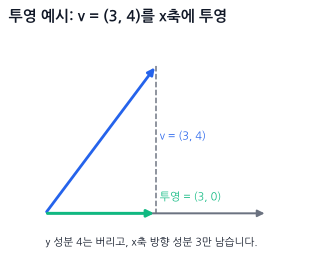

## 15. 경사면에서 미끄러지는 방향

물체가 경사면 위에 있을 때, 중력은 아래로 작용합니다.
그런데 물체가 실제로 미끄러지는 방향은 **경사면을 따라가는 방향**입니다.

그래서 중력 벡터를 경사면 방향으로 투영하면, 경사면을 따라 미끄러지는 성분을 구할 수 있습니다.

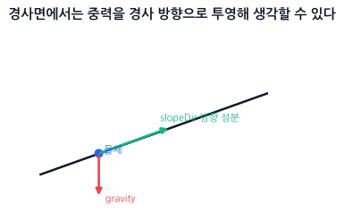


```js
const gravity = { x: 0, y: 9.8 };
const slopeDir = normalize({ x: 1, y: 0.5 });
const slide = project(gravity, slopeDir);
```

`slide`는 중력 전체가 아니라, **경사면 방향으로 남은 중력 성분**입니다.

> **기억 문장:** 투영은 “이 힘이 이 방향으로는 얼마나 작용하나?”를 보는 도구다.

---

## 16. 외적은 “어느 쪽으로 도는가”다

> **실무 맥락 (Mental Hook) - AI 회전 제어 및 포탑 조준:**
> 2D/3D 탑다운 게임에서 적 캐릭터가 플레이어를 향해 몸을 자연스럽게 돌리며 쫓아오게 하고 싶습니다. 이때 내적만으로는 "내 시야에 가까이 있는가"는 알아낼 수 있어도, <strong>"내가 왼쪽으로 돌아야 더 빠른가, 아니면 오른쪽으로 돌아야 더 빠른가?"</strong>는 알 수 없습니다.
> 내적은 코사인 대칭 관계이기 때문에 왼쪽 30도와 오른쪽 30도의 내적값이 똑같기 때문입니다.
> 이때 **외적**이 구원투수가 됩니다. 나의 정면 화살표와 적으로의 화살표를 외적하면 그 결과값의 부호가 양수(+) 또는 음수(-)로 떨어집니다. 이 부호값만 보고 AI는 즉각적으로 좌회전 또는 우회전을 실행할 수 있습니다.

3D 외적은 두 벡터에 동시에 수직인 제3의 벡터를 만들지만, 2D 공간에서는 회전 축이 $z$축 하나뿐이므로 보통 $z$값 스칼라 하나만 구합니다.

```js
// [JavaScript/GLSL 공통 - 2D 외적 연산]
function cross2D(a, b) {
  return a.x * b.y - a.y * b.x;
}
```

2D 외적 결과의 의미 (수학적 우측 핸드 좌표계, y가 위로 증가 기준):
```txt
cross > 0   b가 a의 왼쪽, 반시계 방향 (CCW)
cross < 0   b가 a의 오른쪽, 시계 방향 (CW)
cross = 0   같은 선 위 (일직선)
```

> [!WARNING]
> **화면 좌표계(y-down)에서의 반전:**
> Canvas나 브라우저 화면처럼 y축이 아래로 증가하는 좌표계에서는 외적 결과의 부호가 가진 기하학적 의미가 반대로 뒤집힙니다.
> * `cross > 0` 이면 b가 a의 **오른쪽(시계 방향)**
> * `cross < 0` 이면 b가 a의 **왼쪽(반시계 방향)**
> 따라서 타겟이 내 왼쪽에 있는지 오른쪽에 있는지 판단할 때, 현재 사용 중인 좌표계의 y축 방향을 반드시 먼저 확인해야 합니다!

### 🟢 실시간 인터랙티브 시각화 (웹 캔버스)
아래 캔버스에서 마우스를 드래그하여 두 벡터의 상대 위치에 따라 2D 외적값과 방향 판정 결과가 어떻게 달라지는지 실시간으로 확인해보세요.

<div id="interactive-cross-product"></div>

---

## 17. 적이 내 왼쪽에 있는지 오른쪽에 있는지

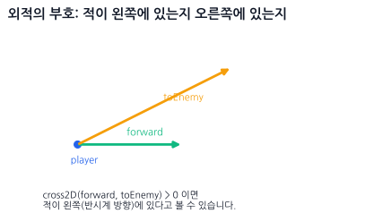

```js
// [JavaScript - CPU 캐릭터 회전 제어]

// 1. 캐릭터가 바라보는 앞 방향 벡터 계산
const forward = {
  x: Math.cos(player.rotation),
  y: Math.sin(player.rotation)
};

// 2. 캐릭터에서 적을 향하는 상대 방향 벡터 계산 및 정규화
const toEnemy = normalize({
  x: enemy.x - player.x,
  y: enemy.y - player.y
});

// 3. 2D 외적을 통해 적이 좌/우 중 어느 쪽에 위치하는지 횡방향 판정
// 주의: 아래 좌/우 해석은 수학 좌표계(y-up) 기준이다.
// Canvas 같은 y-down 화면 좌표계에서는 좌/우가 그대로 뒤바뀐다.
const side = cross2D(forward, toEnemy);

if (side > 0) {
  console.log("적은 내 왼쪽에 있음 -> 좌회전 작동");
} else if (side < 0) {
  console.log("적은 내 오른쪽에 있음 -> 우회전 작동");
} else {
  console.log("정면 또는 정반대 뒤에 있음");
}
```

## 18. 그래픽스에서 외적은 어디에 쓰나?

외적은 특히 3D 그래픽스에서 자주 씁니다.

```txt
두 방향 벡터 → 수직인 방향 벡터
```

대표 용도:

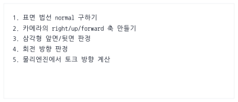


삼각형의 법선 예:

```js
function cross3D(a, b) {
  return {
    x: a.y * b.z - a.z * b.y,
    y: a.z * b.x - a.x * b.z,
    z: a.x * b.y - a.y * b.x
  };
}
```

```txt
삼각형의 두 변을 외적하면, 면에 수직인 방향(법선 벡터, Normal)이 나온다.
```

### A. 백페이스 컬링 (Backface Culling - 후면 제거)
3D 카메라가 삼각형 폴리곤을 바라볼 때, 이 폴리곤이 카메라를 향하고 있는지(앞면), 아니면 카메라를 등지고 있는지(뒷면)를 판단하여 뒷면인 경우 그리기를 생략(Culling)하여 렌더링 속도를 최적화합니다.

1. 삼각형 세 꼭짓점 $A, B, C$의 두 변 벡터인 $\vec{E_1} = B - A$와 $\vec{E_2} = C - A$를 만듭니다.
2. 두 변을 외적하여 표면 법선 벡터 $\vec{N} = \vec{E_1} \times \vec{E_2}$를 구합니다.
3. 여기서는 $\vec{V}$를 **카메라에서 면으로 향하는 방향**이라고 정의하고, 법선 $\vec{N}$과 내적합니다.
   * 이 규약에서는 `dot(N, V) > 0`이면 면이 카메라 반대쪽을 보므로 <strong>그리지 않음(Cull)</strong>입니다.
   * `dot(N, V) <= 0`이면 면이 카메라를 향하므로 **그립니다**.

> 법선의 방향은 정점 나열 순서(winding)에 따라 달라지고, $V$를 `면 → 카메라`로 정의하면 위 부호도 반대로 바뀝니다. 실제 렌더링 API의 앞면 규약(CW/CCW)과 컬링 설정을 함께 확인해야 합니다.

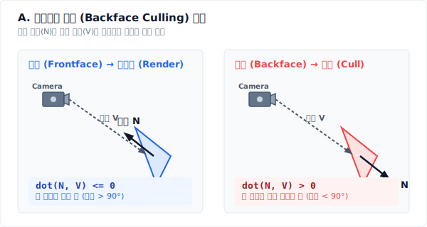

### B. TBN 행렬 구성 (노멀 맵 매핑)
3D 그래픽스에서 울퉁불퉁한 표면 질감을 가짜로 표현하는 노멀 맵(Normal Map)을 계산하기 위해 <strong>접선 공간(Tangent Space)</strong>이 필요합니다.
* 이때 표면의 가로축인 **접선(Tangent, $\vec{T}$)** 벡터와 표면의 **법선(Normal, $\vec{N}$)** 벡터를 외적하여, 세 번째 축인 **종법선(Bitangent, $\vec{B}$)** 벡터를 만듭니다.
  $$\vec{B} = \vec{N} \times \vec{T}$$
* 이 세 축을 조립하여 셰이더 내부에서 3D 벡터 좌표계를 변환하는 $3 \times 3$ **TBN 행렬**을 만듭니다.

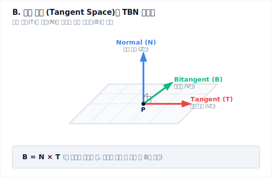

---

# Part 3. 삼각함수와 회전

## 19. 삼각함수는 “원 위의 좌표”다

삼각함수와 회전은 이렇게 잡으면 덜 헷갈립니다.

> **cos는 x축 쪽 성분, sin은 y축 쪽 성분이다.**

반지름이 1인 원을 단위원이라고 합니다.

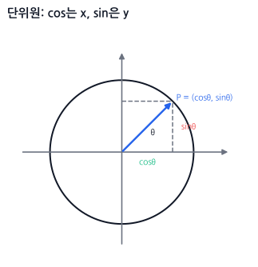


각도 `θ`만큼 돌았을 때 원 위 점의 좌표가:

```txt
x = cosθ
y = sinθ
```

입니다.

그래서 방향 벡터는 이렇게 만듭니다.

```js
const dir = {
  x: Math.cos(angle),
  y: Math.sin(angle)
};
```

## 20. 자주 쓰는 각도값

아래 표는 **수학 좌표계(y-up)** 기준이며, 화면 좌표계(y-down)에서의 방향 반전 차이점을 보여줍니다.

| 각도 | 라디안 | cos | sin | 수학 좌표계(y-up) 방향 | 화면 좌표계(y-down) 방향 |
| ---: | ---: | --: | --: | --- | --- |
| 0도 | 0 | 1 | 0 | 오른쪽 | 오른쪽 |
| 90도 | π/2 | 0 | 1 | 위쪽 | **아래쪽 (CW 회전)** |
| 180도 | π | -1 | 0 | 왼쪽 | 왼쪽 |
| 270도 | 3π/2 | 0 | -1 | 아래쪽 | **위쪽 (CCW 회전)** |
| 360도 | 2π | 1 | 0 | 오른쪽 | 오른쪽 |

> [!NOTE]
> 화면 좌표계(y-down)에서는 $y$축이 아래로 갈수록 커지기 때문에, 양의 부호를 가진 $90^\circ$ ($\sin(90^\circ) = 1$) 방향이 화면상에서 **아래쪽**이 됩니다.

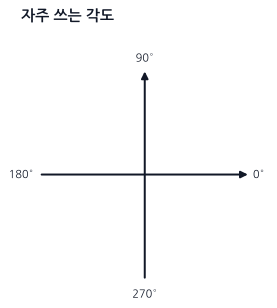


> **기억 문장:** 0도는 오른쪽, cos는 x, sin은 y.

---

## 21. 도와 라디안

코드에서는 대부분 라디안을 씁니다.

```js
Math.sin(angle);
Math.cos(angle);
```

여기서 `angle`은 도가 아니라 라디안입니다.

도 → 라디안:

```js
function degToRad(deg) {
  return deg * Math.PI / 180;
}
```

라디안 → 도:

```js
function radToDeg(rad) {
  return rad * 180 / Math.PI;
}
```

예:

```js
const angle = degToRad(45);
```

---

## 22. 각도에서 방향 벡터 만들기

총알 발사:

```js
const bulletVelocity = {
  x: Math.cos(angle) * speed,
  y: Math.sin(angle) * speed
};
```

그림:

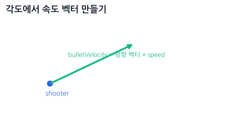


캐릭터 앞 방향:

```js
const forward = {
  x: Math.cos(rotation),
  y: Math.sin(rotation)
};

position.x += forward.x * speed * dt;
position.y += forward.y * speed * dt;
```

## 23. 화면 좌표계에서 위로 쏘고 싶을 때

Canvas처럼 y가 아래로 증가한다면 위쪽은 `y = -1`입니다.

수학 좌표계:

```txt
위 = +y
```

화면 좌표계:

```txt
위 = -y
```

그래서 화면 좌표계에서는 다음처럼 조정해야 할 수 있습니다.

```js
const dir = {
  x: Math.cos(angle),
  y: Math.sin(angle)
};
```

또는 프로젝트 기준에 따라:

```js
const dir = {
  x: Math.cos(angle),
  y: -Math.sin(angle)
};
```

중요한 건 한 프로젝트 안에서 기준을 하나로 통일하는 것입니다.

---

## 24. 방향 벡터에서 각도 구하기: atan2

위치 벡터나 변위 벡터 `(x, y)`가 주어졌을 때, 이 벡터가 가리키는 방향이 <strong>x축 양의 기준선(0°)으로부터 몇 라디안 회전했는지(각도 $\theta$)</strong>를 구하려면 반드시 `Math.atan2` 함수를 사용해야 합니다.

```js
const angle = Math.atan2(dir.y, dir.x);
```

이 함수는 탄젠트의 역함수($\tan^{-1}$)를 계산하는 함수로, 인자의 순서가 **y가 먼저, x가 나중**인 점에 특히 주의해야 합니다.

```txt
atan2(y, x)
```

이것이 단순 벡터 연산(`toMouse = mouse - player`)과 다른 점은, 벡터 연산의 결과는 또 다른 <strong>방향과 크기(화살표)</strong>인 반면, `atan2` 연산의 결과는 <strong>기준선 대비 돌아간 정도를 나타내는 '단일 숫자 값(각도/라디안 스칼라)'</strong>을 반환한다는 것입니다.

### 24.1 왜 `atan` 대신 `atan2`를 쓰는가? (실무 면접 단골 질문)
단순 아크탄젠트 함수인 `Math.atan(y / x)`를 쓰지 않고 `Math.atan2(y, x)`를 써야 하는 이유는 두 가지 결정적인 한계 때문입니다.

1. **상한선 및 사분면(Quadrant)의 유실:**
   * `Math.atan(val)`은 탄젠트의 역함수로서 범위가 $[-\pi/2, \pi/2]$ (즉, $-90^\circ$에서 $+90^\circ$ 사이인 우측 반원 영역)로만 제한됩니다.
   * 예를 들어, 방향이 우상향 `(x: 1, y: 1)` 일 때 비율은 `1 / 1 = 1`이며 각도는 $45^\circ$입니다. 그런데 좌하향 `(x: -1, y: -1)` 일 때도 비율은 `-1 / -1 = 1`이므로 동일하게 $45^\circ$가 반환되어 정반대 방향을 구분하지 못합니다.
   * 반면 `Math.atan2(y, x)`는 $y$와 $x$의 부호를 각각 개별 분석하여 $[-\pi, \pi]$ (즉, $-180^\circ$에서 $+180^\circ$까지의 전방위 $360^\circ$ 영역)의 올바른 사분면 각도를 찾아줍니다.
2. **분모가 0인 오류 (Division by Zero):**
   * 위쪽이나 아래쪽 수직 방향 `(x: 0, y: 1)`에서는 `y / x`가 무한대가 됩니다. JavaScript는 이 경우 크래시하지 않고 `Infinity`를 만들며 `Math.atan(Infinity)`도 $\pi/2$를 반환하지만, `(0, 0)`에서는 `0 / 0`이 `NaN`이 됩니다. 다른 언어에서는 0 나눗셈이 예외가 될 수도 있습니다.
   * `Math.atan2(y, x)`는 나눗셈 없이 두 성분을 함께 처리하므로 사분면을 보존하고 수직 방향도 안전하게 계산합니다. 단, `(0, 0)`은 방향 자체가 정의되지 않으므로 애플리케이션에서 별도로 처리해야 합니다.

## 25. 마우스를 바라보는 캐릭터

> **실무 맥락 (Mental Hook) - 마우스를 조준하는 포탑 / 캐릭터 고개 돌리기:**
> 탑다운 뷰의 2D 슈팅 게임이나 서바이벌 게임에서 캐릭터가 마우스 커서가 움직이는 방향을 향해 총구를 항상 겨누게 만들어야 합니다.
> 마우스 좌표와 플레이어 좌표의 차이인 `(dx, dy)`는 직관적인 거리(화살표) 정보이지만, 게임 엔진의 스프라이트 회전 컴포넌트(`rotation` 혹은 `angle`)는 30도, 90도 같은 **각도(라디안)** 값을 원합니다.
> 이 화살표 정보 `(dx, dy)`를 컴퓨터가 회전시킬 수 있는 라디안 각도로 바꿔주는 마법의 번역기가 바로 `Math.atan2` 함수입니다.

```js
// [JavaScript - CPU 캐릭터 2D 회전 제어]

// 1. 내 위치(시작점)와 마우스 위치(목표점) 사이의 변위 벡터(화살표) 계산
const dx = mouse.x - player.x;
const dy = mouse.y - player.y;

// 2. atan2를 이용해 방향 벡터를 라디안 각도로 변환 (y가 첫 번째 인자임에 주의!)
const angle = Math.atan2(dy, dx);

// 3. 캐릭터의 회전 컴포넌트에 변환된 각도를 할당하여 조준 적용
player.rotation = angle;
```

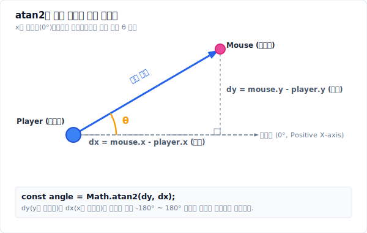

> **기억 문장:** 목표를 바라보려면 `atan2(목표.y - 내.y, 목표.x - 내.x)`.

---

## 26. 2D 회전 공식

점 $P(x, y)$를 원점 기준으로 $\theta$만큼 회전시킨 새로운 점 $P'(x', y')$의 좌표를 구하는 공식입니다.

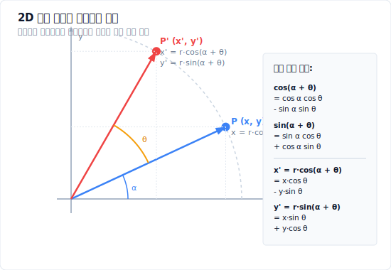

### 26.1 회전 공식 유도 과정 (극좌표계와 삼각함수 덧셈정리)

이 공식이 어떻게 유도되었는지 이해하면 굳이 외우지 않아도 기억에 오래 남습니다.

1. **원래 점 $P(x, y)$를 극좌표(Polar Coordinates)로 표현하기:**
   원점과 점 $P$ 사이의 거리를 $r$, $x$축 기준선과 선분 $OP$가 이루는 각도를 $\alpha$라고 하면, 삼각함수의 정의에 의해 다음과 같이 쓸 수 있습니다.
   $$x = r \cos\alpha$$
   $$y = r \sin\alpha$$

2. **$\theta$만큼 회전한 점 $P'(x', y')$ 표현하기:**
   점 $P$를 원점 기준으로 $\theta$만큼 회전하면 거리는 그대로 $r$이지만, 각도는 $\alpha + \theta$가 됩니다.
   $$x' = r \cos(\alpha + \theta)$$
   $$y' = r \sin(\alpha + \theta)$$

3. **삼각함수의 덧셈정리(Addition Formulas) 대입하기:**
   고등학교 수학에서 배우는 코사인과 사인의 합 공식인 $\cos(A+B) = \cos A\cos B - \sin A\sin B$, $\sin(A+B) = \sin A\cos B + \cos A\sin B$를 각각 대입해 전개합니다.
   $$x' = r (\cos\alpha \cos\theta - \sin\alpha \sin\theta)$$
   $$y' = r (\sin\alpha \cos\theta + \cos\alpha \sin\theta)$$

4. **원래 좌표($x, y$) 다시 대입하기:**
   $r\cos\alpha$ 자리에 $x$를, $r\sin\alpha$ 자리에 $y$를 대입합니다.
   $$x' = (r\cos\alpha)\cos\theta - (r\sin\alpha)\sin\theta = x\cos\theta - y\sin\theta$$
   $$y' = (r\sin\alpha)\cos\theta + (r\cos\alpha)\sin\theta = y\cos\theta + x\sin\theta = x\sin\theta + y\cos\theta$$

이렇게 해서 그래픽스와 게임 엔진에서 핵심적으로 쓰이는 **2차원 회전 행렬 공식**이 탄생하게 됩니다.

코드:

```js
function rotatePoint(p, angle) {
  const c = Math.cos(angle);
  const s = Math.sin(angle);

  return {
    x: p.x * c - p.y * s,
    y: p.x * s + p.y * c
  };
}
```

이 함수는 이 책에서 가장 중요한 함수 중 하나입니다.

## 27. 왜 x에는 -sin이 들어갈까?

점을 회전시키는 게 아니라 **x축과 y축이라는 기준 방향 자체가 같이 돌아간다**고 생각하면 매우 직관적입니다.

원래 x축 방향 `(1, 0)`을 회전하면:

```txt
rotatedX = (cosθ, sinθ)
```

원래 y축 방향 `(0, 1)`을 회전하면:

```txt
rotatedY = (-sinθ, cosθ)
```

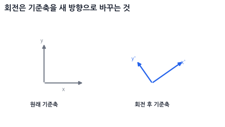

#### 💡 여기서 잠깐: y축 회전에는 왜 `-sinθ`가 들어갈까요?

* **기하학적 직관 (그림으로 이해하기):**
  원래 수직 위를 향하던 y축 `(0, 1)`이 왼쪽(반시계 방향)으로 $\theta$만큼 기울어지면, 2사분면(x는 음수, y는 양수)으로 넘어가게 됩니다.
  새로운 y축 벡터와 세로축 사이의 각도가 $\theta$이므로, 삼각비에 의해:
  * **가로(x) 성분:** 왼쪽 방향이며 각도의 대변(Opposite)이므로 <strong>$-\sin\theta$</strong>가 됩니다.
  * **세로(y) 성분:** 위쪽 방향이며 각도의 인접변(Adjacent)이므로 <strong>$\cos\theta$</strong>가 됩니다.
  * 그래서 `rotatedY = (-sinθ, cosθ)`가 됩니다.

  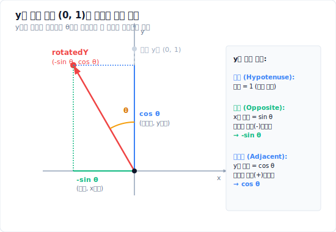
* **수학적 공식 (각도로 이해하기):**
  원래 y축의 각도는 $90^\circ$입니다. 여기서 $\theta$만큼 더 회전했으므로 새로운 각도는 $90^\circ + \theta$가 됩니다.
  삼각함수의 각도 변환 공식에 의해 다음과 같이 계산됩니다.
  * $x$ 성분: $\cos(90^\circ + \theta) = -\sin\theta$
  * $y$ 성분: $\sin(90^\circ + \theta) = \cos\theta$

---

#### 📐 이제 두 기준축을 합쳐봅시다

어떤 점 `(x, y)`는 원래 기준축을 기준으로 **"x축 방향으로 x만큼 + y축 방향으로 y만큼"** 간 위치입니다.

```txt
점 p = x축 방향으로 x만큼 + y축 방향으로 y만큼
```

축이 회전하더라도 이 상대적인 관계는 유지되므로, 회전된 점 `p'`는 회전된 기준축들을 똑같은 비율로 더해주면 됩니다.

```txt
p' = rotatedX * x + rotatedY * y
```

이 식을 성분별로 나누어 대입해보면 다음과 같습니다.

$$p' = (\cos\theta, \sin\theta) \cdot x + (-\sin\theta, \cos\theta) \cdot y$$
$$p' = (x\cos\theta, x\sin\theta) + (-y\sin\theta, y\cos\theta)$$
$$p' = (x\cos\theta - y\sin\theta,\; x\sin\theta + y\cos\theta)$$

따라서 최종 회전 공식이 도출됩니다.

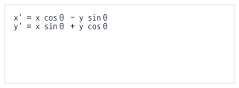

---

## 28. 90도 회전은 특별히 쉽다

일반적인 임의 각도 회전보다 90도 회전(직각 회전)은 훨씬 간단하게 해결할 수 있습니다. 곱셈이나 삼각함수 연산 없이, 단순히 x와 y의 성분을 맞바꾸고 부호만 하나 바꿔주면 끝납니다.

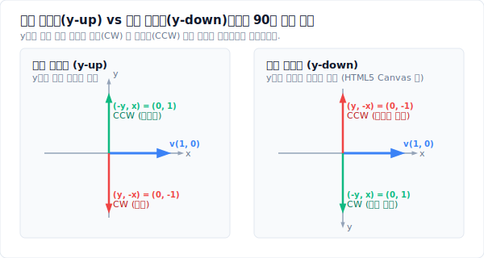

아래 코드 공식은 **수학 좌표계(y-up)** 기준입니다.

반시계 방향 90도 회전 (CCW):

```js
function rotate90CCW(v) {
  return { x: -v.y, y: v.x };
}
```

시계 방향 90도 회전 (CW):

```js
function rotate90CW(v) {
  return { x: v.y, y: -v.x };
}
```

> [!WARNING]
> **화면 좌표계(y-down)에서의 반전:**
> 화면 좌표계(HTML5 Canvas, 브라우저 DOM 등)에서는 y축이 아래로 갈수록 커지는 구조이기 때문에, 기하학적 회전 방향이 수학 좌표계와 반대로 적용됩니다.
> * 화면 좌표계(y-down)에서 **시계 방향 90도 회전(CW)**: `{ x: -v.y, y: v.x }` (수학의 CCW 공식과 같음)
> * 화면 좌표계(y-down)에서 **반시계 방향 90도 회전(CCW)**: `{ x: v.y, y: -v.x }` (수학의 CW 공식과 같음)
>
> 예를 들어, 화면 좌표계에서 캐릭터의 현재 앞 방향이 `forward = { x: 1, y: 0 }` (오른쪽)일 때, 캐릭터 기준 오른쪽 방향(즉, 화면상에서 시계방향 90도 회전한 아래쪽)인 `right = { x: 0, y: 1 }`을 구하려면 수학의 `rotate90CCW` 공식인 `{ x: -v.y, y: v.x }`를 사용해야 합니다.

---

# Part 4. 행렬과 3D 변환

## 29. 이동, 회전, 스케일

오브젝트 변환은 보통 세 가지입니다.

```txt
이동 Translation: 어디에 놓을까?
회전 Rotation: 얼마나 돌릴까?
스케일 Scale: 얼마나 키울까?
```

## 30. 스케일

```txt
x' = x * sx
y' = y * sy
```

```js
function scaleVec2(v, sx, sy) {
  return {
    x: v.x * sx,
    y: v.y * sy
  };
}
```

## 31. 이동

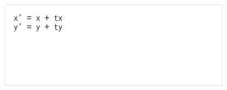


```js
function translateVec2(v, tx, ty) {
  return {
    x: v.x + tx,
    y: v.y + ty
  };
}
```

---

## 32. 로컬 좌표와 월드 좌표

오브젝트는 보통 자기 중심을 기준으로 모양을 가집니다.

```js
const localVertices = [
  { x: -50, y: -25 },
  { x:  50, y: -25 },
  { x:  50, y:  25 },
  { x: -50, y:  25 }
];
```

이건 중심이 `(0, 0)`인 사각형입니다.

이 사각형을 실제 월드에 놓으려면:

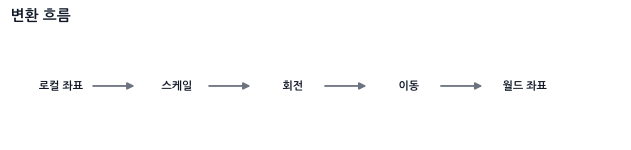


코드:

```js
function transformPoint2D(p, position, rotation, scale) {
  // 1. scale
  let x = p.x * scale.x;
  let y = p.y * scale.y;

  // 2. rotate
  const c = Math.cos(rotation);
  const s = Math.sin(rotation);

  const rx = x * c - y * s;
  const ry = x * s + y * c;

  // 3. translate
  return {
    x: rx + position.x,
    y: ry + position.y
  };
}
```

사용:

```js
const worldVertices = localVertices.map(v =>
  transformPoint2D(v, box.position, box.rotation, box.scale)
);
```

> **기억 문장:** 물체 자체를 먼저 키우고, 자기 중심에서 돌리고, 마지막에 월드 위치로 옮긴다.

---

## 33. 피벗 기준 회전

회전은 기본적으로 원점 `(0, 0)`을 기준으로 일어납니다.

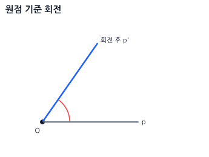


하지만 실제 게임에서는 원점이 아니라 특정 점을 기준으로 돌리고 싶을 때가 많습니다.

예:

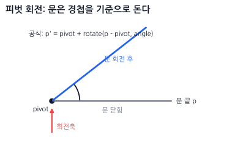


어떤 점 `pivot`을 중심으로 회전하고 싶으면 순서는 이렇습니다.

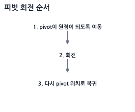


공식:

```txt
p' = pivot + rotate(p - pivot, angle)
```

코드:

```js
function rotateAround(p, pivot, angle) {
  const translated = {
    x: p.x - pivot.x,
    y: p.y - pivot.y
  };

  const rotated = rotatePoint(translated, angle);

  return {
    x: rotated.x + pivot.x,
    y: rotated.y + pivot.y
  };
}
```

예:

```js
const rotatedPoint = rotateAround(point, objectCenter, angle);
```

이건 문이 경첩을 기준으로 회전하거나, 무기가 손잡이를 기준으로 도는 경우에 많이 씁니다.

---

## 34. 동차좌표와 3x3 행렬

2D 공간에서의 회전(Rotation)과 크기 조절(Scale)은 $2 \times 2$ 행렬 곱으로 직접 표현할 수 있습니다. 그러나 위치 이동(Translation)은 덧셈 연산이기 때문에 $2 \times 2$ 행렬의 곱셈 형태로 표현할 수 없습니다.

```txt
회전/스케일 (행렬 곱): p' = M * p
위치 이동 (벡터 합): p' = p + t
```

이동, 회전, 스케일을 하나의 일관된 <strong>행렬 곱셈식으로 통일(Affine Transformation)</strong>하여 결합하기 위해, 2차원 좌표 `(x, y)` 뒤에 가상의 3번째 성분 `w`를 추가하여 `(x, y, w)` 형태의 3차원 좌표로 확장합니다.

```txt
position = (x, y, 1)
```

이 시스템을 <strong>동차좌표 (Homogeneous Coordinates)</strong>라고 부릅니다. 동차좌표계를 도입하면 2D의 아핀 변환을 한 차원 높은 동차공간의 **선형변환**으로 표현할 수 있어, 위치 이동까지 행렬 곱셈으로 처리할 수 있습니다. 행렬 모양이 전단과 비슷해 보일 수 있지만, 여기서 핵심은 이동을 전단이라고 부르는 것이 아니라 **아핀 변환을 선형대수의 언어로 통일한다**는 점입니다.

### 34.1 동차좌표에서 w 성분의 역할 ($w=0$ vs. $w=1$)
그래픽스 연산 시 정점의 속성에 따라 $w$ 값을 제어하여 변환 행렬 연산 결과를 제어합니다.

* **위치 (Position): $w = 1$**
  * 위치를 나타내는 좌표에는 세 번째 값으로 $1$을 둡니다. 행렬 곱셈을 수행하면 이동량 `tx`, `ty`가 그대로 더해져 물체가 정상적으로 이동합니다.
  * $T \cdot (x, y, 1)^T = (x + tx, y + ty, 1)^T$
* **방향 및 벡터 (Direction / Vector): $w = 0$**
  * 방향만을 나타내는 벡터(예: 법선 벡터, 시선 벡터 등)는 공간상의 위치 이동에 영향을 받지 않아야 합니다. 따라서 $w = 0$으로 설정합니다.
  * 이렇게 하면 이동 변환 행렬($T$)을 곱해도 이동 성분 `tx`, `ty`가 $0$과 곱해져 소거되므로 이동하지 않고 방향 속성만 보존됩니다.
  * $T \cdot (x, y, 0)^T = (x, y, 0)^T$ (이동 무시)

이동 행렬:

![T = [ 1 0 tx ]](./images/diagram_027.svg)


회전 행렬:

![R = [ cosθ -sinθ 0 ]](./images/diagram_028.svg)


스케일 행렬:

![S = [ sx 0 0 ]](./images/diagram_029.svg)

## 35. 3D로의 확장: 4x4 행렬과 아핀 공간

지금까지 본 2D의 $3 \times 3$ 동차좌표를 3D로 올리면, 그래픽스에서 가장 많이 보게 되는 <strong>$4 \times 4$ 행렬(`mat4`)</strong>이 됩니다. 원리는 완전히 같습니다. 3D 좌표 $(x, y, z)$ 뒤에 $w$를 붙여 $(x, y, z, w)$로 만들면, 이동까지 곱셈 하나로 처리할 수 있습니다.

$$T = \begin{bmatrix} 1 & 0 & 0 & t_x \\ 0 & 1 & 0 & t_y \\ 0 & 0 & 1 & t_z \\ 0 & 0 & 0 & 1 \end{bmatrix}, \qquad S = \begin{bmatrix} s_x & 0 & 0 & 0 \\ 0 & s_y & 0 & 0 \\ 0 & 0 & s_z & 0 \\ 0 & 0 & 0 & 1 \end{bmatrix}$$

그리고 각 주축(X, Y, Z축)을 기준으로 $\theta$만큼 회전시키는 $4 \times 4$ 회전 행렬은 다음과 같습니다. 선형 대수적 회전(3x3) 부분 외곽에 w 성분(이동 차단)이 결합된 형태입니다.

$$
\begin{aligned}
R_x(\theta) &= \begin{bmatrix} 1 & 0 & 0 & 0 \\ 0 & \cos\theta & -\sin\theta & 0 \\ 0 & \sin\theta & \cos\theta & 0 \\ 0 & 0 & 0 & 1 \end{bmatrix} \\[1.5em]
R_y(\theta) &= \begin{bmatrix} \cos\theta & 0 & \sin\theta & 0 \\ 0 & 1 & 0 & 0 \\ -\sin\theta & 0 & \cos\theta & 0 \\ 0 & 0 & 0 & 1 \end{bmatrix} \\[1.5em]
R_z(\theta) &= \begin{bmatrix} \cos\theta & -\sin\theta & 0 & 0 \\ \sin\theta & \cos\theta & 0 & 0 \\ 0 & 0 & 1 & 0 \\ 0 & 0 & 0 & 1 \end{bmatrix}
\end{aligned}
$$

*참고: $R_y(\theta)$에서 $-\sin\theta$의 부호가 아래쪽에 있어서 헷갈리기 쉬운데, 이는 **기준축(기저 벡터)의 회전 결과**로 이해하면 아주 간단합니다.*

> **💡 왜 Y축 회전 행렬만 부호가 반대일까?**
>
> 3D 변환 행렬의 **1열, 2열, 3열**은 각각 **회전된 X축, Y축, Z축 벡터**의 종착지입니다.
> 오른손 법칙 좌표계에서 Y축 기준으로 내려다보면 회전은 Z에서 X 방향(반시계 방향)으로 돌게 됩니다.
>
> 1. <strong>원래 X축 $(1,0,0)$</strong>을 Y축 기준으로 회전하면 $\to$ Z의 음수 방향으로 회전하므로 <strong>새 X축 벡터는 $(\cos\theta, 0, -\sin\theta)$</strong>가 됩니다. 이 벡터가 행렬의 **1열**이 되므로 $-\sin\theta$가 3행 1열에 오게 됩니다.
> 2. <strong>원래 Z축 $(0,0,1)$</strong>을 Y축 기준으로 회전하면 $\to$ X의 양수 방향으로 회전하므로 <strong>새 Z축 벡터는 $(\sin\theta, 0, \cos\theta)$</strong>가 됩니다. 이 벡터가 행렬의 **3열**이 되므로 $\sin\theta$가 1행 3열에 오게 됩니다.
>
> 결과적으로 부호가 이상한 게 아니라, **X축이 회전했을 때 $z$ 성분이 음수 방향($-\sin\theta$)으로 움직이기 때문에** 3행 1열에 마이너스가 오게 되는 정상적인 결과입니다.

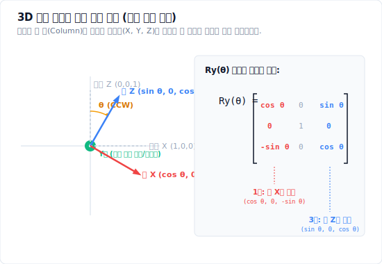


$w$의 역할도 2D와 똑같습니다. 이 규칙은 3D 셰이더를 짤 때 **매일 만나는 실전 규칙**입니다.

```txt
점(위치)   → (x, y, z, 1)  이동이 적용된다
방향(벡터) → (x, y, z, 0)  이동이 무시된다
```

그래서 GLSL에서 정점 위치는 `vec4(position, 1.0)`으로, 법선이나 빛의 방향은 `vec4(normal, 0.0)`으로 확장합니다. 법선에 실수로 `1.0`을 넣으면 카메라가 움직일 때마다 조명이 이상하게 흔들리는데, 법선이 이동 성분까지 먹어버리기 때문입니다.

### 아핀 변환(Affine Transformation)이란 무엇인가

$4 \times 4$ 행렬 중에서도 **마지막 행이 $(0, 0, 0, 1)$인 것**들을 **아핀 변환**이라고 부릅니다. 이동, 회전, 스케일, 전단이 전부 여기에 속합니다.

$$M_{affine} = \begin{bmatrix} & A & & \vec{t} \\ 0 & 0 & 0 & 1 \end{bmatrix} \qquad (A = 3 \times 3\ \text{선형 부분},\quad \vec{t} = \text{이동})$$

아핀 변환의 성질을 감각적으로 잡으면 이렇습니다.

```txt
직선은 변환 후에도 직선이다.
평행한 두 선은 변환 후에도 평행하다.
선분의 중점은 변환 후에도 중점이다.
```

즉 **모양이 기울고 늘어날 수는 있어도, 원근감처럼 "멀리 있는 게 작아지는" 왜곡은 일어나지 않습니다.** 마지막 행이 $(0,0,0,1)$이라 어떤 점을 넣어도 결과의 $w$가 항상 1로 유지되고, 따라서 94절에서 배울 **원근 분할이 일어나지 않기 때문**입니다.

여기서 중요한 대비가 나옵니다.

```txt
Model / View 행렬  → 아핀 변환이다 (w = 1 유지, 원근 없음)
Projection 행렬    → 아핀 변환이 아니다 (마지막 행이 (0,0,-1,0) 등, w에 z를 넣음)
```

투영 행렬만 유일하게 마지막 행을 부숴서 $w$에 깊이값 $z$를 집어넣습니다. 바로 그 덕분에 나중에 $w$로 나누는 **원근 분할**이 가능해지고, 멀리 있는 물체가 작아집니다. "투영 행렬은 물체를 옮기는 행렬이 아니라 렌즈"라는 94절의 말이 수학적으로는 <strong>"투영 행렬만 아핀 변환이 아니다"</strong>라는 뜻입니다.

> **기억 문장:** 아핀 변환은 $w$를 1로 지켜주는 변환이다. 투영 행렬만 그 약속을 깨고, 그래서 원근감이 생긴다.

---

## 36. 변환 합성

이동, 회전, 스케일을 하나로 합치면:

```txt
M = T * R * S
```

점에 적용하면:

```txt
worldPosition = T * R * S * localPosition
```

주의:

```txt
행렬 곱은 오른쪽부터 적용된다.
```

즉:

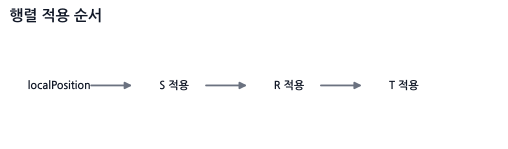

## 37. 순서가 왜 중요할까?

점 `(1, 0)`을 생각해봅시다.

먼저 이동 후 회전:

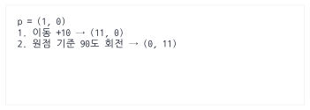


먼저 회전 후 이동:

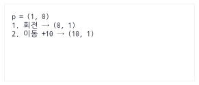


결과가 다릅니다.

```txt
이동 후 회전: (0, 11)
회전 후 이동: (10, 1)
```

> **기억 문장:** 행렬 순서가 바뀌면 물체가 “자기 자리에서 도는지”, “원점 주변을 공전하는지”가 달라진다.

---

## 38. 3x3 행렬 코드

여기서는 `p' = M * p` 방식으로 생각합니다.

> **이 절의 규약:** 점은 열벡터이고, 아래 JavaScript 배열은 사람이 읽기 쉽게 **행 우선(row-major)** 순서로 저장합니다. WebGL에 행렬을 전달할 때 사용하는 열 우선 메모리 배치와는 별개의 문제이므로, 라이브러리의 저장 규약과 곱셈 방향을 반드시 확인해야 합니다.

```js
function mat3Translation(tx, ty) {
  return [
    1, 0, tx,
    0, 1, ty,
    0, 0, 1
  ];
}

function mat3Rotation(angle) {
  const c = Math.cos(angle);
  const s = Math.sin(angle);

  return [
    c, -s, 0,
    s,  c, 0,
    0,  0, 1
  ];
}

function mat3Scale(sx, sy) {
  return [
    sx, 0,  0,
    0,  sy, 0,
    0,  0,  1
  ];
}
```

행렬 곱:

```js
function mat3Multiply(a, b) {
  const out = new Array(9);

  for (let row = 0; row < 3; row++) {
    for (let col = 0; col < 3; col++) {
      out[row * 3 + col] =
        a[row * 3 + 0] * b[0 * 3 + col] +
        a[row * 3 + 1] * b[1 * 3 + col] +
        a[row * 3 + 2] * b[2 * 3 + col];
    }
  }

  return out;
}
```

점 변환:

```js
function mat3TransformPoint(m, p) {
  return {
    x: m[0] * p.x + m[1] * p.y + m[2],
    y: m[3] * p.x + m[4] * p.y + m[5]
  };
}
```

합성:

```js
function makeTransform2D(position, rotation, scale) {
  const T = mat3Translation(position.x, position.y);
  const R = mat3Rotation(rotation);
  const S = mat3Scale(scale.x, scale.y);

  return mat3Multiply(T, mat3Multiply(R, S));
}
```

---

## 39. 2D 회전은 3D의 z축 회전이다

3D에는 축이 세 개 있습니다.

```txt
x축
y축
z축
```

2D 화면을 정면에서 보면, z축은 화면 밖으로 나오는 축입니다.

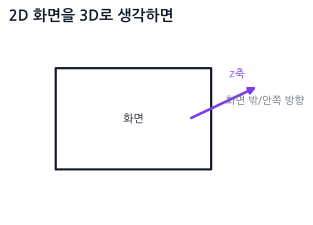


2D 회전 행렬은 3D의 z축 회전과 같습니다.

![[ cosθ -sinθ 0 ]](./images/diagram_042.svg)

세 축의 회전 행렬을 나란히 놓고 보면 규칙이 한눈에 보입니다.

$$R_x(\theta) = \begin{bmatrix} 1 & 0 & 0 \\ 0 & \cos\theta & -\sin\theta \\ 0 & \sin\theta & \cos\theta \end{bmatrix} \quad
R_y(\theta) = \begin{bmatrix} \cos\theta & 0 & \sin\theta \\ 0 & 1 & 0 \\ -\sin\theta & 0 & \cos\theta \end{bmatrix} \quad
R_z(\theta) = \begin{bmatrix} \cos\theta & -\sin\theta & 0 \\ \sin\theta & \cos\theta & 0 \\ 0 & 0 & 1 \end{bmatrix}$$

외우지 말고 이 규칙만 기억하면 됩니다.

```txt
회전축이 되는 줄과 칸은 그대로 둔다 (1과 0만 남는다).
나머지 2x2 자리에 26절에서 배운 2D 회전 행렬을 그대로 끼워 넣는다.
```

### 왜 y축 회전만 부호가 뒤집혀 보일까?

$R_y$만 유독 $-\sin\theta$가 아래쪽에 있어서 오타처럼 보입니다. 하지만 맞습니다.

축의 순환 순서가 $x \to y \to z \to x$이기 때문입니다. $R_z$는 ($x$에서 $y$로) 도는 회전이고 $R_x$는 ($y$에서 $z$로) 도는 회전이라 순서가 자연스럽지만, $R_y$는 ($z$에서 $x$로) 도는 회전이라 행렬에 적을 때 행과 열의 순서가 뒤집혀서 부호가 반대로 나타납니다. **버그가 아니라 축 순환의 결과**이므로, 직접 구현할 때 "부호가 이상한데?" 하고 고치면 오히려 틀립니다.

## 40. 3D 회전 행렬 코드

```js
// [JavaScript - 3x3 회전 행렬 (row-major)]
function rotationX(angle) {
  const c = Math.cos(angle), s = Math.sin(angle);
  return [
    1, 0,  0,
    0, c, -s,
    0, s,  c
  ];
}

function rotationY(angle) {
  const c = Math.cos(angle), s = Math.sin(angle);
  return [
     c, 0, s,
     0, 1, 0,
    -s, 0, c
  ];
}

function rotationZ(angle) {
  const c = Math.cos(angle), s = Math.sin(angle);
  return [
    c, -s, 0,
    s,  c, 0,
    0,  0, 1
  ];
}
```

## 41. 3D에서는 회전 순서가 결과를 바꾼다

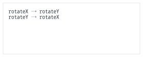

2D에서는 회전이 하나뿐이라 순서 문제가 없었지만, 3D에서는 **곱하는 순서가 바뀌면 결과가 달라집니다.**

$$R_x R_y \neq R_y R_x$$

직접 해보면 바로 느껴집니다. 책을 하나 들고 **① x축으로 90도 돌린 뒤 y축으로 90도** 돌리는 것과, **② y축으로 먼저 90도 돌린 뒤 x축으로 90도** 돌리는 것은 표지가 향하는 방향이 완전히 달라집니다.

> **실무 함정:** 그래서 "회전값 `{x: 30, y: 45, z: 10}`"이라는 말은 그 자체로는 **의미가 불완전합니다.** 어떤 순서로 곱했는지(XYZ? ZYX? YXZ?)를 알아야만 실제 방향이 정해집니다. 엔진마다 이 순서 규약이 달라서, 다른 엔진에서 뽑은 Euler 각도를 그대로 옮기면 모델이 엉뚱한 방향을 보는 사고가 자주 납니다. Three.js가 `Euler` 객체에 `order` 필드를 따로 두는 이유가 이것입니다.

---

## 42. 짐벌락: 축 하나가 사라지는 순간

Euler 회전은 x, y, z축 회전을 순서대로 적용하는 방식입니다.

```txt
rotation = { x, y, z }
```

이 방식은 사람이 읽기 쉽지만, **특정 각도에서 회전 축 하나를 통째로 잃어버리는** 치명적인 문제가 있습니다. 이것이 <strong>짐벌락(Gimbal Lock)</strong>입니다.

### 42.1 짐벌락이 실제로 일어나는 순간

말로만 "축이 겹친다"고 하면 와닿지 않으니, 비행기를 예로 숫자를 직접 넣어봅시다. 비행기의 회전은 보통 이렇게 부릅니다.

```txt
Yaw   (좌우 방향 틀기) - 위아래 축 회전
Pitch (기수 들기/내리기) - 좌우 날개 축 회전
Roll  (몸통 비틀기) - 앞뒤 축 회전
```

이제 **Pitch를 정확히 $90^\circ$로 올려** 비행기가 하늘을 수직으로 바라보게 만듭니다.

이 상태에서 Yaw를 돌려보면, 비행기는 제자리에서 몸통을 비틉니다. 그런데 Roll을 돌려도 **똑같이 몸통을 비틉니다.** 기수를 하늘로 세우는 순간, 원래 서로 수직이던 Yaw 축과 Roll 축이 **같은 축 위로 포개져 버렸기 때문**입니다.

```txt
Pitch = 0도   → Yaw 축과 Roll 축이 서로 수직. 자유도 3개. 정상.
Pitch = 90도  → Yaw 축과 Roll 축이 완전히 겹침. 자유도 2개. 축 하나 증발!
```

즉 **회전 값 3개를 갖고 있는데 실제로 만들 수 있는 회전은 2방향뿐인 상태**가 됩니다. 이 자세에서는 아무리 Yaw와 Roll을 조합해도 만들어낼 수 없는 방향이 생기고, 그 방향으로 가려 하면 물체가 갑자기 홱 돌아가거나(스냅) 카메라가 뒤집힙니다. 1인칭 카메라에서 고개를 하늘로 완전히 젖혔을 때 화면이 빙글 도는 버그가 바로 이것입니다.

수학적으로는 $R_y(90^\circ)$가 x축과 z축을 서로 맞바꿔 놓기 때문에, 남은 두 회전 행렬이 같은 축의 회전으로 축약되어 **행렬 곱의 결과가 하나의 각도 합에만 의존하게 됩니다.**

### 42.2 왜 각도를 조심해서 다뤄도 못 고치나

짐벌락은 코드를 잘못 짜서 생기는 버그가 아닙니다. **"3D 회전을 세 개의 각도로 순서대로 표현한다"는 방식 자체에 내재된 한계**입니다. 각도 순서를 XYZ에서 ZYX로 바꾸면 잠기는 자세만 옮겨갈 뿐, 잠기는 자세가 사라지지는 않습니다.

그래서 해법은 각도를 더 잘 다루는 것이 아니라, **회전을 각도 3개로 표현하는 것 자체를 그만두는 것**입니다. 그 대안이 다음 절의 쿼터니언입니다.

> **기억 문장:** 짐벌락은 버그가 아니라 Euler 각 표현법의 구조적 한계다. Pitch가 90도가 되면 축 하나가 증발한다.

```txt
Euler: 사람이 읽고 입력하기 쉬운 회전값 (Inspector에 표시)
Quaternion: 짐벌락 없이 안정적으로 계산/보간하기 좋은 값 (내부 처리)
```

쿼터니언의 실체는 **89절**에서 코드와 함께 자세히 다룹니다.

---

# Part 5. 미분 감각과 운동

## 43. 속도, 속력, 가속도

이 부분은 이름이 비슷해서 헷갈리기 쉽습니다.

```txt
위치 position: 어디에 있는가? (단위: m 또는 px)
속도 velocity: 어느 방향으로 얼마나 빠르게 움직이는지 나타내는 벡터값 (단위: m/s 또는 px/s)
속력 speed: 방향을 빼고 빠르기만 나타내는 스칼라값 (단위: m/s 또는 px/s, speed = |velocity|)
가속도 acceleration: 속도가 시간에 따라 얼마나 빠르게 변하는가를 나타내는 벡터값 (단위: m/s² 또는 px/s²)
```

표로 보면:

| 개념 | 영어 | 구분 | 물리적 기호 | 의미 |
| --- | --- | --- | --- | --- |
| 위치 | position | 벡터 (Vector) | $x$, $p$ | 공간 상의 좌표 |
| 속도 | velocity | 벡터 (Vector) | $v$ | 방향과 속력을 가진 물리량 |
| 속력 | speed | 스칼라 (Scalar) | $s$, $|v|$ | 속도의 크기 |
| 가속도 | acceleration | 벡터 (Vector) | $a$ | 초당 속도가 변화하는 정도 |

## 44. 물리 이론: 등가속도 운동 공식 (연속적 해법)

가속도 $a$가 일정하게 유지될 때, 임의의 시간 $t$초 후의 상태를 수학적으로 계산하는 **등가속도 운동 공식**은 다음과 같습니다.

1. **시간-속도 공식:**
   $$v(t) = v_0 + a t$$
2. **시간-위치 공식:**
   $$x(t) = x_0 + v_0 t + \frac{1}{2} a t^2$$
3. **시간 제외 공식:**
   $$v^2 - v_0^2 = 2 a (x - x_0)$$

* $x_0$, $v_0$는 각각 처음 위치와 처음 속도입니다.

> **실무에서의 한계:**
> 종이 위에 수학 문제를 풀 때는 이 공식들을 사용하여 임의의 시점 $t$에서의 위치를 한 번에 알아낼 수 있습니다. 그러나 게임 및 물리엔진 개발에서는 이를 사용할 수 없는 경우가 대부분입니다. 왜냐하면 매 프레임 플레이어의 조작 입력, 바람(공기 저항), 갑작스러운 충돌 반응 등에 의해 가속도 $a$가 실시간으로 끊임없이 변하기 때문입니다.
> 따라서, 매 프레임 아주 미세한 시간 조각($dt$) 단위로 잘라 위치와 속도를 매번 누적하여 업데이트하는 **수치 적분(Numerical Integration)** 방식을 채택합니다.

## 45. 코드로 보는 관계 (수치 적분)

아래는 현재 속도로 위치를 먼저 바꾸는 **명시적 오일러** 순서입니다.

```js
position.x += velocity.x * dt;
position.y += velocity.y * dt;

velocity.x += acceleration.x * dt;
velocity.y += acceleration.y * dt;
```

뒤의 중력 및 물리엔진 예제에서는 안정성이 더 나은 **반암시적 오일러**, 즉 `속도 갱신 → 위치 갱신` 순서를 사용합니다. 두 방식은 코드 한 줄의 순서만 다르지만 수치적 결과는 같지 않습니다.

즉:

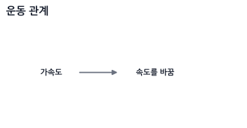


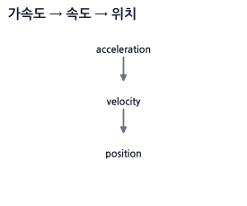

## 46. 자동차 비유

자동차 위치가 `position`입니다.

자동차가 오른쪽으로 초속 10m 움직이면 `velocity`입니다.

```txt
velocity = { x: 10, y: 0 }
```

자동차의 계기판에 10m/s라고만 뜨면 `speed`입니다.

```txt
speed = 10
```

엑셀을 밟아서 속도가 점점 증가하면 `acceleration`입니다.

```txt
acceleration = { x: 2, y: 0 }
```

---

## 47. dt는 프레임 독립 이동의 핵심

게임 루프는 매 프레임 실행됩니다.

하지만 컴퓨터마다 프레임 수가 다를 수 있습니다.

```txt
60fps: 1초에 60번 업데이트
144fps: 1초에 144번 업데이트
```

프레임마다 `position.x += 1`을 하면 144fps 컴퓨터가 더 빨리 움직입니다.

그래서 `dt`를 씁니다.

```js
position.x += velocity.x * dt;
```

`dt`는 지난 프레임 이후 흐른 시간입니다.

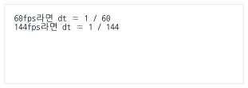


속도가 초당 100px이면:

```js
position.x += 100 * dt;
```

어떤 fps에서도 1초에 약 100px 움직입니다.

> **기억 문장:** dt는 “이번 프레임이 1초 중 몇 조각인지”다.

---

## 48. 미분과 적분을 개발 감각으로 보기

수학책에서는 미적분이 복잡하게 느껴지지만, 실무 개발(물리엔진)에서는 다음과 같이 매우 단순하게 이해할 수 있습니다.

* **미분(Differentiation):** 어떤 물리량이 지금 이 순간 얼마나 빠르게 변하고 있는지, 그 <strong>'순간 변화율'</strong>을 구하는 것. (위치를 미분하면 속도, 속도를 미분하면 가속도)
* **적분(Integration):** 시간 조각 $dt$ 동안 일어난 <strong>'작은 변화량'</strong>을 현재 값에 계속 누적하여 최종 상태를 복원하는 것.

물리엔진에서는 다음과 같이 적분을 통해 캐릭터를 이동시키고 중력을 적용합니다.

```txt
가속도(a)를 누적(적분)하여 -> 속도(v)를 구하고,
속도(v)를 누적(적분)하여 -> 위치(x)를 구한다.
```

## 49. 수치 적분법(Numerical Integration)의 세 가지 방식

컴퓨터는 연속적인 계산을 할 수 없으므로, 매 프레임 $dt$ 간격으로 이 적분을 근사하여 해결합니다. 이를 수치 적분이라고 하며, 실무에서는 주로 다음 세 가지 방식이 쓰입니다.

### A. 명시적 오일러 (Explicit Euler / Forward Euler)
현재 프레임의 속도를 바탕으로 위치를 먼저 바꾼 뒤, 가속도로 속도를 갱신합니다.

```js
// [JavaScript - CPU 물리 시뮬레이션 적분 연산]

// 1. 현재 속도로 위치를 먼저 업데이트
position.x += velocity.x * dt;
position.y += velocity.y * dt;

// 2. 가속도로 속도를 업데이트
velocity.x += acceleration.x * dt;
velocity.y += acceleration.y * dt;
```
* **문제점:** 수학적으로 오차가 매 단계마다 밖으로 발산하는 성질을 가집니다. 스프링 진동 운동이나 공전 궤도 시뮬레이션 등에 사용 시 물체가 에너지를 무한히 얻어 궤도 밖으로 폭발하듯 튕겨 나가는 치명적인 불안정성을 보입니다. 실무에서는 거의 쓰이지 않습니다.

### B. 반암시적 오일러 (Semi-implicit Euler / Symplectic Euler)
가속도로 속도를 먼저 갱신하고, 그 새로운 속도로 위치를 업데이트합니다. **코드상 순서만 바뀐 형태**입니다.

```js
// [JavaScript - CPU 물리 시뮬레이션 적분 연산]

// 1. 가속도로 속도를 먼저 업데이트
velocity.x += acceleration.x * dt;
velocity.y += acceleration.y * dt;

// 2. 새로운 속도로 위치를 업데이트
position.x += velocity.x * dt;
position.y += velocity.y * dt;
```
* **특징:** 정확한 에너지를 매 순간 보존하는 방법은 아니지만, 명시적 오일러보다 에너지 오차가 장시간 제한되는 경향이 있어 강체 물리에서 널리 쓰입니다. 다만 `dt`가 너무 크거나 스프링이 매우 강하면 여전히 불안정할 수 있습니다. 실제 엔진은 반암시적 적분 외에도 반복 제약 풀이, 감쇠, 연속 충돌 검출 등 여러 기법을 함께 사용합니다.

### C. 베를레 적분 (Verlet Integration)
속도(Velocity) 변수를 명시적으로 저장하지 않고, **'현재 위치'와 '이전 프레임의 위치'의 차이**를 통해 속도를 암묵적으로 계산하여 이동을 갱신하는 방식입니다.

공식:
$$x_{new} = 2x_{current} - x_{previous} + a \cdot dt^2$$

> **왜 속도 변수가 없어도 되나?**
> 한 스텝 앞($x_{current} + v\,dt + \frac12 a\,dt^2$)과 한 스텝 뒤($x_{previous} = x_{current} - v\,dt + \frac12 a\,dt^2$)의 테일러 전개 두 개를 **더하면 속도항($v\,dt$)이 부호가 반대라 상쇄**되고 $x_{new} + x_{previous} = 2x_{current} + a\,dt^2$만 남습니다. 여기서 $x_{new}$에 대해 정리한 것이 위 공식입니다. 즉 속도는 `현재 위치 - 이전 위치` 안에 이미 녹아 있어서 따로 저장할 필요가 없습니다.

코드:
```js
// [JavaScript - CPU 물리 시뮬레이션 적분 연산]
function updateVerlet(body, dt) {
  // 이전 위치 백업
  const tempX = body.x;
  const tempY = body.y;

  // 베를레 적분 공식 적용 (이전 프레임과의 변위차로 움직임 추적)
  body.x = 2 * body.x - body.prevX + body.ax * dt * dt;
  body.y = 2 * body.y - body.prevY + body.ay * dt * dt;

  // 이전 위치 갱신
  body.prevX = tempX;
  body.prevY = tempY;

  // 가속도 초기화 (매 프레임 힘 누적 후 리셋)
  body.ax = 0;
  body.ay = 0;
}
```
> 이 단순한 위치 베를레 공식은 <strong>고정된 `dt`</strong>를 전제로 합니다. 프레임마다 `dt`가 크게 달라지면 `현재 위치 - 이전 위치`에 저장된 속도의 시간 기준도 달라져 움직임과 에너지가 왜곡됩니다. 실시간 물리에서는 고정 시간 간격을 사용하거나 가변 시간 간격을 보정한 공식을 사용해야 합니다.

* **주의점:** 속도가 `current - previous`에 암묵적으로 들어 있으므로 현재 위치만 강제로 고치면 다음 스텝의 속도도 함께 바뀝니다. 충돌이나 제약으로 위치를 보정할 때는 이것을 의도한 속도 변화로 사용할지, `previous`도 같은 양만큼 옮겨 속도를 보존할지 명시적으로 정해야 합니다.
* **실무 활용:** **밧줄(Rope), 옷감(Cloth / Fabric), 간단한 레그돌**에서는 위치 기반 제약 풀이와 함께 자주 사용됩니다. 현대 구현은 단순 Verlet 자체보다 PBD/XPBD처럼 제약 오차, 강성, 시간 스텝 의존성을 명시적으로 다루는 방법으로 확장하는 경우가 많습니다.

이게 아주 단순한 적분입니다.

## 50. 중력 예제

```js
// [JavaScript - CPU 물리 시뮬레이션 적분 연산]
const gravity = { x: 0, y: 980 }; // px/s² (중력 가속도)

function update(body, dt) {
  // 중력을 속도에 누적 (적분)
  body.velocity.x += gravity.x * dt;
  body.velocity.y += gravity.y * dt;

  // 새로운 속도로 위치 갱신 (적분)
  body.position.x += body.velocity.x * dt;
  body.position.y += body.velocity.y * dt;
}
```

처음에는 천천히 떨어지다가 시간이 지날수록 빨라집니다.

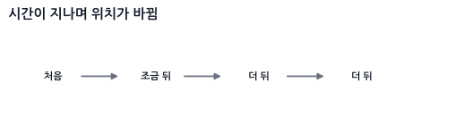


왜냐하면 중력이 위치를 직접 바꾸는 게 아니라, 속도를 계속 바꾸기 때문입니다.

---

# Part 6. 힘과 물리엔진 기초

## 51. 힘은 가속도를 만든다

뉴턴의 두 번째 법칙:

```txt
F = m * a
```

즉, 힘 $F$를 질량 $m$으로 나눈 것이 가속도 $a$가 됩니다.

```txt
a = F / m
```

코드:

```js
function applyForce(body, force) {
  body.acceleration.x += force.x / body.mass;
  body.acceleration.y += force.y / body.mass;
}
```

> 이건 개념을 보여주는 가장 단순한 버전입니다. 이대로 쓰면 `acceleration`이 프레임마다 계속 쌓이므로, 매 프레임 적분이 끝난 뒤 `0`으로 리셋해 주어야 합니다. 실무에서는 아예 가속도가 아니라 **힘을 누적**했다가 마지막에 한 번만 나누는 52절의 방식을 씁니다.

질량이 크면 같은 힘을 받아도 덜 움직입니다.

```txt
가벼운 공: 같은 힘에도 휙 날아감
무거운 상자: 같은 힘에도 조금 움직임
```

## 52. 힘 누적 방식

물리엔진에서는 한 프레임 동안 작동하는 다양한 힘(중력, 키보드 조작, 저항 등)을 모두 모았다가(누적), 마지막에 가속도를 계산하여 적용합니다.

```js
function applyForce(body, force) {
  body.force.x += force.x;
  body.force.y += force.y;
}

// 반암시적 오일러 적분기를 통한 속도와 위치 갱신
function integrate(body, dt) {
  if (body.mass === 0) return; // 고정된 물체(무한 질량)는 갱신 안 함

  const ax = body.force.x / body.mass;
  const ay = body.force.y / body.mass;

  // 1. 속도 먼저 업데이트
  body.velocity.x += ax * dt;
  body.velocity.y += ay * dt;

  // 2. 새로운 속도로 위치 업데이트
  body.position.x += body.velocity.x * dt;
  body.position.y += body.velocity.y * dt;

  // 3. 다음 프레임을 위한 누적 힘 리셋
  body.force.x = 0;
  body.force.y = 0;
}
```

## 53. 실무 마찰과 저항: 공기 저항 (Drag Force)

물체가 공기나 물 같은 유체 속을 움직일 때 속도의 반대 방향으로 받는 저항력입니다. 저항력을 물리엔진에 반영하지 않으면 물체가 감속하지 않고 영원히 날아갑니다.

### A. 선형 공기 저항 (Linear Drag)
느린 속도로 움직이는 물체나 단순 2D 탑다운 게임에서 마찰 효과를 줄 때 씁니다. 속력에 정비례하여 힘이 감소합니다.
$$\vec{F}_{drag} = -c \cdot \vec{v}$$

코드:
```js
function applyLinearDrag(body, dragCoeff) {
  // 속도의 반대 방향으로 힘을 누적
  const dragForce = {
    x: -dragCoeff * body.velocity.x,
    y: -dragCoeff * body.velocity.y
  };
  applyForce(body, dragForce);
}
```

### B. 속도 제곱 저항 (Quadratic Drag)
비행기, 낙하산, 날아가는 화살 등 속도가 빠른 경우 실감나는 유체 저항을 묘사합니다. 속도의 제곱에 비례합니다.
$$\vec{F}_{drag} = -\frac{1}{2} \rho v^2 C_d A \hat{v} = -k \cdot |\vec{v}| \cdot \vec{v}$$

코드:
```js
function applyQuadraticDrag(body, k) {
  const vx = body.velocity.x;
  const vy = body.velocity.y;
  const speed = Math.sqrt(vx * vx + vy * vy);

  if (speed > 0) {
    const dragForce = {
      x: -k * speed * vx,
      y: -k * speed * vy
    };
    applyForce(body, dragForce);
  }
}
```

## 54. 종단 속도 (Terminal Velocity)

하늘에서 떨어지는 빗방울이나 낙하 대상을 시뮬레이션할 때, 중력 방향 힘($m \cdot g$)과 공기 저항력($F_{drag}$)이 평형을 이루어 가속도가 0이 되는 최대 속도 한계점을 **종단 속도**라고 합니다.

실제 종단 속도는 중력과 항력을 함께 적분했을 때 두 힘이 평형을 이루며 자연스럽게 나타납니다. 아래 코드는 그 물리를 계산하는 대신, 게임플레이에서 속도가 일정 값을 넘지 않게 만드는 <strong>인위적인 최대 속도 제한(speed cap)</strong>입니다.

코드:
```js
function clampTerminalVelocity(body, maxSpeed) {
  const vx = body.velocity.x;
  const vy = body.velocity.y;
  const speed = Math.sqrt(vx * vx + vy * vy);

  if (speed > maxSpeed) {
    body.velocity.x = (vx / speed) * maxSpeed;
    body.velocity.y = (vy / speed) * maxSpeed;
  }
}
```

## 55. 포물선 탄도학 (Ballistic Trajectory)

대포를 쏘거나 화살을 쏠 때, 고정된 초기 속력 $v_0$로 상대 위치 $(x, y)$에 있는 타겟을 정확히 맞추기 위한 <strong>조준 발사각 $\theta$</strong>를 계산하는 기법입니다.

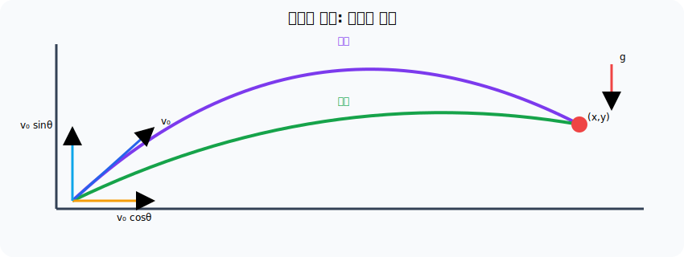

> **좌표계 전제:** 아래 공식은 수학 좌표계 `y-up`, 아래로 작용하는 중력의 **크기** `g > 0`, 수평 상대거리 `x > 0`을 가정합니다. Canvas의 `y-down` 좌표를 사용한다면 목표의 y차와 중력 부호를 이 규약으로 변환한 뒤 계산해야 합니다.

> **이 공식은 어디서 왔나?**
> 하늘에서 뚝 떨어진 마법 공식이 아니라, 앞의 **44절 등가속도 운동 공식**에서 유도됩니다. 발사각이 $\theta$일 때 초기 속도는 $v_{0x} = v_0\cos\theta$, $v_{0y} = v_0\sin\theta$로 나뉩니다. 이를 수평·수직 위치 공식에 각각 대입하면 다음 두 식이 나옵니다.
> $$x = (v_0\cos\theta)\, t, \qquad y = (v_0\sin\theta)\, t - \tfrac{1}{2} g t^2$$
> 첫 식에서 비행 시간 $t = x / (v_0\cos\theta)$를 구해 둘째 식에 대입하고, $\tan\theta$에 대한 2차 방정식으로 정리해 근의 공식으로 풀면 아래 발사각 공식이 나옵니다. (즉, "시간 $t$를 소거하고 $\theta$만 남긴" 결과입니다.)

공식:
$$\theta = \arctan\left(\frac{v_0^2 \pm \sqrt{v_0^4 - g(g x^2 + 2 y v_0^2)}}{gx}\right)$$

* $g$는 중력 가속도(예: 9.8), $x$와 $y$는 목표물과 나의 상대적 거리 차이입니다.
* **좌표계 주의:** 이 공식은 **$y$가 위로 증가하는 수학 좌표계**(중력이 $-y$ 방향, $g > 0$)를 전제로 유도했습니다. Canvas처럼 $y$가 아래로 증가하는 화면 좌표계에서 쓰려면 목표의 $y$를 뒤집어(`targetY = -(mouse.y - player.y)`) 넣고, 나온 각도도 다시 뒤집어(`-angle`) 써야 합니다. 이걸 빠뜨리면 고각과 저각이 서로 바뀌어 포탄이 엉뚱한 곳으로 날아갑니다.
* $\pm$ 부호에 따라 포탄의 궤적이 2가지 나옵니다. ($+$는 높게 포물선을 그리며 떨어지는 고각, $-$는 직사 형태로 날아가는 저각)
* 루트 내부가 음수($<0$)가 되면 주어진 초기 속력 $v_0$로는 사거리가 부족하여 타겟에 닿을 수 없음을 의미합니다.

코드:
```js
function solveLaunchAngle(targetX, targetY, v0, g) {
  const v2 = v0 * v0;
  const v4 = v2 * v2;
  const gX = g * targetX;

  // 판별식 계산
  const discriminant = v4 - g * (g * targetX * targetX + 2 * targetY * v2);

  if (discriminant < 0) {
    return null; // 사거리 부족으로 타격 불가능
  }

  const root = Math.sqrt(discriminant);

  // 고각 (High trajectory)
  const angleHigh = Math.atan2(v2 + root, gX);
  // 저각 (Low trajectory)
  const angleLow = Math.atan2(v2 - root, gX);

  return {
    high: angleHigh, // 라디안
    low: angleLow    // 라디안
  };
}
```

## 56. 스프링과 감쇠: 후크의 법칙 (Hooke's Law)

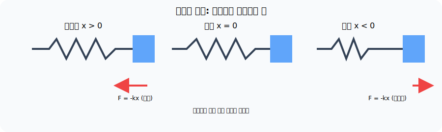

> **실무 맥락 (Mental Hook) - 출렁이는 카메라, 젤리 UI, 밧줄:**
> 카메라가 플레이어를 딱딱하게 따라가는 대신 살짝 늦게 따라붙었다가 부드럽게 멈추게 하고 싶습니다. 버튼을 누르면 말랑하게 눌렸다가 통통 튀며 제자리로 돌아오게 하고 싶습니다. 이 "제자리로 돌아오려는 성질"을 만드는 것이 **스프링**입니다.

스프링은 아주 단순한 규칙 하나로 동작합니다.

```txt
원래 길이에서 벗어난 만큼, 그 반대 방향으로 당기는 힘이 생긴다.
```

이것이 **후크의 법칙**입니다.

$$\vec{F}_{spring} = -k \cdot \vec{x}$$

* $k$는 <strong>강성 계수(stiffness)</strong>입니다. 크면 뻣뻣한 강철 스프링, 작으면 흐물흐물한 고무줄이 됩니다.
* $\vec{x}$는 **평형 위치(원래 있어야 할 자리)로부터 벗어난 변위**입니다.
* 앞의 마이너스 부호가 핵심입니다. 오른쪽으로 늘어나면 왼쪽으로 당기고, 왼쪽으로 눌리면 오른쪽으로 밀어냅니다. **항상 제자리로 돌아오려는 방향**이라는 뜻입니다.

### 56.1 왜 감쇠(Damping)가 반드시 필요한가

후크의 법칙만 적용하면 스프링은 **영원히 진동합니다**. 제자리를 지나칠 때 속도가 최대라서 그대로 반대편으로 넘어가고, 다시 당겨져 되돌아오기를 무한 반복하기 때문입니다.

그래서 실무에서는 **속도에 비례해 반대로 작용하는 감쇠력**을 같이 넣습니다. 53절의 선형 공기 저항과 정확히 같은 형태입니다.

$$\vec{F}_{damping} = -c \cdot \vec{v}$$

두 힘을 합친 것이 물리엔진에서 말하는 <strong>스프링-댐퍼(Spring-Damper)</strong>입니다.

$$\vec{F} = -k \cdot \vec{x} - c \cdot \vec{v}$$

감쇠 계수 $c$의 크기에 따라 움직임의 성격이 완전히 달라집니다.

```txt
c가 너무 작으면: 통통 여러 번 튕기며 천천히 멈춤 (underdamped, 젤리/카툰 느낌)
c가 적당하면:   한 번 살짝 넘어갔다가 부드럽게 정착 (게임에서 가장 많이 쓰는 느낌)
c가 너무 크면:  전혀 튕기지 않고 느릿하게 기어감 (overdamped, 끈적한 느낌)
```

코드 (52절의 힘 누적 방식에 그대로 얹으면 됩니다):

```js
// [JavaScript - CPU 물리 시뮬레이션 힘 연산]

// body를 anchor 지점으로 당기는 스프링 (restLength = 0이면 그 점에 붙으려 함)
function applySpringForce(body, anchor, restLength, stiffness, damping) {
  const delta = {
    x: body.position.x - anchor.x,
    y: body.position.y - anchor.y
  };

  const dist = Math.hypot(delta.x, delta.y);
  if (dist === 0) return; // 방향을 정할 수 없음

  const dir = { x: delta.x / dist, y: delta.y / dist };

  // 1. 후크의 법칙: 평형 길이에서 벗어난 만큼 반대로 당김
  const displacement = dist - restLength;
  const springMag = -stiffness * displacement;

  // 2. 감쇠: 늘어나고 줄어드는 속도(법선 방향 속도)에 반대로 작용
  const velAlongDir = dot(body.velocity, dir);
  const dampingMag = -damping * velAlongDir;

  const totalMag = springMag + dampingMag;

  applyForce(body, {
    x: dir.x * totalMag,
    y: dir.y * totalMag
  });
}
```

> **기억 문장:** 스프링은 "벗어난 거리"에 비례해 되돌리고, 감쇠는 "움직이는 속도"에 비례해 붙잡는다.

> **127절의 단순 감쇠와 무엇이 다른가?** `velocity *= damping`은 목표 없이 그냥 속도를 줄이는 마찰입니다. 스프링은 **돌아갈 목표 지점(평형 위치)이 있다는 점**이 다릅니다. 그리고 87절의 LERP 추적과 비교하면, LERP는 속도 개념 없이 위치를 목표 쪽으로 끌어당기기만 하므로 절대 넘어가지 않지만, 스프링은 속도(관성)를 가지므로 목표를 살짝 지나쳤다가 되돌아오는 **탄력 있는 오버슈트**가 생깁니다. 이 오버슈트가 바로 UI와 카메라를 "살아 있게" 만드는 감각입니다.

> [!WARNING]
> 스프링은 `dt`가 크거나 `stiffness`가 아주 높으면 **폭발합니다**. 힘이 커질수록 속도가 커지고, 속도가 커질수록 다음 프레임에 더 멀리 지나쳐서 힘이 더 커지는 악순환에 빠지기 때문입니다(49절에서 말한 수치 적분의 불안정성). 뻣뻣한 스프링을 쓸 때는 고정 `dt`를 사용하거나, 물리 스텝을 여러 번 잘게 쪼개어(substep) 계산해야 합니다.

> **$k$와 $c$를 직접 튜닝하기 어렵다면:** 강성 $k$와 감쇠 $c$는 질량에 따라 체감이 달라져서 손으로 맞추기가 까다롭습니다. 그래서 카메라나 UI처럼 **원하는 느낌을 직접 지정하고 싶을 때는**, 같은 스프링을 <strong>진동수 $\omega$와 감쇠비 $\zeta$</strong>로 바꿔 쓰는 편이 훨씬 편합니다. 두 표현은 완전히 같은 물리이며 $\omega^2 = k/m$, $2\zeta\omega = c/m$의 관계로 연결됩니다. 특히 $\zeta = 1$은 <strong>전혀 흔들리지 않으면서 가장 빠르게 도달하는 임계 감쇠(critical damping)</strong>라, 카메라 추적의 기본값으로 쓰기 좋습니다. 이 형태의 코드는 **57절 스프링 카메라와 임계 감쇠**에서 다룹니다.

---

## 57. 스프링 카메라와 임계 감쇠

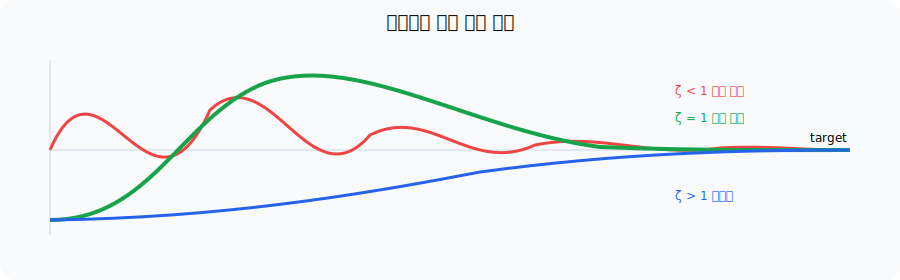

LERP 추적은 간단하지만 실제 속도 상태가 없어 자연스러운 관성이 제한됩니다. 스프링은 위치 오차와 속도에 따라 가속합니다.

$$a=\omega^2(target-x)-2\zeta\omega v$$

이것은 **56절의 후크의 법칙($F = -kx - cv$)과 완전히 같은 스프링**입니다. 양변을 질량으로 나눠 가속도 형태로 바꾸고, 튜닝하기 쉬운 두 값으로 파라미터만 갈아끼운 것입니다.

```txt
ω (각진동수)  = sqrt(k / m)    "얼마나 빠르게 반응하는가"
ζ (감쇠비)    = c / (2·sqrt(k·m))  "얼마나 흔들리는가"
```

$k$와 $c$는 질량에 따라 체감이 달라져 손으로 맞추기 어렵지만, $\omega$와 $\zeta$는 **의미가 직관적이라 디자이너가 바로 튜닝할 수 있습니다.** 그래서 물리엔진 내부의 56절은 힘 기반으로, 카메라·UI 연출은 이 형태로 쓰는 것이 보통입니다.

`ζ=1`은 진동 없이 가장 빠르게 목표로 수렴하는 임계 감쇠입니다.

```txt
ζ < 1  통통 튀며 수렴 (underdamped, 젤리 느낌)
ζ = 1  전혀 튀지 않고 최단 시간에 정착 (critical, 카메라 기본값)
ζ > 1  느릿하게 기어감 (overdamped)
```

```js
function updateSpring1D(state, target, frequency, dampingRatio, dt) {
  const omega = 2 * Math.PI * frequency;
  const acceleration = omega * omega * (target - state.position)
    - 2 * dampingRatio * omega * state.velocity;
  state.velocity += acceleration * dt;
  state.position += state.velocity * dt;
}
```

큰 `dt`에서는 이 단순 적분도 불안정할 수 있으므로 고정 스텝 또는 해석적 spring 공식을 사용합니다.

| 값을 바꾸면 | 체감 |
|---|---|
| `frequency` 증가 | 목표를 더 빠르고 단단하게 따라감 |
| `frequency` 감소 | 느리고 부드럽게 따라감 |
| `dampingRatio < 1` | 목표를 지나쳐 흔들림 |
| `dampingRatio = 1` | 진동 없이 빠르게 정착 |
| `dampingRatio > 1` | 진동은 없지만 둔하게 정착 |

## 58. 반사는 법선 방향 성분을 뒤집는 것

공이 벽에 튕기는 상황을 봅시다.

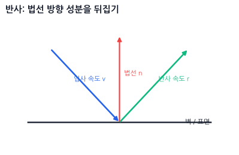


법선 `normal`은 표면에 수직인 방향입니다.
반사는 속도 전체를 뒤집는 게 아니라, **normal 방향 성분만 반대로 뒤집는 것**입니다.

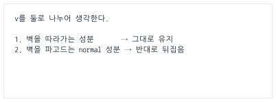


반사 공식:

```txt
r = v - 2 * dot(v, n) * n
```

단, `n`은 정규화되어 있어야 합니다. 그리고 여기서 `n`은 **표면에서 물체를 향하는 방향**(벽 → 공)입니다. 이 절과 59절의 벽 튕김 코드는 이 규약을 씁니다. 뒤의 충돌 판정·해결 Part에서는 물체가 둘 다 움직이므로 **A → B** 방향 법선을 쓰는데, 두 규약은 서로 반대라는 점을 기억해 두세요.

코드:

```js
function reflect(v, n) {
  const d = dot(v, n);

  return {
    x: v.x - 2 * d * n.x,
    y: v.y - 2 * d * n.y
  };
}
```

---

## 59. 벽에 튕기는 공

```js
const velocity = { x: 100, y: 50 };
const wallNormal = { x: -1, y: 0 };

const reflected = reflect(velocity, wallNormal);
```

탄성 계수를 넣으면 덜 튕기게 만들 수 있습니다.

```js
// n: 표면에서 물체를 향하는 법선 (벽 → 공)
function reflectWithRestitution(v, n, restitution) {
  const vn = dot(v, n);

  // vn >= 0이면 표면에서 이미 멀어지는 중이므로 바꾸지 않음
  if (vn >= 0) return { ...v };

  // 반발계수는 법선 성분에만 적용한다. 접선 성분은 마찰이 담당한다.
  return {
    x: v.x - (1 + restitution) * vn * n.x,
    y: v.y - (1 + restitution) * vn * n.y
  };
}
```

```js
const bounce = reflectWithRestitution(velocity, wallNormal, 0.8);
```

`restitution`은 튕김 정도입니다.

```txt
1.0 = 완전 탄성, 거의 그대로 튕김
0.5 = 절반 정도만 튕김
0.0 = 안 튕김
```

---


---

# Part 7. 충돌 판정과 기하학적 판정

## 60. 충돌 판정: AABB부터 시작하자

가장 쉬운 박스 충돌은 AABB입니다.

AABB는 축에 평행한 박스입니다.

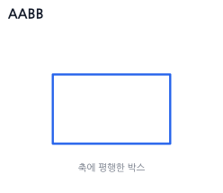


두 AABB가 겹치는지:

```js
function intersectsAABB(a, b) {
  return (
    a.min.x <= b.max.x &&
    a.max.x >= b.min.x &&
    a.min.y <= b.max.y &&
    a.max.y >= b.min.y
  );
}
```

직관:

```txt
x축에서도 겹치고,
y축에서도 겹치면,
두 박스는 겹친다.
```

## 61. AABB 판정에서 manifold로 넘어가기

앞 절의 boolean 판정을 물리엔진에서 사용할 충돌 데이터로 확장합니다.

중요한 건 이겁니다.

```txt
충돌 판정은 “겹쳤냐?”를 묻는 단계다.
충돌 해결은 “얼마나, 어느 방향으로 밀어낼까?”를 묻는 단계다.
```

AABB 판정만 할 때는 겹쳤는지만 알면 됩니다.
하지만 물리엔진에서는 보통 **충돌 방향 normal**과 **침투 깊이 penetration**도 필요합니다.

---

## 62. AABB의 충돌 방향과 침투 깊이

두 박스가 겹쳤을 때, 어느 방향으로 밀어낼지 알아야 합니다.

예를 들어 오른쪽에서 박스가 벽에 박혔다면:

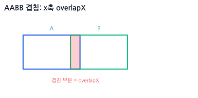


겹친 양이 x축에서 작으면 x축으로 밀어내고,
y축에서 작으면 y축으로 밀어냅니다.

코드:

```js
function getAABBManifold(a, b) {
  const intersectsX = a.min.x < b.max.x && a.max.x > b.min.x;
  const intersectsY = a.min.y < b.max.y && a.max.y > b.min.y;

  if (!intersectsX || !intersectsY) {
    return null;
  }

  // 단순 교집합 길이가 아니라, 포함 관계에서도 완전히 분리되는 최소 거리
  const overlapX = Math.min(a.max.x - b.min.x, b.max.x - a.min.x);
  const overlapY = Math.min(a.max.y - b.min.y, b.max.y - a.min.y);

  const centerA = {
    x: (a.min.x + a.max.x) / 2,
    y: (a.min.y + a.max.y) / 2
  };

  const centerB = {
    x: (b.min.x + b.max.x) / 2,
    y: (b.min.y + b.max.y) / 2
  };

  if (overlapX < overlapY) {
    return {
      normal: { x: centerA.x < centerB.x ? 1 : -1, y: 0 },
      penetration: overlapX
    };
  }

  return {
    normal: { x: 0, y: centerA.y < centerB.y ? 1 : -1 },
    penetration: overlapY
  };
}
```

여기서 `normal`은 <strong>A에서 B를 밀어내는 방향(A → B)</strong>으로 정했습니다.
이후의 OBB/SAT, 위치 보정, 임펄스 절은 모두 이 **A → B** 규약을 쓰므로 반드시 통일해야 합니다. 규약이 반대로 뒤집히면 위치 보정 코드가 두 물체를 밀어내는 대신 오히려 더 겹치게 만드는 버그가 생깁니다.

---

## 63. 원 충돌은 거리 비교다

원과 원의 충돌은 아주 직관적입니다.

```txt
두 원의 중심 거리 < 두 반지름의 합
```

그림:

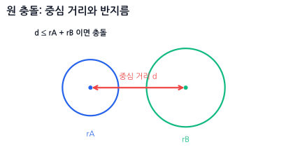


코드:

```js
function intersectCircle(a, b) {
  const dx = b.position.x - a.position.x;
  const dy = b.position.y - a.position.y;

  const r = a.radius + b.radius;

  return dx * dx + dy * dy <= r * r;
}
```

`sqrt`를 쓰지 않는 이유는 성능과 단순함 때문입니다.

```txt
거리 <= 반지름합
```

대신:

```txt
거리제곱 <= 반지름합제곱
```

으로 비교합니다.

---

## 64. 원 충돌의 normal과 penetration

원 충돌에서는 normal도 쉽습니다.


코드:

```js
function getCircleManifold(a, b) {
  const dx = b.position.x - a.position.x;
  const dy = b.position.y - a.position.y;

  const distSq = dx * dx + dy * dy;
  const radiusSum = a.radius + b.radius;

  if (distSq > radiusSum * radiusSum) {
    return null;
  }

  const dist = Math.sqrt(distSq);

  if (dist === 0) {
    return {
      normal: { x: 1, y: 0 },
      penetration: radiusSum
    };
  }

  return {
    normal: {
      x: dx / dist,
      y: dy / dist
    },
    penetration: radiusSum - dist
  };
}
```

주의:

```txt
두 원의 중심이 완전히 같으면 방향을 정할 수 없다.
```

그래서 `dist === 0`일 때는 임시 방향을 하나 정해줍니다.

---

## 65. 원-박스 충돌

원-박스 충돌은 처음 보면 어려워 보이지만, 핵심은 단순합니다.

기억 문장:

```txt
원 중심에서 박스 안의 가장 가까운 점을 찾고,
그 점과 원 중심의 거리를 비교한다.
```

그림:


AABB 박스 기준으로 가장 가까운 점은 `clamp`로 구합니다.

```js
function clamp(value, min, max) {
  return Math.max(min, Math.min(max, value));
}
```

코드:

```js
function intersectCircleAABB(circle, box) {
  const closest = {
    x: clamp(circle.position.x, box.min.x, box.max.x),
    y: clamp(circle.position.y, box.min.y, box.max.y)
  };

  const dx = circle.position.x - closest.x;
  const dy = circle.position.y - closest.y;

  return dx * dx + dy * dy <= circle.radius * circle.radius;
}
```

이 공식은 게임에서 정말 많이 씁니다.

예:

```txt
플레이어 원형 히트박스 vs 벽 사각형
총알 원형 히트박스 vs 박스 장애물
아이템 획득 범위 vs 상자
```

## 66. 원-박스 충돌의 normal과 penetration

단순히 겹쳤는지 판정하는 것 외에, 물리가 반응하려면 충돌 법선(normal)과 겹침 깊이(penetration)가 필요합니다.

이 책의 공통 규약대로 `circle`을 A, `box`를 B로 보고 법선은 **A → B** 방향으로 반환합니다. 따라서 바깥 충돌에서는 원 중심에서 박스의 가장 가까운 점으로 향하는 벡터를 사용합니다. 뒤의 위치 보정이 A를 `-normal`, B를 `+normal` 방향으로 움직이므로 원은 박스 바깥으로 밀려납니다.

코드:

```js
function getCircleAABBManifold(circle, box) {
  const closest = {
    x: clamp(circle.position.x, box.min.x, box.max.x),
    y: clamp(circle.position.y, box.min.y, box.max.y)
  };

  // 충돌 거리 계산용: closest → circle
  const dx = circle.position.x - closest.x;
  const dy = circle.position.y - closest.y;
  const distSq = dx * dx + dy * dy;

  if (distSq > circle.radius * circle.radius) {
    return null; // 충돌 없음
  }

  const dist = Math.sqrt(distSq);

  // 원의 중심이 박스 내부에 완전히 갇힌 경우 예외 처리
  if (dist === 0) {
    // 박스의 4면 중 가장 가까운 면을 찾아서 밀어냄
    // (dt는 이 책에서 델타 타임을 뜻하므로, 거리 변수는 distTop처럼 따로 이름 짓는다)
    const distLeft = circle.position.x - box.min.x;
    const distRight = box.max.x - circle.position.x;
    const distTop = circle.position.y - box.min.y;
    const distBottom = box.max.y - circle.position.y;

    const minOverlap = Math.min(distLeft, distRight, distTop, distBottom);

    if (minOverlap === distLeft) {
      return { normal: { x: 1, y: 0 }, penetration: circle.radius + distLeft };
    } else if (minOverlap === distRight) {
      return { normal: { x: -1, y: 0 }, penetration: circle.radius + distRight };
    } else if (minOverlap === distTop) {
      return { normal: { x: 0, y: 1 }, penetration: circle.radius + distTop };
    } else {
      return { normal: { x: 0, y: -1 }, penetration: circle.radius + distBottom };
    }
  }

  return {
    // 원(A) → 박스(B). 거리 계산 벡터와 반대 방향이다.
    normal: { x: -dx / dist, y: -dy / dist },
    penetration: circle.radius - dist
  };
}
```

이 함수를 통해 벽(AABB)에 부딪힌 동그란 캐릭터(Circle)를 적절히 밀어내고 미끄러지도록 처리할 수 있습니다.

---

## 67. 회전된 박스 OBB를 보는 감각

OBB는 **Oriented Bounding Box**입니다.
즉, 회전된 박스입니다.


AABB는 x축, y축에 딱 맞게 서 있습니다.
OBB는 자기만의 x축, y축을 가지고 회전합니다.

기억 문장:

```txt
OBB는 회전된 로컬 좌표계를 가진 박스다.
```

OBB를 표현하려면 보통 아래 정보가 필요합니다.

```js
const box = {
  center: { x: 300, y: 200 },
  halfSize: { x: 50, y: 25 },
  rotation: Math.PI / 6
};
```

그리고 박스의 로컬 축을 구합니다.

```js
function getBoxAxes(rotation) {
  const c = Math.cos(rotation);
  const s = Math.sin(rotation);

  return {
    xAxis: { x: c, y: s },
    yAxis: { x: -s, y: c }
  };
}
```

여기서:

```txt
xAxis = 박스의 오른쪽 방향
 yAxis = 박스의 위쪽 또는 아래쪽 방향
```

화면 좌표계에서는 y 방향 때문에 “위쪽”이 헷갈릴 수 있지만,
중요한 건 두 축이 서로 직각이라는 점입니다.

---

## 68. 회전된 박스 OBB

회전된 박스는 AABB보다 어렵습니다.


먼저 로컬 꼭짓점을 만들고:

```js
function getBoxVertices(box) {
  const hw = box.width / 2;
  const hh = box.height / 2;

  const local = [
    { x: -hw, y: -hh },
    { x:  hw, y: -hh },
    { x:  hw, y:  hh },
    { x: -hw, y:  hh }
  ];

  return local.map(p =>
    transformPoint2D(p, box.position, box.rotation, box.scale)
  );
}
```

이 과정은 결국:

```txt
로컬 좌표 → 회전 → 이동 → 월드 좌표
```

입니다.

## 69. 점이 회전된 박스 안에 있는지 검사하기

월드 점을 박스의 로컬 좌표로 되돌리면 쉽습니다.

```js
function worldToLocal(point, body) {
  const translated = {
    x: point.x - body.position.x,
    y: point.y - body.position.y
  };

  const rotated = rotatePoint(translated, -body.rotation);

  return {
    x: rotated.x / body.scale.x,
    y: rotated.y / body.scale.y
  };
}

function pointInBoxLocal(p, halfWidth, halfHeight) {
  return (
    p.x >= -halfWidth &&
    p.x <=  halfWidth &&
    p.y >= -halfHeight &&
    p.y <=  halfHeight
  );
}
```

사용:

```js
const localMouse = worldToLocal(mouseWorld, box);

if (pointInBoxLocal(localMouse, box.width / 2, box.height / 2)) {
  console.log("박스 클릭됨");
}
```

> **기억 문장:** 충돌 검사가 어렵다면, 월드를 로컬로 되돌려서 쉬운 모양으로 검사한다.

---

## 70. SAT 분리축 정리

SAT는 **Separating Axis Theorem**입니다.
한글로는 보통 **분리축 정리**라고 부릅니다.

말은 어려운데 감각은 이겁니다.

```txt
어떤 축 하나라도 두 도형의 그림자가 겹치지 않으면 충돌하지 않는다.
모든 후보 축에서 그림자가 겹치면 충돌한다.
```

투영을 “그림자”라고 했던 걸 떠올리면 됩니다.


반대로:


SAT의 결론:

```txt
모든 중요한 축에서 겹쳐야 진짜 충돌이다.
```

---

## 71. OBB vs OBB에서 검사할 축

두 OBB가 충돌하는지 보려면 후보 축은 4개입니다.

```txt
박스 A의 x축
박스 A의 y축
박스 B의 x축
박스 B의 y축
```

왜 이 네 개만 보면 될까요?

사각형의 분리축은 각 변의 법선 방향입니다.
OBB의 변 방향과 법선 방향은 결국 박스의 로컬 x축/y축과 같습니다.

코드 흐름:

```txt
1. 각 박스의 꼭짓점 4개를 구한다.
2. 검사할 축 4개를 만든다.
3. 각 축에 두 박스 꼭짓점을 투영한다.
4. 투영 구간이 하나라도 안 겹치면 충돌 아님.
5. 전부 겹치면 충돌.
```

---

## 72. 점들을 축에 투영하기

SAT에서 “점들을 축에 투영한다”는 말은, 각 꼭짓점을 축 위의 숫자로 바꾼다는 뜻입니다.

점 하나를 축에 투영할 때는 내적을 씁니다.

```txt
projection = point · axis
```

여기서 결과는 2D 점이 아니라 **axis 위에서의 위치를 나타내는 숫자 하나**입니다.


점 여러 개를 투영하면 숫자들이 나옵니다.

```txt
[3.2, 4.1, 7.8, 6.5]
```

이 중 최소값과 최대값이 그 도형의 “그림자 구간”입니다.

```js
function projectPoints(points, axis) {
  let min = dot(points[0], axis);
  let max = min;

  for (let i = 1; i < points.length; i++) {
    const p = dot(points[i], axis);
    min = Math.min(min, p);
    max = Math.max(max, p);
  }

  return { min, max };
}
```

구간이 겹치는지 확인:

```js
function overlapInterval(a, b) {
  return a.min <= b.max && b.min <= a.max;
}

function getIntervalOverlap(a, b) {
  // 한 구간이 다른 구간 안에 완전히 포함된 경우까지 고려한 분리 거리
  return Math.min(a.max - b.min, b.max - a.min);
}
```

---

## 73. OBB vs OBB 충돌 코드

먼저 유틸 함수입니다.

```js
function dot(a, b) {
  return a.x * b.x + a.y * b.y;
}

function normalize(v) {
  const len = Math.hypot(v.x, v.y);

  if (len === 0) {
    return { x: 0, y: 0 };
  }

  return {
    x: v.x / len,
    y: v.y / len
  };
}
```

OBB 꼭짓점 구하기:

```js
function getOBBVertices(box) {
  const axes = getBoxAxes(box.rotation);
  const hx = box.halfSize.x;
  const hy = box.halfSize.y;

  const corners = [
    { x: -hx, y: -hy },
    { x:  hx, y: -hy },
    { x:  hx, y:  hy },
    { x: -hx, y:  hy }
  ];

  return corners.map(p => ({
    x: box.center.x + axes.xAxis.x * p.x + axes.yAxis.x * p.y,
    y: box.center.y + axes.xAxis.y * p.x + axes.yAxis.y * p.y
  }));
}
```

SAT 충돌 판정:

```js
function intersectOBB(a, b) {
  const verticesA = getOBBVertices(a);
  const verticesB = getOBBVertices(b);

  const axesA = getBoxAxes(a.rotation);
  const axesB = getBoxAxes(b.rotation);

  const axes = [
    axesA.xAxis,
    axesA.yAxis,
    axesB.xAxis,
    axesB.yAxis
  ];

  for (const axis of axes) {
    const n = normalize(axis);
    const projA = projectPoints(verticesA, n);
    const projB = projectPoints(verticesB, n);

    if (!overlapInterval(projA, projB)) {
      return false;
    }
  }

  return true;
}
```

이제 회전된 박스끼리 충돌 여부를 검사할 수 있습니다.

---

## 74. SAT에서 충돌 normal과 penetration 구하기

물리엔진에서는 `true/false`만으로 부족합니다.
충돌했다면 어느 방향으로 얼마나 밀어낼지도 필요합니다.

SAT에서는 각 축의 겹침량을 계산하고, 가장 작은 겹침량을 찾습니다.

```txt
가장 적게 겹친 축 = 가장 적게 밀어내도 되는 방향
```

코드:

```js
function getOBBManifold(a, b) {
  const verticesA = getOBBVertices(a);
  const verticesB = getOBBVertices(b);

  const axesA = getBoxAxes(a.rotation);
  const axesB = getBoxAxes(b.rotation);

  const axes = [
    axesA.xAxis,
    axesA.yAxis,
    axesB.xAxis,
    axesB.yAxis
  ];

  let minOverlap = Infinity;
  let smallestAxis = null;

  for (const axis of axes) {
    const n = normalize(axis);
    const projA = projectPoints(verticesA, n);
    const projB = projectPoints(verticesB, n);
    const overlap = getIntervalOverlap(projA, projB);

    if (overlap <= 0) {
      return null;
    }

    if (overlap < minOverlap) {
      minOverlap = overlap;
      smallestAxis = n;
    }
  }

  const centerDelta = {
    x: b.center.x - a.center.x,
    y: b.center.y - a.center.y
  };

  if (dot(centerDelta, smallestAxis) < 0) {
    smallestAxis = {
      x: -smallestAxis.x,
      y: -smallestAxis.y
    };
  }

  return {
    normal: smallestAxis,
    penetration: minOverlap
  };
}
```

이제 OBB 충돌도 아래 정보를 얻을 수 있습니다.

```txt
충돌 여부
충돌 방향 normal
겹친 깊이 penetration
```

---


---

# Part 8. 충돌 해결과 충돌 물리학

## 75. 충돌 해결의 두 단계

충돌 판정이 만든 manifold에는 최소한 normal, penetration, contact point가 들어 있습니다. 충돌 해결은 이 데이터를 두 단계에서 사용합니다.

```txt
위치 단계: 이미 생긴 겹침을 줄인다.
속도 단계: 다음 순간 다시 파고들지 않도록 상대속도를 바꾼다.
```

이 Part에서는 normal을 **A에서 B로 향하는 방향**으로 통일합니다. 한 물체와 고정 벽의 단순 반사는 59절에서 이미 다뤘으므로 여기서는 반복하지 않고, 역질량과 상대속도를 사용하는 두 물체의 일반식으로 확장합니다.

## 76. 위치 보정: 겹친 물체를 밀어내기

충돌한 두 물체가 서로 겹쳐 있으면, 일단 위치를 보정해야 합니다.

가장 단순한 방법:

```txt
A를 normal 반대 방향으로 밀고,
B를 normal 방향으로 민다.
```

이때 **얼마씩 나눠서 밀지**가 중요합니다. 무조건 절반씩 밀면 벽이나 바닥처럼 움직이면 안 되는 물체(`invMass = 0`)까지 밀려납니다. 그래서 **역질량에 비례해서** 보정량을 나눕니다. 가벼운 물체(역질량이 큼)가 많이 밀려나고, 무거운 물체는 조금만 밀려나며, 역질량이 0인 물체는 아예 움직이지 않습니다. (86절 거리 제약에서 쓰는 가중 방식과 같은 원리입니다.)

코드:

```js
function positionalCorrection(a, b, manifold) {
  const percent = 0.8;
  const slop = 0.01;

  const invMassSum = a.invMass + b.invMass;

  // 둘 다 고정 물체이면 밀어낼 수 없고 0으로 나누게 된다.
  if (invMassSum === 0) {
    return;
  }

  const correctionMag = Math.max(manifold.penetration - slop, 0) * percent / invMassSum;

  const correction = {
    x: manifold.normal.x * correctionMag,
    y: manifold.normal.y * correctionMag
  };

  // 역질량에 비례해서 나눠 민다. invMass가 0인 물체는 움직이지 않는다.
  a.position.x -= correction.x * a.invMass;
  a.position.y -= correction.y * a.invMass;

  b.position.x += correction.x * b.invMass;
  b.position.y += correction.y * b.invMass;
}
```

질량이 같은 두 물체라면 `a.invMass / invMassSum`이 정확히 0.5가 되므로, 결국 절반씩 미는 것과 같아집니다.

`slop`은 아주 작은 겹침은 무시하기 위한 값입니다.
이게 없으면 물체가 미세하게 떨릴 수 있습니다.

---

## 77. 속도 반응: 충돌하면 속도를 바꿔야 한다

위치만 밀어내면 물체는 다음 프레임에 다시 파고들 수 있습니다.
그래서 속도도 바꿔야 합니다.

충돌 속도 계산:


`normalVelocity`가 음수면 두 물체가 서로 가까워지는 중입니다.


이미 멀어지는 중이면 튕길 필요가 없습니다.

---

## 78. 임펄스 impulse

임펄스는 어렵게 들리지만 감각은 단순합니다.

```txt
힘을 아주 짧은 시간 동안 강하게 준 결과가 임펄스다.
```

공을 벽에 던졌을 때, 벽이 공을 순간적으로 툭 밀어냅니다. 그 “툭”이 임펄스(충격량)입니다.

> **기억 문장:** 임펄스는 속도를 순간적으로 바꾸는 충돌 반응이다.

### 78.1 임펄스 공식 유도 과정 (Newton의 반발법칙과 운동량 보존)

물리엔진에서 두 물체가 부딪혔을 때 속도를 순간적으로 바꾸기 위해 적용하는 **임펄스 크기 $j$** 공식이 어떻게 나왔는지 유도해봅시다.

1. **충돌 후 속도 변화 정의:**
   두 물체 $A$와 $B$가 충돌할 때, 작용·반작용 법칙에 의해 $A$는 충돌 법선 방향($n$)의 반대로 $-j \cdot n$ 만큼의 충격량을 받고, $B$는 $j \cdot n$ 만큼의 충격량을 받습니다. 뉴턴의 운동 법칙($F=ma$, 즉 $\Delta v = J/m$)에 따라 충돌 후 속도 $v'_A, v'_B$는 다음과 같이 나타낼 수 있습니다:
   $$v'_A = v_A - \frac{j}{m_A}n = v_A - j \cdot m_A^{-1}n$$
   $$v'_B = v_B + \frac{j}{m_B}n = v_B + j \cdot m_B^{-1}n$$
   *(여기서 $m^{-1}$은 역질량인 `invMass`를 나타냅니다.)*

2. **충돌 후 법선 방향 상대 속도 구하기:**
   두 물체의 상대 속도를 $v_{rel} = v_B - v_A$ 라고 할 때, 법선 방향 성분은 여기에 법선 벡터 $n$을 내적한 값($v_{rel} \cdot n$)입니다.
   충돌 후의 법선 방향 상대 속도를 전개해봅니다:
   $$v'_{rel} \cdot n = (v'_B - v'_A) \cdot n$$
   $$= \left( (v_B + j \cdot m_B^{-1}n) - (v_A - j \cdot m_A^{-1}n) \right) \cdot n$$
   $$= (v_B - v_A) \cdot n + j(m_A^{-1} + m_B^{-1})(n \cdot n)$$
   법선 벡터 $n$은 정규화되어 있으므로 자기 자신과의 내적 $n \cdot n = 1$입니다. 따라서 식은 다음과 같이 간단해집니다:
   $$v'_{rel} \cdot n = v_{rel} \cdot n + j(m_A^{-1} + m_B^{-1})$$

3. **뉴턴의 반발 법칙(Restitution) 대입:**
   뉴턴의 충돌 법칙에 따르면, 충돌 후 법선 방향 상대 속도는 충돌 전 상대 속도에 반발계수 $e$와 마이너스를 곱한 값입니다.
   $$v'_{rel} \cdot n = -e(v_{rel} \cdot n)$$

4. **결합하여 $j$에 대해 풀기:**
   위의 두 식을 같게 놓고 임펄스 크기 $j$에 대해 정리합니다:
   $$-e(v_{rel} \cdot n) = v_{rel} \cdot n + j(m_A^{-1} + m_B^{-1})$$
   $$j(m_A^{-1} + m_B^{-1}) = -(1 + e)(v_{rel} \cdot n)$$
   $$j = \frac{-(1 + e)(v_{rel} \cdot n)}{m_A^{-1} + m_B^{-1}}$$

이것이 바로 물리엔진이 충돌 반응을 계산할 때 사용하는 **선형 임펄스 공식**입니다.

여기서:
- $e$ : 반발계수(restitution, `restitution`), $0 \sim 1$ 사이의 값.
- $v_{rel}$ : 충돌 전 두 물체의 상대 속도 ($v_B - v_A$).
- $n$ : 충돌 표면의 법선 벡터 (A에서 B를 밀어내는 방향).
- $m_A^{-1}, m_B^{-1}$ : 각 물체의 역질량 (`invMass`).


반발계수 `e`는 얼마나 튕기는지를 뜻합니다.

```txt
e = 0    전혀 안 튕김 (찰흙처럼 붙음)
e = 0.5  적당히 튕김
e = 1    완전 탄성 충돌 (에너지 손실 없이 그대로 튕김)
```

---

## 79. 임펄스로 속도 바꾸기

코드:

```js
function resolveCollisionVelocity(a, b, manifold) {
  const rv = {
    x: b.velocity.x - a.velocity.x,
    y: b.velocity.y - a.velocity.y
  };

  const velAlongNormal = dot(rv, manifold.normal);

  if (velAlongNormal > 0) {
    return;
  }

  const e = Math.min(a.restitution, b.restitution);
  const invMassA = a.invMass;
  const invMassB = b.invMass;
  const invMassSum = invMassA + invMassB;

  // 둘 다 고정 물체이면 반응시킬 필요가 없고 0으로 나누게 된다.
  if (invMassSum === 0) {
    return;
  }

  const j = -(1 + e) * velAlongNormal / invMassSum;

  const impulse = {
    x: manifold.normal.x * j,
    y: manifold.normal.y * j
  };

  a.velocity.x -= impulse.x * invMassA;
  a.velocity.y -= impulse.y * invMassA;

  b.velocity.x += impulse.x * invMassB;
  b.velocity.y += impulse.y * invMassB;
}
```

여기서 `invMass`를 쓰는 이유:

```txt
무거운 물체는 속도가 덜 바뀐다.
가벼운 물체는 속도가 더 많이 바뀐다.
```

질량이 무한대인 바닥이나 벽은 이렇게 둘 수 있습니다.

```js
const wall = {
  invMass: 0
};
```

`invMass = 0`이면 임펄스를 받아도 속도가 변하지 않습니다.

---

## 80. 마찰 impulse 맛보기

충돌 normal 방향만 처리하면 물체가 너무 미끄럽게 느껴집니다.
마찰은 normal에 수직인 방향, 즉 접선 방향에서 속도를 줄이는 효과입니다.

```txt
normal 방향: 튕김
 tangent 방향: 미끄러짐 감소
```

아래 코드는 세 가지 아이디어로 이루어져 있습니다.

1. **접선 벡터 `tangent` 구하기:** 상대 속도 `rv`에서 법선 방향 성분(`n * dot(rv, n)`)을 빼면, 표면을 따라 미끄러지는 **접선 방향 성분만** 남습니다. 이것을 정규화한 것이 마찰이 작용할 방향입니다. (78.1절의 임펄스가 법선 방향이었다면, 마찰은 여기에 수직인 접선 방향 버전입니다.)
2. **접선 임펄스 크기 `jt`:** 78.1절의 법선 임펄스 공식과 똑같은 구조인데, 법선 `n` 자리에 접선 `tangent`를 넣고 반발계수를 빼서 "접선 속도를 0으로 만드는" 크기를 구한 것입니다.
3. **쿨롱 마찰 한계로 클램핑:** 마찰은 무한정 커질 수 없고 최대 `수직항력 × 마찰계수`까지만 작용합니다(쿨롱 마찰 법칙). 그래서 `jt`를 `±(normalImpulseMag * mu)` 범위로 잘라냅니다. 이 상한이 없으면 마찰이 물체를 오히려 반대로 밀어버리는 비현실적 현상이 생깁니다.

접선 방향 구하기:

```js
function resolveFriction(a, b, manifold, normalImpulseMag) {
  const rv = {
    x: b.velocity.x - a.velocity.x,
    y: b.velocity.y - a.velocity.y
  };

  const n = manifold.normal;
  const tangent = normalize({
    x: rv.x - n.x * dot(rv, n),
    y: rv.y - n.y * dot(rv, n)
  });

  const invMassSum = a.invMass + b.invMass;
  if (invMassSum === 0) return;

  const jt = -dot(rv, tangent) / invMassSum;

  const mu = Math.sqrt(a.friction * b.friction);
  const maxFriction = normalImpulseMag * mu;

  const frictionMag = clamp(jt, -maxFriction, maxFriction);

  const frictionImpulse = {
    x: tangent.x * frictionMag,
    y: tangent.y * frictionMag
  };

  a.velocity.x -= frictionImpulse.x * a.invMass;
  a.velocity.y -= frictionImpulse.y * a.invMass;

  b.velocity.x += frictionImpulse.x * b.invMass;
  b.velocity.y += frictionImpulse.y * b.invMass;
}
```

처음부터 마찰까지 완벽히 구현하려고 하면 복잡해집니다.
입문 단계에서는 아래 순서가 좋습니다.

```txt
1. 위치 보정
2. normal 방향 속도 반응
3. 나중에 마찰 추가
```

---


---

# Part 9. 회전 역학 (Rotational Physics)

## 81. 각속도 angular velocity

지금까지는 위치와 선속도만 봤습니다.

```txt
position
velocity
acceleration
```

회전 물리에서는 여기에 회전 버전이 생깁니다.

```txt
rotation
angularVelocity
angularAcceleration
```

비교하면 쉽습니다.

| 직선 운동 | 회전 운동 |
|---|---|
| 위치 position | 각도 rotation |
| 속도 velocity | 각속도 angularVelocity |
| 가속도 acceleration | 각가속도 angularAcceleration |
| 힘 force | 토크 torque |
| 질량 mass | 관성 모멘트 inertia |

기억 문장:

```txt
각속도는 각도가 얼마나 빨리 변하는가다.
```

코드:

```js
body.rotation += body.angularVelocity * dt;
```

각도도 위치와 같은 방식으로 업데이트됩니다.


---

## 82. 토크 torque

힘은 물체를 밀어서 움직입니다.
토크는 물체를 돌립니다.

기억 문장:

```txt
토크는 회전을 만드는 힘이다.
```

문을 생각하면 쉽습니다.

```txt
문 손잡이를 밀면 잘 돈다.
문 경첩 가까이를 밀면 잘 안 돈다.
```

왜냐하면 회전축에서 멀수록 토크가 커지기 때문입니다.

2D 토크 공식:

```txt
torque = r × F
```

2D 외적 스칼라 버전:

```js
function cross2(a, b) {
  return a.x * b.y - a.y * b.x;
}
```

힘을 어떤 지점에 가할 때:

```js
function applyForceAtPoint(body, force, point) {
  body.force.x += force.x;
  body.force.y += force.y;

  const r = {
    x: point.x - body.position.x,
    y: point.y - body.position.y
  };

  body.torque += cross2(r, force);
}
```

`r`은 물체 중심에서 힘이 작용한 지점까지의 벡터입니다.

---

## 83. 관성 모멘트 inertia

질량이 직선 운동에서 “움직이기 어려움”을 나타낸다면, <strong>관성 모멘트(Moment of Inertia, $I$)</strong>는 회전 운동에서 “돌리기 어려움(회전 가속에 저항하는 정도)”을 나타냅니다.

> **기억 문장:** 관성 모멘트는 회전 버전의 질량이다.


같은 질량이라도 물체의 형태가 길게 퍼져 있거나 질량이 회전축에서 멀리 분포할수록 돌리기가 힘들어집니다(관성 모멘트가 커집니다).

```txt
작은 공: 질량이 중심에 뭉쳐 있어 쉽게 회전함 (낮은 관성 모멘트)
긴 막대: 질량이 양끝 멀리 분산되어 돌리기 어려움 (높은 관성 모멘트)
```

### 83.1 사각형의 관성 모멘트 공식과 `/ 12` 분모의 비밀

물리엔진에서 가로 `width`($w$), 세로 `height`($h$), 질량 `mass`($m$)인 사각형 박스의 관성 모멘트 공식은 다음과 같습니다.
$$I = \frac{m(w^2 + h^2)}{12}$$

많은 개발자들이 이 공식의 분모에 왜 생뚱맞게 **12**가 들어가는지 궁금해합니다. 이는 대학 수학의 <strong>적분(Integral)</strong>에서 유도됩니다.

1. **관성 모멘트의 기본 수학 정의:**
   회전축에서 거리 $r$만큼 떨어진 아주 미세한 질량 $dm$들의 관성 모멘트는 $dI = r^2 dm$ 입니다. 전체 면적에 대해 이를 적분하면 다음과 같습니다.
   $$I = \int r^2 dm = \int (x^2 + y^2) dm$$

2. **1차원 균일한 막대(길이 $w$, 질량 $m$)의 회전 관성 계산:**
   밀도가 일정한 두께가 없는 막대의 중심을 회전축으로 잡으면, 적분 구간은 $[-w/2, w/2]$가 되고, 미세 질량은 $dm = \frac{m}{w} dx$가 됩니다.
   $$I_{rod} = \int_{-w/2}^{w/2} x^2 \left(\frac{m}{w} dx\right) = \frac{m}{w} \left[ \frac{x^3}{3} \right]_{-w/2}^{w/2}$$
   $$= \frac{m}{w} \left( \frac{w^3}{24} - \left(- \frac{w^3}{24}\right) \right) = \frac{m}{w} \left(\frac{w^3}{12}\right) = \frac{m w^2}{12}$$
   *여기서 분모 **12**가 유도됩니다! $x^3/3$을 적분 구간 $[-w/2, w/2]$에 대입하면 각각 $\frac{w^3}{24}$가 나오고($\frac{(w/2)^3}{3} = \frac{w^3}{24}$), 이 둘을 빼면 $\frac{w^3}{24} + \frac{w^3}{24} = \frac{w^3}{12}$가 되기 때문입니다.*

3. **2차원 사각형으로의 확장:**
   2차원 사각형은 x축 방향 막대 성분과 y축 방향 막대 성분이 합쳐진 것과 같으므로(피타고라스 정리 $r^2 = x^2 + y^2$에 의해 선형적으로 더해짐), 각각 $x$축과 $y$축 방향 관성을 더하면 최종 공식이 완성됩니다.
   $$I_{box} = \frac{m w^2}{12} + \frac{m h^2}{12} = \frac{m(w^2 + h^2)}{12}$$

코드:

```js
function boxInertia(mass, width, height) {
  return mass * (width * width + height * height) / 12;
}
```

보통 계산에서는 역질량(`invMass`)처럼 역관성(`invInertia`)을 곱하기 연산에 사용합니다.

```js
body.invInertia = body.inertia === 0 ? 0 : 1 / body.inertia;
```

---

## 84. 회전까지 포함한 물리 업데이트

기본 물리 업데이트는 이렇게 확장됩니다.

```js
function integrate(body, dt) {
  if (body.invMass === 0) {
    return;
  }

  const acceleration = {
    x: body.force.x * body.invMass,
    y: body.force.y * body.invMass
  };

  body.velocity.x += acceleration.x * dt;
  body.velocity.y += acceleration.y * dt;

  body.position.x += body.velocity.x * dt;
  body.position.y += body.velocity.y * dt;

  const angularAcceleration = body.torque * body.invInertia;

  body.angularVelocity += angularAcceleration * dt;
  body.rotation += body.angularVelocity * dt;

  body.force.x = 0;
  body.force.y = 0;
  body.torque = 0;
}
```

여기까지 오면 물체는 이제:

```txt
힘을 받으면 움직이고,
중심에서 벗어난 힘을 받으면 회전한다.
```

---

## 85. 충돌 지점과 회전 반응

실제 충돌에서는 물체 중심끼리만 부딪히지 않습니다. 대부분은 모서리나 옆면의 특정 지점에서 충돌합니다.


충돌점이 중심에서 벗어나 있으면 물체는 회전합니다. 그래서 회전까지 포함한 물리 연산에서는 충돌 지점의 속도를 정확히 구해야 합니다.

### 85.1 충돌 지점의 속도 공식 $v_p = v + \omega \times r$ 유도

회전하는 강체 위의 한 지점 $P$의 속도는 단순히 전체가 함께 이동하는 <strong>선속도(Linear Velocity, $v$)</strong>에, 회전으로 인해 발생하는 <strong>회전 접선 속도(Rotational Velocity, $v_{rot}$)</strong>를 더한 값입니다.


1. **회전 접선 속도의 크기와 방향:**
   - 물체가 각속도 $\omega$로 돌고 있을 때, 중심에서 거리 $r$만큼 떨어진 지점은 반경 $r$인 원 궤도를 따라 운동합니다.
   - 접선 속도의 크기는 $v = r \omega$ 입니다.
   - 접선 속도의 방향은 회전 반경 벡터 $r$에 항상 **수직**입니다.
   - 3D 물리에서는 이를 외적(Cross Product)으로 $\vec{v}_{rot} = \vec{\omega} \times \vec{r}$ 로 정의합니다.

2. **2D에서의 외적($\omega \times r$) 연산:**
   - 2D 평면 물리에서는 회전축이 항상 z축(화면을 뚫고 나오는 축) 고정이므로, 각속도는 단순한 스칼라 값 $\omega$로 표현됩니다.
   - 스칼라 $\omega$와 2D 벡터 $r = (r_x, r_y)$의 외적은 수학적으로 다음과 같이 정의되어 수직 벡터를 생성합니다.
     $$\vec{v}_{rot} = (-\omega \cdot r_y, \omega \cdot r_x)$$
   - 이 결과 벡터는 $r$ 벡터와 내적하면 0이 되므로 정확히 수직이며, 회전 방향에 맞는 접선 속도 벡터가 됩니다.

코드:

```js
// 2D 스칼라 각속도(s)와 2D 위치 벡터(v)의 외적 -> 수직 방향 접선 벡터 반환
function crossScalarVec(s, v) {
  return {
    x: -s * v.y,
    y:  s * v.x
  };
}
```

충돌점의 상대속도:

```js
// 충돌점에서의 A와 B의 최종 결합 속도 구하기
const velAAtContact = add(a.velocity, crossScalarVec(a.angularVelocity, ra));
const velBAtContact = add(b.velocity, crossScalarVec(b.angularVelocity, rb));

// 상대 속도 = B의 충돌점 속도 - A의 충돌점 속도
const rv = sub(velBAtContact, velAAtContact);
```

이 상대 속도 `rv`를 사용하여 충돌 임펄스를 구해야 물체가 부딪혔을 때 튕겨 나가면서 동시에 팽이처럼 빙글빙글 도는 사실적인 물리 반응이 일어납니다.

핵심 감각은 이것만 기억하면 됩니다.

```txt
중심에서 벗어난 충돌 지점의 속도는 '선속도 + 회전으로 인한 접선 속도'의 합이다.
```

### 85.2 회전까지 포함한 완성 임펄스 공식

78.1절에서 유도한 선형 임펄스 공식은 물체가 회전하지 않는다고 가정한 버전이었습니다. 이제 충돌점이 중심에서 벗어나 있으면(팔 길이 $r$이 있으면) 임펄스가 속도뿐 아니라 **회전(각속도)도 바꾸므로**, 분모에 회전 저항 항이 추가됩니다.

$$j = \frac{-(1 + e)\,(v_{rel} \cdot n)}{m_A^{-1} + m_B^{-1} + \dfrac{(r_A \times n)^2}{I_A} + \dfrac{(r_B \times n)^2}{I_B}}$$

* 앞의 두 항 $m_A^{-1} + m_B^{-1}$는 78.1절과 동일한 **직선 운동의 저항**입니다.
* 새로 붙은 $\dfrac{(r_A \times n)^2}{I_A}$, $\dfrac{(r_B \times n)^2}{I_B}$는 **회전 운동의 저항**입니다. 충돌점이 중심에서 멀거나($r$이 크거나) 관성 모멘트 $I$가 작을수록 회전이 잘 일어나므로, 그만큼 임펄스가 분산되어 작아집니다.
* 여기서 $r \times n$은 2D 외적 스칼라(`cross2D(r, n)`)입니다.

이렇게 구한 $j$로 선속도와 각속도를 함께 갱신하면 회전 반응이 완성됩니다.

```js
// 선속도 갱신 (78.1절과 동일)
a.velocity = sub(a.velocity, mul(n, j * a.invMass));
b.velocity = add(b.velocity, mul(n, j * b.invMass));

// 각속도 갱신 (새로 추가된 부분)
a.angularVelocity -= a.invInertia * cross2D(ra, mul(n, j));
b.angularVelocity += b.invInertia * cross2D(rb, mul(n, j));
```

> 즉, 79절의 임펄스는 "직선 버전", 85.2절은 "회전까지 포함한 완성 버전"입니다. 실제 물리엔진은 이 완성 공식을 씁니다.

---

## 86. Constraint 제약 조건 맛보기

Constraint는 물체의 움직임에 조건을 거는 것입니다.

예:

```txt
두 물체 사이 거리를 일정하게 유지한다.
캐릭터 발이 바닥을 뚫고 내려가지 않게 한다.
문이 경첩을 기준으로만 돌게 한다.
로프 길이 이상 멀어지지 않게 한다.
```

기억 문장:

```txt
Constraint는 “이 조건을 만족하도록 위치와 속도를 고치는 규칙”이다.
```

가장 쉬운 예는 거리 제약입니다. 아래 첫 코드는 설명을 단순하게 하기 위해 **두 물체의 질량이 같고 둘 다 움직일 수 있다**고 가정하여 오차를 절반씩 나눕니다.

```txt
A와 B 사이 거리는 항상 length여야 한다.
```

단순 위치 보정 코드:

```js
function solveDistanceConstraint(a, b, targetLength) {
  const delta = {
    x: b.position.x - a.position.x,
    y: b.position.y - a.position.y
  };

  const dist = Math.hypot(delta.x, delta.y);

  if (dist === 0) {
    return;
  }

  const error = dist - targetLength;
  const n = {
    x: delta.x / dist,
    y: delta.y / dist
  };

  const correction = {
    x: n.x * error * 0.5,
    y: n.y * error * 0.5
  };

  a.position.x += correction.x;
  a.position.y += correction.y;

  b.position.x -= correction.x;
  b.position.y -= correction.y;
}
```

질량이 다르거나 한쪽이 고정 물체라면 역질량에 비례해 보정량을 나눠야 합니다. `invMass = 0`인 물체는 움직이지 않습니다.

```js
function solveDistanceConstraintWeighted(a, b, targetLength) {
  const delta = sub(b.position, a.position);
  const dist = Math.hypot(delta.x, delta.y);
  const invMassSum = a.invMass + b.invMass;

  if (dist === 0 || invMassSum === 0) return;

  const error = dist - targetLength;
  const n = { x: delta.x / dist, y: delta.y / dist };

  a.position.x += n.x * error * (a.invMass / invMassSum);
  a.position.y += n.y * error * (a.invMass / invMassSum);
  b.position.x -= n.x * error * (b.invMass / invMassSum);
  b.position.y -= n.y * error * (b.invMass / invMassSum);
}
```

이걸 여러 번 반복하면 로프, 천, 관절 같은 효과의 기초가 됩니다.

---


---

# Part 10. 보간과 3D 회전

## 87. LERP (선형 보간)

> **실무 맥락 (Mental Hook) - 부드러운 카메라 추적 및 UI 페이드인:**
> 화면 속 카메라가 플레이어를 1:1로 칼같이 고정해 쫓아다니면 화면이 끊기거나 덜덜 떨리며 부자연스럽게 보입니다.
> 이때 플레이어 위치와 현재 카메라 위치 사이의 중간값을 계산하는 기본 도구가 <strong>LERP(선형 보간)</strong>입니다. 단, 매 프레임 고정된 `t = 0.1`을 반복 적용하면 시간에 대한 선형 이동이 아니라 목표에 지수적으로 가까워지는 추적이 되며, 프레임률이 높을수록 더 빨리 따라갑니다.
> LERP는 위치·색상·불투명도와 여러 애니메이션 값을 보간할 때 매우 널리 사용됩니다. 다만 **회전에는 그대로 쓰면 안 됩니다.** 2D 회전각은 $360^\circ$ 경계를 고려해야 하고(안 하면 359도에서 1도로 갈 때 반대로 358도를 빙 돌아갑니다), 3D 회전에는 **91절의 쿼터니언 SLERP**를 써야 합니다.

공식:
```txt
lerp(a, b, t) = a + (b - a) * t
```

코드:
```js
// [JavaScript - CPU 보간 연산]

// 1. 실수 단일 값의 선형 보간 (t 비중에 따라 중간값 반환)
function lerp(a, b, t) {
  return a + (b - a) * t;
}

// 2. 2D 좌표 벡터 간의 선형 보간
function lerpVec2(a, b, t) {
  return {
    x: lerp(a.x, b.x, t),
    y: lerp(a.y, b.y, t)
  };
}
```

정해진 전체 시간 동안 `t`를 0에서 1까지 증가시키는 보간은 프레임률과 무관합니다. 목표를 계속 따라가는 카메라처럼 LERP를 매 프레임 반복하려면 다음처럼 `dt`로 보간 계수를 만드는 방법이 유용합니다.

```js
const t = 1 - Math.exp(-followSpeed * dt);
camera.position = lerpVec2(camera.position, target.position, t);
```


### 🟠 실시간 인터랙티브 시각화 (웹 캔버스)
아래 슬라이더를 마우스로 조절하여 $t$ 값에 따라 중간점 $P$의 위치가 시작점 $A$와 종료점 $B$ 사이에서 어떻게 연산되는지 눈으로 확인해보세요.

<div id="interactive-lerp"></div>

---

## 88. 보간 도구상자

```js
function clamp01(t) { return Math.max(0, Math.min(1, t)); }
function inverseLerp(a, b, value) {
  return a === b ? 0 : (value - a) / (b - a);
}
function remap(inA, inB, outA, outB, value) {
  return lerp(outA, outB, inverseLerp(inA, inB, value));
}
function smoothstep(t) {
  t = clamp01(t);
  return t * t * (3 - 2 * t);
}
```

위 `inverseLerp`는 clamp하지 않으므로 범위 밖 값은 extrapolation됩니다. 예를 들어 `inverseLerp(0, 10, 20)`은 `2`입니다. 게이지처럼 반드시 `0..1`이어야 하면 `clamp01(inverseLerp(...))`를 사용합니다.

```js
// 체력 25/100을 UI 막대 폭 0~300px로 바꾸면 75px
const healthT = clamp01(inverseLerp(0, 100, 25));
const barWidth = lerp(0, 300, healthT);
```

### 88.1 각도의 최단 경로

```js
function shortestAngleDelta(from, to) {
  let d = (to - from) % (Math.PI * 2);
  if (d > Math.PI) d -= Math.PI * 2;
  if (d < -Math.PI) d += Math.PI * 2;
  return d;
}

function lerpAngle(from, to, t) {
  return from + shortestAngleDelta(from, to) * t;
}
```

## 89. 쿼터니언 (Quaternion)

42절에서 Euler 각도의 구조적 한계(짐벌락, 순서 의존성)를 봤습니다. 여기서는 그 대안인 쿼터니언의 **실체**를 봅니다.


### 89.1 핵심 아이디어: 축 하나와 각도 하나

쿼터니언을 어렵게 만드는 건 보통 "4차원 복소수"라는 설명입니다. 실무 감각으로는 이 한 문장이면 충분합니다.

```txt
3D의 모든 회전은, 결국 "어떤 축 하나를 중심으로 얼마만큼 도는 것"으로 표현할 수 있다.
```

이것을 **오일러 회전 정리**라고 합니다. 아무리 복잡하게 이리저리 돌린 결과라도, 그것과 똑같은 최종 자세를 만드는 **단 하나의 회전축과 단 하나의 각도**가 반드시 존재합니다. 쿼터니언은 바로 그 **(축, 각도)를 담는 그릇**입니다.

축을 3개로 쪼개지 않고 축 하나로 통째로 다루기 때문에, **애초에 겹칠 축이 없어서 짐벌락이 발생하지 않습니다.**

### 89.2 쿼터니언의 구조

쿼터니언은 숫자 4개로 이루어집니다. 회전축이 단위 벡터 $\vec{a} = (a_x, a_y, a_z)$이고 회전각이 $\theta$일 때:

$$q = \left(\underbrace{\cos\frac{\theta}{2}}_{w},\ \underbrace{a_x \sin\frac{\theta}{2},\ a_y \sin\frac{\theta}{2},\ a_z \sin\frac{\theta}{2}}_{x,\ y,\ z}\right)$$

여기서 반드시 짚어야 할 두 가지가 있습니다.

**1. 왜 하필 $\theta/2$(반각)인가?**
뒤에 나올 회전 공식이 쿼터니언을 벡터 **양옆에 두 번** 곱하는 형태($q v q^{-1}$)이기 때문입니다. 절반씩 두 번 적용되어 합쳐지면 결국 $\theta$가 됩니다. "각도를 반씩 나눠 양쪽에서 한 번씩 미는 구조"라고 생각하면 됩니다.

**2. 쿼터니언은 항상 정규화되어 있어야 합니다.**
길이가 1인 쿼터니언(`단위 쿼터니언`)만이 순수한 회전을 나타냅니다. 길이가 1에서 벗어나면 회전에 스케일이 섞여 물체가 늘어나거나 찌그러집니다. 곱셈을 반복하면 부동소수점 오차가 쌓이므로, **실무에서는 주기적으로 정규화해 주어야 합니다.**

```js
// [JavaScript - 쿼터니언 기본 연산]

// 회전축(정규화된 단위 벡터)과 각도로부터 쿼터니언 생성
function quatFromAxisAngle(axis, angle) {
  const half = angle / 2;
  const s = Math.sin(half);

  return {
    w: Math.cos(half),
    x: axis.x * s,
    y: axis.y * s,
    z: axis.z * s
  };
}

// 회전이 전혀 없는 상태 (항등 쿼터니언)
const IDENTITY_QUAT = { w: 1, x: 0, y: 0, z: 0 };

function quatNormalize(q) {
  const len = Math.sqrt(q.w * q.w + q.x * q.x + q.y * q.y + q.z * q.z);
  if (len === 0) return { ...IDENTITY_QUAT };

  return { w: q.w / len, x: q.x / len, y: q.y / len, z: q.z / len };
}

// 켤레(conjugate). 단위 쿼터니언에서는 역회전(inverse)과 같다.
function quatConjugate(q) {
  return { w: q.w, x: -q.x, y: -q.y, z: -q.z };
}
```

> 각도가 0이면 $\cos(0) = 1$, $\sin(0) = 0$이므로 $q = (1, 0, 0, 0)$이 됩니다. 이것이 "회전 없음"을 뜻하는 **항등 쿼터니언**이며, 회전값을 초기화할 때 쓰는 기본값입니다. `{w: 0, x: 0, y: 0, z: 0}`으로 초기화하면 길이가 0이라 회전이 깨지므로 주의해야 합니다. 이건 실무에서 정말 흔한 실수입니다.

### 89.3 회전 합성: 쿼터니언 곱셈

행렬을 곱해서 변환을 합성했듯이, 쿼터니언도 **곱하면 회전이 합성**됩니다. 행렬과 마찬가지로 **순서가 중요하고(교환법칙 성립 안 함)**, 오른쪽 것이 먼저 적용됩니다.

$$q_{total} = q_2 \cdot q_1 \qquad (q_1 \text{을 먼저 회전한 뒤 } q_2 \text{를 회전})$$

```js
// 쿼터니언 곱셈 (해밀턴 곱). a * b = b를 먼저 적용한 뒤 a를 적용
function quatMultiply(a, b) {
  return {
    w: a.w * b.w - a.x * b.x - a.y * b.y - a.z * b.z,
    x: a.w * b.x + a.x * b.w + a.y * b.z - a.z * b.y,
    y: a.w * b.y - a.x * b.z + a.y * b.w + a.z * b.x,
    z: a.w * b.z + a.x * b.y - a.y * b.x + a.z * b.w
  };
}
```

이 공식은 외울 필요가 없습니다. <strong>"쿼터니언 곱 = 회전 합성"</strong>이라는 의미만 알면 됩니다.

### 89.4 벡터를 실제로 회전시키기

수학적으로 벡터 $\vec{v}$를 쿼터니언 $q$로 회전시키는 공식은 다음과 같습니다.

$$\vec{v}' = q \, \vec{v} \, q^{-1}$$

($\vec{v}$를 $w = 0$인 쿼터니언으로 취급해 양옆에서 곱합니다. 89.2절에서 각도를 반으로 나눈 이유가 여기 있습니다.)

하지만 실무 코드에서는 곱셈을 두 번 하지 않고, 이를 전개해 정리한 **더 빠른 형태**를 씁니다.

```js
// v' = v + 2w(qv × v) + 2(qv × (qv × v))  를 정리한 표준 최적화 형태
function quatRotateVector(q, v) {
  // t = 2 * (쿼터니언의 벡터부 × v)
  const tx = 2 * (q.y * v.z - q.z * v.y);
  const ty = 2 * (q.z * v.x - q.x * v.z);
  const tz = 2 * (q.x * v.y - q.y * v.x);

  return {
    x: v.x + q.w * tx + (q.y * tz - q.z * ty),
    y: v.y + q.w * ty + (q.z * tx - q.x * tz),
    z: v.z + q.w * tz + (q.x * ty - q.y * tx)
  };
}
```

이제 캐릭터의 앞 방향을 구하는 것도 간단합니다. 로컬 기준 앞 방향 $(0, 0, -1)$을 캐릭터의 회전 쿼터니언으로 돌리면 됩니다.

```js
const forward = quatRotateVector(player.rotation, { x: 0, y: 0, z: -1 });
```

### 89.5 왜 실무에서 회전값을 쿼터니언으로 저장하는가

| | Euler 각 (3개) | 회전 행렬 (9개) | 쿼터니언 (4개) |
|---|---|---|---|
| 짐벌락 | **발생함** | 없음 | 없음 |
| 메모리 | 3 | 9 | 4 |
| 합성 비용 | 비쌈(행렬 변환 필요) | 보통 | **쌈** |
| 부드러운 보간 | **거의 불가능** | 어려움 | **쉬움 (SLERP)** |
| 사람이 읽기 | **쉬움** | 어려움 | 어려움 |
| 오차 보정 | - | 재직교화(어려움) | **정규화(쉬움)** |

결론적으로 엔진은 이렇게 나눠 씁니다.

```txt
Inspector / UI 입력 → Euler (사람이 읽기 쉬움)
내부 저장 및 계산   → Quaternion (짐벌락 없음, 보간 쉬움)
셰이더로 넘기기     → Matrix (GPU가 곱하기 좋음)
```

## 90. Euler ↔ 쿼터니언 변환 (Three.js `XYZ` 기준)

위 표대로 "UI는 Euler, 내부는 쿼터니언"으로 나눠 쓰려면 **둘 사이를 오가는 변환**이 반드시 필요합니다.

> [!WARNING]
> **변환 공식은 회전 순서 규약마다 다릅니다.** 41절에서 말했듯 Euler 각도는 순서를 모르면 의미가 정해지지 않기 때문입니다. 아래 코드는 **Three.js의 기본 순서인 `'XYZ'`** 기준입니다. Unity(`ZXY`)나 다른 엔진의 값을 그대로 넣으면 다른 자세가 나옵니다. Three.js에서도 `new THREE.Euler(x, y, z, 'ZYX')`처럼 순서를 바꿔 쓸 수 있으므로, 변환 함수를 쓸 때는 **그 Euler 값이 어떤 순서로 만들어졌는지** 반드시 확인해야 합니다.

**Euler → 쿼터니언** (Three.js `Quaternion.setFromEuler`와 동일):

```js
// [JavaScript - Euler(라디안, XYZ 순서) → 쿼터니언]
function quatFromEuler(euler) {
  const c1 = Math.cos(euler.x / 2);
  const c2 = Math.cos(euler.y / 2);
  const c3 = Math.cos(euler.z / 2);

  const s1 = Math.sin(euler.x / 2);
  const s2 = Math.sin(euler.y / 2);
  const s3 = Math.sin(euler.z / 2);

  return {
    w: c1 * c2 * c3 - s1 * s2 * s3,
    x: s1 * c2 * c3 + c1 * s2 * s3,
    y: c1 * s2 * c3 - s1 * c2 * s3,
    z: c1 * c2 * s3 + s1 * s2 * c3
  };
}
```

세 축을 각각 반각으로 나눠($\theta/2$) 만든 쿼터니언 3개를 곱해 합성한 결과를 미리 전개해 둔 것일 뿐입니다. `quatMultiply(qx, quatMultiply(qy, qz))`와 결과가 같습니다.

**쿼터니언 → Euler** (Three.js `Euler.setFromQuaternion`과 동일):

쿼터니언에서 곧바로 각도를 뽑을 수는 없어서, 일단 회전 행렬로 펼친 뒤 원하는 성분을 역삼각함수로 뽑아냅니다.

```js
// [JavaScript - 쿼터니언 → Euler(라디안, XYZ 순서)]
function quatToEuler(q) {
  // 1. 쿼터니언을 3x3 회전 행렬 성분으로 전개
  const x2 = q.x + q.x, y2 = q.y + q.y, z2 = q.z + q.z;
  const xx = q.x * x2, xy = q.x * y2, xz = q.x * z2;
  const yy = q.y * y2, yz = q.y * z2, zz = q.z * z2;
  const wx = q.w * x2, wy = q.w * y2, wz = q.w * z2;

  const m11 = 1 - (yy + zz), m12 = xy - wz, m13 = xz + wy;
  const m22 = 1 - (xx + zz), m23 = yz - wx;
  const m32 = yz + wx,       m33 = 1 - (xx + yy);

  // 2. XYZ 순서에 맞는 성분에서 각도를 역산
  const y = Math.asin(clamp(m13, -1, 1));

  let x, z;

  // 3. 짐벌락 방어: |m13|이 1에 가까우면 y가 ±90도 근처라 x와 z를 분리할 수 없다
  if (Math.abs(m13) < 0.9999999) {
    x = Math.atan2(-m23, m33);
    z = Math.atan2(-m12, m11);
  } else {
    x = Math.atan2(m32, m22);
    z = 0; // 자유도가 하나 사라졌으므로 z를 0으로 고정하고 x가 전부 흡수한다
  }

  return { x, y, z };
}
```

`asin`에 `clamp`를 씌운 이유는 부동소수점 오차로 `m13`이 `1.0000001`이 되는 순간 `asin`이 `NaN`을 뱉어 회전이 통째로 깨지기 때문입니다. 실무에서 반드시 필요한 방어 코드입니다.

### 짐벌락을 코드로 직접 확인하기

42절에서 설명한 짐벌락이 이 변환에서 **눈에 보이는 형태로** 드러납니다. `XYZ` 순서에서는 <strong>가운데 축인 $y$가 $\pm 90^\circ$</strong>일 때 잠깁니다.

```js
// y = 90도인 자세를 만들어 왕복 변환해 보면 (degToRad는 21절 참고)
const euler = {
  x: degToRad(40),
  y: degToRad(90),
  z: degToRad(25)
};

quatToEuler(quatFromEuler(euler));
// 결과: { x: 65도, y: 90도, z: 0도 }   ← 40 + 25 = 65
```

넣은 값과 **다른 값**이 나왔는데도 **회전 자체는 완전히 동일합니다.** $y = 90^\circ$에서는 $x$축 회전과 $z$축 회전이 같은 축으로 포개져서, 물체의 최종 자세가 **$x$와 $z$의 합($x + z$)에만 의존**하게 되기 때문입니다. 40°/25°든 65°/0°든 구별할 방법이 없습니다. 축 하나가 증발했다는 42절의 말이 바로 이 뜻입니다.

> **실무 결론:** 자유롭게 회전하는 런타임 자세를 Euler 각에 매 프레임 누적하면 잠금 자세에서 값이 튈 수 있으므로, 보통 **쿼터니언으로 저장·누적·보간**합니다. 다만 축 제한 관절, 에디터 입력, 애니메이션 곡선처럼 각 축의 의미가 중요한 데이터는 Euler로 저장하기도 합니다. 핵심은 표현을 금지하는 것이 아니라 **회전 순서와 용도를 명시하고, 불필요한 왕복 변환을 피하는 것**입니다.

---

## 91. SLERP: 회전의 부드러운 보간

> **실무 맥락 (Mental Hook) - 캐릭터가 목표를 부드럽게 바라보게 하기:**
> 적 캐릭터가 플레이어 쪽으로 고개를 홱 꺾지 않고 자연스럽게 돌아보게 하고 싶습니다. 카메라가 목표 자세로 부드럽게 전환되게 하고 싶습니다. 87절의 LERP를 회전에 그대로 쓰면 어떻게 될까요?

87절의 LERP는 위치나 색상 같은 **직선적인 값**에는 완벽하지만, **회전에는 그대로 쓸 수 없습니다.**

두 쿼터니언을 단순 LERP하면 결과가 <strong>4차원 구(hypersphere)의 표면에서 안쪽으로 파고드는 지름길(현)</strong>을 그립니다. 이렇게 되면 두 가지 문제가 생깁니다.

```txt
1. 길이가 1이 아니게 되어 회전이 찌그러진다. (정규화로 보정은 가능)
2. 정규화하더라도 각속도가 일정하지 않다.
   → 보간 중간 구간에서 빨라졌다가 끝에서 느려지는 등, 회전이 울컥거린다.
```

<strong>SLERP(Spherical Linear Interpolation, 구면 선형 보간)</strong>는 지름길로 가로지르는 대신, **구의 표면을 따라 최단 호(arc)를 그리며** 이동합니다. 그 결과 **일정한 각속도**로 회전하는 완벽하게 매끄러운 보간이 됩니다.

$$\text{slerp}(q_0, q_1, t) = \frac{\sin((1-t)\Omega)}{\sin\Omega} q_0 + \frac{\sin(t\Omega)}{\sin\Omega} q_1 \qquad (\Omega = \arccos(q_0 \cdot q_1))$$

여기서 $\Omega$는 두 쿼터니언 사이의 각도이고, $q_0 \cdot q_1$은 성분 4개를 곱해 더한 **4D 내적**입니다. (내적은 차원이 늘어나도 규칙이 같다는 13절의 이야기가 여기서 또 쓰입니다.)

구현할 때는 **반드시 처리해야 하는 예외 두 가지**가 있습니다.

```js
// [JavaScript - 쿼터니언 구면 선형 보간]

function quatDot(a, b) {
  return a.w * b.w + a.x * b.x + a.y * b.y + a.z * b.z;
}

function slerp(a, b, t) {
  let cosOmega = quatDot(a, b);
  let end = b;

  // [예외 1] 최단 경로 보장:
  // q와 -q는 완전히 똑같은 회전을 나타낸다(이중 덮개, double cover).
  // 내적이 음수면 반대편으로 멀리 돌아가는 중이므로, 부호를 뒤집어 가까운 길로 간다.
  // 이 처리가 없으면 캐릭터가 10도만 돌면 될 것을 350도 반대로 빙 돌아버린다.
  if (cosOmega < 0) {
    end = { w: -b.w, x: -b.x, y: -b.y, z: -b.z };
    cosOmega = -cosOmega;
  }

  let k0, k1;

  // [예외 2] 두 회전이 거의 같으면 sin(Omega)가 0에 가까워져 0으로 나누게 된다.
  // 이때는 호와 직선의 차이가 무의미하므로 그냥 선형 보간(LERP)으로 대체한다.
  if (cosOmega > 0.9995) {
    k0 = 1 - t;
    k1 = t;
  } else {
    const omega = Math.acos(cosOmega);
    const sinOmega = Math.sin(omega);

    k0 = Math.sin((1 - t) * omega) / sinOmega;
    k1 = Math.sin(t * omega) / sinOmega;
  }

  // 누적 오차를 막기 위해 마지막에 정규화
  return quatNormalize({
    w: a.w * k0 + end.w * k1,
    x: a.x * k0 + end.x * k1,
    y: a.y * k0 + end.y * k1,
    z: a.z * k0 + end.z * k1
  });
}
```

사용 예 (87절의 프레임 독립 추적 방식을 그대로 적용):

```js
// 적 캐릭터가 목표 자세로 부드럽게 고개를 돌린다
const t = 1 - Math.exp(-turnSpeed * dt);
enemy.rotation = slerp(enemy.rotation, targetRotation, t);
```

## 92. 실무적 최적화의 열쇠: NLERP (Normalized Linear Interpolation)

실제 상용 게임 엔진(Unity, Unreal Engine)의 애니메이션 블렌딩 시스템 등에서는 연산 속도 향상을 위해 SLERP 대신 <strong>NLERP(정규화 선형 보간)</strong>를 기본적으로 가장 많이 활용합니다.

### A. NLERP의 정의와 구현
두 쿼터니언을 단순히 직선으로 보간(LERP)한 뒤, 크기를 1로 맞추기 위해 최종적으로 정규화(Normalize)해 주는 직관적인 기법입니다.

공식:
$$\text{nlerp}(q_0, q_1, t) = \text{normalize}((1-t)q_0 + t q_1)$$

코드:
```js
function nlerp(a, b, t) {
  let cosOmega = quatDot(a, b);
  let end = b;

  // 최단 경로 보장 (SLERP와 동일)
  if (cosOmega < 0) {
    end = { w: -b.w, x: -b.x, y: -b.y, z: -b.z };
  }

  // 단순히 LERP 계산 후 최종 정규화
  const k0 = 1 - t;
  const k1 = t;

  return quatNormalize({
    w: a.w * k0 + end.w * k1,
    x: a.x * k0 + end.x * k1,
    y: a.y * k0 + end.y * k1,
    z: a.z * k0 + end.z * k1
  });
}
```

### B. SLERP vs NLERP 비교

| 비교 항목 | SLERP (구면 선형 보간) | NLERP (정규화 선형 보간) |
| :--- | :--- | :--- |
| **속도 변화 (각속도)** | **항상 일정함 (등속 회전)** | 중간 부분이 약간 빨라지고 양 끝이 느려짐 |
| **연산 비용** | **매우 높음** (`acos`, `sin` 삼각함수 다수 사용) | **매우 낮음** (기본 사칙연산 + 제곱근 역수 한 번) |
| **최단 호(Arc) 이동** | 만족 (구면 경로를 따라 회전) | 만족 (직선 지름길로 간 뒤 구면으로 투영) |
| **주요 사용 영역** | 대형 카메라 트랙 보간, 긴 회전 경로 | 캐릭터 관절(Bone) 애니메이션 블렌딩, 물리 엔진 |

### C. 실무 가이드라인: 무엇을 선택해야 할까?
* **회전각이 좁을 때:** NLERP의 각속도 가속 왜곡은 두 쿼터니언 사이의 각도 차가 좁을 때(예: $10^\circ \sim 20^\circ$ 미만) 육안으로 식별이 불가능할 만큼 작아집니다.
* **캐릭터 본(Bone) 애니메이션:** 수십~수백 개의 뼈대 회전을 매 프레임 여러 애니메이션 클립과 섞어 블렌딩해야 하는 스켈레탈 애니메이션 시스템에서는 연산 성능의 이점이 압도적이므로 **NLERP가 정답**입니다.
* **시네마틱 카메라 및 큰 회전:** 카메라 뷰가 부드럽게 $120^\circ$ 이상 넓은 반경을 회전해야 하는 경우, NLERP를 쓰면 회전 중간 부분이 부자연스럽게 울컥거리며 튕기는 느낌이 들 수 있으므로 **SLERP를 써야 합니다.**

---

# Part 11. 실전 그래픽스 파이프라인

이 Part에서는 `MVP를 곱한다`에서 멈추지 않고 정점이 실제 화면 픽셀이 되기까지를 연결합니다.

## 93. 카메라 행렬과 MVP

3D 그래픽스 렌더링 파이프라인에서 정점(Vertices)은 최종적으로 모니터 화면에 그려지기 위해 좌표계 변환을 거칩니다.


GLSL Vertex Shader에서 정점을 변환하는 표준 행렬 곱셈 연산:

```glsl
gl_Position = projectionMatrix * viewMatrix * modelMatrix * vec4(position, 1.0);
```

### 93.1 각 행렬의 상세 기하학적 의미 및 수학적 구조

1. **Model Matrix (모델 행렬): 로컬 공간 $\rightarrow$ 월드 공간**
   * 물체를 크기 조절($S$), 회전($R$), 이동($T$)하여 월드 내의 특정 절대 위치에 배치합니다.
   * $M = T \cdot R \cdot S$
2. **View Matrix (뷰 행렬): 월드 공간 $\rightarrow$ 카메라(뷰) 공간**
   * 세상 모든 물체를 **카메라 기준의 새로운 좌표계**로 재배치합니다. 카메라는 원점 `(0, 0, 0)`에 위치하고 카메라가 바라보는 시선 방향이 $-z$ 축이 되도록 세상을 반대 방향으로 평행이동 및 회전시킵니다.
   * **수학적 배경 (카메라 변환의 역행렬):**
     카메라 역시 월드에 존재하는 물체이므로 카메라의 위치 이동($T$)과 회전($R_{cam}$)을 결합한 카메라 모델 행렬 $C = T \cdot R_{cam}$을 가집니다. 카메라에서 바라본 세상의 좌표를 구하려면, 카메라가 원점으로 오도록 월드 전체를 거꾸로 이동하고 회전해야 합니다. 즉, 뷰 행렬 $V$는 <strong>카메라 행렬의 역행렬($C^{-1}$)</strong>입니다.
     $$V = C^{-1} = (T \cdot R_{cam})^{-1} = R_{cam}^{-1} \cdot T^{-1}$$
     - **이동의 역변환 ($T^{-1}$):** 카메라 위치가 $P = (P_x, P_y, P_z)$일 때, 반대 방향으로 평행이동하는 행렬입니다 (위 공식의 우측 행렬).
     - **회전의 역변환 ($R_{cam}^{-1}$):** 회전 행렬은 각 축이 직교하는 직교 행렬(Orthogonal Matrix)이므로, 역행렬은 <strong>전치 행렬(Transpose Matrix)</strong>과 같습니다 ($R^{-1} = R^T$). 카메라의 우측축 $\vec{R}$, 상단축 $\vec{Up}$, 시선축 $\vec{D}$를 행으로 배치하여 전치한 형태가 위 공식의 좌측 행렬입니다.
   * **LookAt 행렬 공식:** 카메라 위치 $\vec{P}$, 타겟 위치 $\vec{T}$, 카메라 상단 하늘 방향 $\vec{U}$ 벡터를 통해 세 방향 축을 순서대로 구한 뒤, 아래와 같은 두 역행렬의 합성 행렬로 구성합니다.
     $$\vec{D} = \text{normalize}(\vec{P} - \vec{T}), \qquad \vec{R} = \text{normalize}(\vec{U} \times \vec{D}), \qquad \vec{Up} = \vec{D} \times \vec{R}$$
     여기서 $\vec{D}$는 시선의 **반대** 방향(카메라 뒤쪽)임에 주의해야 합니다. 카메라가 원점에서 $-z$를 바라보는 표준 상황을 대입해 보면 $\vec{D} = (0,0,1)$, $\vec{U} = (0,1,0)$이고, $\vec{U} \times \vec{D} = (1, 0, 0)$으로 정확히 오른쪽 축이 나옵니다. 외적은 순서를 바꾸면 부호가 뒤집히므로($\vec{D} \times \vec{U} = (-1,0,0)$), 순서를 반대로 쓰면 화면이 좌우 반전된 뷰 행렬이 만들어집니다.
     $$V = \begin{bmatrix} R_x & R_y & R_z & 0 \\ Up_x & Up_y & Up_z & 0 \\ D_x & D_y & D_z & 0 \\ 0 & 0 & 0 & 1 \end{bmatrix} \cdot \begin{bmatrix} 1 & 0 & 0 & -P_x \\ 0 & 1 & 0 & -P_y \\ 0 & 0 & 1 & -P_z \\ 0 & 0 & 0 & 1 \end{bmatrix}$$
3. **Projection Matrix (투영 행렬): 카메라 공간 $\rightarrow$ 클립 공간**
   * 3D 카메라 공간을 클립 공간(가시 범위 내부)으로 찌그러뜨려 $2D$ 스크린 영역으로 투영합니다.

---

## 94. 원근 투영 perspective projection 감각

원근 투영은 멀리 있는 물체일수록 작게 보이게 만들어 인간의 눈과 카메라 렌즈의 원근감을 구현합니다.

```txt
가까운 물체: 크게 보임
먼 물체: 작게 보임
```

### 94.1 원근 분할 (Perspective Divide)의 작동 원리

투영 행렬을 정점에 곱하면, 정점의 동차좌표 $w$값에 깊이값 $z$에 비례하는 크기가 암묵적으로 저장됩니다.

1. **투영 연산 결과:**
   $$\vec{P}_{clip} = M_{proj} \cdot \vec{P}_{camera} = (x_{clip}, y_{clip}, z_{clip}, w_{clip})^T$$
   * 여기서 $w_{clip}$ 값은 카메라로부터의 거리에 비례하는 값(보통 $-z_{camera}$)이 자동으로 들어갑니다.
2. **원근 분할 (GPU 처리):**
   * 하드웨어 GPU는 래스터라이저 단계 직전에 $x, y, z$ 성분을 $w$로 강제 나눕니다. 이를 **원근 분할**이라 하며, 그 결과 좌표는 $[-1, 1]$ 범위의 <strong>정규화된 디바이스 좌표 (NDC, Normalized Device Coordinates)</strong>가 됩니다.
   $$\vec{P}_{ndc} = \left(\frac{x_{clip}}{w_{clip}}, \frac{y_{clip}}{w_{clip}}, \frac{z_{clip}}{w_{clip}}\right)$$
   * 같은 카메라 공간의 크기나 간격을 비교하면, 분모 $w_{clip}$가 클수록 화면에서 차지하는 폭과 높이가 작아집니다. 핵심은 좌표가 대략 `x / 거리`, `y / 거리`의 비율로 보인다는 것입니다. 물체의 중심이 무조건 화면 중앙으로 이동한다는 뜻은 아닙니다.

초보자가 헷갈리는 부분:

```txt
projectionMatrix는 물체를 이동시키는 행렬이 아니다.
3D 공간을 화면에 찍기 위한 렌즈 같은 행렬이다.
```

---

## 95. 또 다른 렌즈: 직교 투영 (Orthographic Projection)

직교 투영(Orthographic Projection 또는 정사영)은 카메라와의 거리에 상관없이 물체의 크기가 화면에서 동일하게 유지되는 투영 방식입니다.

원근 분할의 핵심인 $w$ 값을 $1$로 고스란히 보존하며, 3차원 뷰 볼륨(View Volume) 상자를 NDC(Normalized Device Coordinates) 정육면체인 $[-1, 1]^3$ 공간으로 매핑하는 선형 변환(스케일링 및 이동)입니다.


### A. 기하학적 의미와 직교 투영 행렬
좌우 한계 $[l, r]$, 상하 한계 $[b, t]$, 전후 한계 $[n, f]$ (left, right, bottom, top, near, far)로 이루어진 직육면체 모양의 공간을 원점으로 이동한 뒤 크기를 2배로 맞추어 정규화합니다.

공식:
$$P_{ortho} = \begin{bmatrix} \frac{2}{r-l} & 0 & 0 & -\frac{r+l}{r-l} \\ 0 & \frac{2}{t-b} & 0 & -\frac{t+b}{t-b} \\ 0 & 0 & -\frac{2}{f-n} & -\frac{f+n}{f-n} \\ 0 & 0 & 0 & 1 \end{bmatrix}$$

* **마지막 행 $(0, 0, 0, 1)$:** 마지막 행이 원근 투영처럼 $(0, 0, -1, 0)$이 아니라 $(0, 0, 0, 1)$이므로, 입력 벡터의 $w$ 성분이 변환 후에도 $w'=1$로 유지됩니다. 즉, 원근 분할($w$로 나누기)을 해도 좌표에 아무런 왜곡이 생기지 않는 <strong>아핀 변환(Affine Transformation)</strong>입니다.

### B. 실무 활용 및 섀도우 맵
* **2D 스프라이트 및 UI/HUD 렌더링:** 화면 크기와 일대일 대응되는 투영을 할 때 사용합니다.
* **디렉셔널 라이트(Directional Light)의 그림자 렌더링:** 태양광처럼 평행한 빛은 멀리 있든 가까이 있든 그림자의 크기가 동일해야 하므로, 라이트 기준의 깊이 버퍼를 생성하는 **섀도우 맵(Shadow Map)** 패스에서 직교 투영 행렬을 필수로 사용합니다.
* **CAD/아이소메트릭 게임:** 원근 왜곡 없이 도면의 정확한 길이와 비율을 지켜야 하는 작업이나 시뮬레이션 게임(예: 시티빌더)에 적합합니다.

---

## 96. WebGL의 MVP를 코드 감각으로 보기

WebGL에서는 보통 CPU에서 행렬을 만들고 GPU 셰이더에 넘깁니다.

```js
const model = makeModelMatrix(object);
const view = camera.viewMatrix;
const projection = camera.projectionMatrix;

const mvp = multiply(projection, multiply(view, model));
```

셰이더:

```glsl
attribute vec3 position;
uniform mat4 uMVP;

void main() {
  gl_Position = uMVP * vec4(position, 1.0);
}
```

중요한 순서:

```txt
MVP = Projection * View * Model
```

점에 실제 적용되는 순서:

```txt
local → model → view → projection
```

행렬 곱에서는 오른쪽부터 적용된다는 점을 다시 떠올리면 됩니다.

---

## 97. 이 Part에서 사용하는 Vec3와 Mat4

뒤 예제에서 이름만 보고 의미를 놓치지 않도록 공통 함수를 먼저 모아둡니다. `Mat4`는 열벡터 `M * v` 규약을 사용하되, JavaScript 배열은 앞의 3x3 예제처럼 행 우선으로 적습니다.

```js
function add3(a, b) { return { x: a.x+b.x, y: a.y+b.y, z: a.z+b.z }; }
function sub3(a, b) { return { x: a.x-b.x, y: a.y-b.y, z: a.z-b.z }; }
function mul3(v, s) { return { x: v.x*s, y: v.y*s, z: v.z*s }; }
function dot3(a, b) { return a.x*b.x + a.y*b.y + a.z*b.z; }
function cross3(a, b) {
  return {
    x: a.y*b.z - a.z*b.y,
    y: a.z*b.x - a.x*b.z,
    z: a.x*b.y - a.y*b.x
  };
}
function length3(v) { return Math.hypot(v.x, v.y, v.z); }
function normalize3(v, eps = 1e-8) {
  const len = length3(v);
  return len < eps ? { x:0, y:0, z:0 } : mul3(v, 1/len);
}

function mat4Multiply(a, b) {
  const out = new Array(16).fill(0);
  for (let row=0; row<4; row++) {
    for (let col=0; col<4; col++) {
      for (let k=0; k<4; k++) out[row*4+col] += a[row*4+k] * b[k*4+col];
    }
  }
  return out;
}
function transformHomogeneous(m, v) {
  return {
    x: m[0]*v.x + m[1]*v.y + m[2]*v.z + m[3]*v.w,
    y: m[4]*v.x + m[5]*v.y + m[6]*v.z + m[7]*v.w,
    z: m[8]*v.x + m[9]*v.y + m[10]*v.z + m[11]*v.w,
    w: m[12]*v.x + m[13]*v.y + m[14]*v.z + m[15]*v.w
  };
}
```

일반 4x4 역행렬 구현은 길고 실수하기 쉬우므로 실무에서는 검증된 수학 라이브러리를 사용합니다. Picking 예제의 `invViewProjection`은 `inverse(projection * view)`이며, 역행렬이 존재하지 않으면 picking ray도 만들 수 없습니다.

## 98. 좌표 공간의 전체 여행


```txt
Local → World → View → Clip → NDC → Screen
```

| 공간 | 의미 | 만드는 연산 |
|---|---|---|
| Local | 모델 파일 안의 자체 좌표 | 원본 정점 |
| World | 게임 세계에 배치된 좌표 | `Model * local` |
| View | 카메라를 원점으로 본 좌표 | `View * world` |
| Clip | 보이는 범위를 자르기 위한 동차좌표 | `Projection * view` |
| NDC | 원근 분할 후 표준화된 좌표 | `clip.xyz / clip.w` |
| Screen | 실제 픽셀 좌표 | viewport 변환 |

NDC에서 화면 좌표로 옮기는 기본식은 다음과 같습니다. 아래는 화면의 y가 아래로 증가하는 경우입니다.

```js
function ndcToScreen(ndc, width, height) {
  return {
    x: (ndc.x * 0.5 + 0.5) * width,
    y: (1 - (ndc.y * 0.5 + 0.5)) * height
  };
}
```

### 98.1 좌표계 규약은 프로젝트의 문법이다

3D API와 엔진마다 다음 선택이 다를 수 있습니다.

- 오른손 좌표계 또는 왼손 좌표계
- 카메라 전방이 `-Z` 또는 `+Z`
- 정점 앞면이 CCW 또는 CW
- NDC 깊이가 `-1..1` 또는 `0..1`
- 행렬 저장이 행 우선 또는 열 우선

공식 하나를 복사하기 전에 **벡터를 어느 쪽에 곱하는지와 좌표계 규약**을 먼저 확인해야 합니다.

### 98.2 화면 좌표를 월드 광선으로 되돌리기

마우스 picking은 화면 좌표를 NDC로 바꾸고, 역 View-Projection 행렬로 near/far 두 점을 월드로 되돌립니다.

```js
function screenToNDC(x, y, width, height) {
  return {
    x: 2 * x / width - 1,
    y: 1 - 2 * y / height
  };
}

// transformHomogeneous(invViewProjection, {x, y, z, w})가 있다고 가정
function makePickingRay(mouse, viewport, invViewProjection) {
  const ndc = screenToNDC(mouse.x, mouse.y, viewport.width, viewport.height);
  const near4 = transformHomogeneous(invViewProjection, { x: ndc.x, y: ndc.y, z: -1, w: 1 });
  const far4  = transformHomogeneous(invViewProjection, { x: ndc.x, y: ndc.y, z:  1, w: 1 });
  const near = { x: near4.x / near4.w, y: near4.y / near4.w, z: near4.z / near4.w };
  const far  = { x: far4.x / far4.w,  y: far4.y / far4.w,  z: far4.z / far4.w };
  return { origin: near, direction: normalize3(sub3(far, near)) };
}
```

> 위 `z=-1..1`은 WebGL 계열 규약 예시입니다. 사용하는 API의 NDC 깊이 범위를 확인해야 합니다.

## 99. 기저, 행렬식, 역행렬


기저(Basis)는 공간을 설명하는 기준축 묶음입니다. 2D에서는 `right`, `up`, 3D에서는 여기에 `forward`가 더해집니다.

```txt
worldVector = right * local.x + up * local.y + forward * local.z
```

행렬의 각 열에 새 기저축을 넣으면 로컬 성분을 월드 벡터로 바꿀 수 있습니다. 직교 정규 기저라면 반대 변환은 각 축과 내적하면 됩니다.

```js
function worldToBasis2D(v, right, up) {
  return { x: dot(v, right), y: dot(v, up) };
}
```

### 99.1 행렬식 determinant의 기하학적 의미

2D 행렬의 행렬식은 단위 정사각형의 **부호 있는 넓이 배율**입니다.

$$\det\begin{bmatrix}a&b\\c&d\end{bmatrix}=ad-bc$$

```txt
|det| > 1 : 넓이가 커짐
0 < |det| < 1 : 넓이가 작아짐
det < 0 : 좌우가 뒤집힘
det = 0 : 한 축이 찌그러져 차원이 사라짐 → 역행렬 없음
```

```js
function inverseMat2(m) {
  const det = m.a * m.d - m.b * m.c;
  if (Math.abs(det) < 1e-8) return null;
  const s = 1 / det;
  return { a: m.d * s, b: -m.b * s, c: -m.c * s, d: m.a * s };
}
```

위 코드의 필드 배치는 다음 행렬과 대응합니다.

$$M=\begin{bmatrix}m.a&m.b\\m.c&m.d\end{bmatrix}$$

역행렬은 변환을 되돌립니다. 합성 변환은 순서도 반대로 풀립니다.

$$ (TRS)^{-1}=S^{-1}R^{-1}T^{-1} $$

## 100. 수직성 복구와 공간 재구축: 그램-슈미트 (Gram-Schmidt) 과정

그램-슈미트 정규직교화(Gram-Schmidt Orthonormalization)는 서로 완전히 수직하지 않은 벡터들을 이용하여 **완벽하게 수직이면서 크기가 1인 직교 좌표계(정규직교 기저)를 만들어내는 수학적 기법**입니다.

### A. 핵심 작동 방식 (3D 예시)
임의의 세 벡터 $\vec{v}_1, \vec{v}_2, \vec{v}_3$이 있을 때, 이들을 서로 수직한 $\vec{u}_1, \vec{u}_2, \vec{u}_3$으로 변환합니다.

1. **첫 번째 축 결정:** 첫 축은 기준축으로 그대로 둡니다.
   $$\vec{u}_1 = \vec{v}_1$$
2. **두 번째 축 수직화:** $\vec{v}_2$에서 $\vec{u}_1$ 방향으로 투영된 성분을 뺍니다.
   $$\vec{u}_2 = \vec{v}_2 - \text{proj}_{\vec{u}_1}(\vec{v}_2) = \vec{v}_2 - \frac{\vec{v}_2 \cdot \vec{u}_1}{\vec{u}_1 \cdot \vec{u}_1} \vec{u}_1$$
3. **세 번째 축 수직화:** $\vec{v}_3$에서 $\vec{u}_1$과 $\vec{u}_2$ 방향의 성분을 모두 뺍니다.
   $$\vec{u}_3 = \vec{v}_3 - \frac{\vec{v}_3 \cdot \vec{u}_1}{\vec{u}_1 \cdot \vec{u}_1} \vec{u}_1 - \frac{\vec{v}_3 \cdot \vec{u}_2}{\vec{u}_2 \cdot \vec{u}_2} \vec{u}_2$$

최종적으로 구해진 $\vec{u}_1, \vec{u}_2, \vec{u}_3$을 각각 정규화(Normalize)하면 완벽한 정규직교 기저 $\vec{e}_1, \vec{e}_2, \vec{e}_3$을 얻습니다.

### B. 실무 그래픽스 활용 시나리오

#### 노멀 맵의 TBN 기저 정렬
노멀 맵 매핑을 위한 TBN 좌표계를 계산할 때, 정점 셰이더에서 넘겨받은 법선($\vec{N}$)과 접선($\vec{T}$)은 메시 찌그러짐이나 보간오차 때문에 완전히 수직이 아닐 수 있습니다. 이를 바로잡기 위해 그램-슈미트 과정을 적용합니다.

```glsl
// GLSL 예시 (정점/프래그먼트 셰이더)
vec3 N = normalize(vNormal);
// T에서 N으로 투영된 성분을 빼서 수직으로 만든 뒤 정규화
vec3 T = normalize(vTangent - dot(vTangent, N) * N);
// 수직이 보장된 두 벡터를 외적하여 나머지 축을 완성
vec3 B = cross(N, T);
```

#### 부동소수점 누적 오차로 찌그러진 회전 행렬 복구
게임 내에서 어떤 물체를 오랫동안 계속 회전시키다 보면, 회전 행렬 $M_{rot}$의 각 축 열벡터들에 부동소수점 오차가 누적되어 조금씩 수직이 깨지고 비틀리게 됩니다. 이로 인해 물체 모델이 찌그러져 보이기 시작합니다. 이때 주기적으로 행렬의 기저 벡터들을 그램-슈미트 과정으로 다시 수직화하여 깨끗한 회전 행렬로 복구합니다.

```js
function orthogonalizeMatrix(m) {
  let r0 = { x: m[0], y: m[1], z: m[2] };
  let r1 = { x: m[4], y: m[5], z: m[6] };
  let r2 = { x: m[8], y: m[9], z: m[10] };

  // 1. 첫 행은 정규화만 수행
  r0 = normalize3(r0);

  // 2. 두 번째 행에서 r0 방향 성분 제거 후 정규화
  const dot01 = dot3(r0, r1);
  r1 = normalize3({
    x: r1.x - dot01 * r0.x,
    y: r1.y - dot01 * r0.y,
    z: r1.z - dot01 * r0.z
  });

  // 3. 세 번째 행은 외적을 이용하면 빠르게 수직화 가능 (r2 = r0 x r1)
  r2 = cross3(r0, r1);

  return [
    r0.x, r0.y, r0.z, m[3],
    r1.x, r1.y, r1.z, m[7],
    r2.x, r2.y, r2.z, m[11],
    m[12], m[13], m[14], m[15]
  ];
}
```

---

## 101. 무게중심 좌표 (Barycentric Coordinates)

무게중심 좌표는 삼각형 내부의 점 $P$를 삼각형의 세 꼭짓점 $A, B, C$의 가중치 합($u, v, w$)으로 나타내는 좌표계입니다.

공식:
```txt
P = u * A + v * B + w * C
(단, u + v + w = 1 이며 삼각형 내부의 점일 경우 u, v, w >= 0)
```


### 101.1 가중치($u, v, w$)와 맞은편 삼각형 면적의 관계

무게중심 좌표가 직관적으로 와닿지 않는다면 **면적 비율**로 이해하면 가장 쉽습니다.
삼각형 $ABC$ 내부의 점 $P$를 꼭짓점들과 연결하면 3개의 서브 삼각형이 만들어집니다. 이때 각 꼭짓점에 곱해지는 가중치($u, v, w$)는 **그 꼭짓점의 '맞은편(대변)'에 있는 서브 삼각형의 면적 비율**과 정확히 일치합니다.

- **$u$ (꼭짓점 $A$의 가중치)**: $A$의 맞은편에 있는 삼각형 $PBC$의 면적 비율
  $$u = \frac{\text{Area}(PBC)}{\text{Total Area}}$$
- **$v$ (꼭짓점 $B$의 가중치)**: $B$의 맞은편에 있는 삼각형 $PCA$의 면적 비율
  $$v = \frac{\text{Area}(PCA)}{\text{Total Area}}$$
- **$w$ (꼭짓점 $C$의 가중치)**: $C$의 맞은편에 있는 삼각형 $PAB$의 면적 비율
  $$w = \frac{\text{Area}(PAB)}{\text{Total Area}}$$

삼각형 $PBC$, $PCA$, $PAB$의 면적을 모두 더하면 전체 삼각형 $ABC$의 면적과 같아지므로, 세 가중치의 합은 항상 1이 됩니다:
$$u + v + w = \frac{\text{Area}(PBC) + \text{Area}(PCA) + \text{Area}(PAB)}{\text{Total Area}} = 1$$

만약 점 $P$가 꼭짓점 $A$에 가까워지면 맞은편 삼각형 $PBC$의 면적이 커지므로 $u$는 1에 가까워지고, $v, w$는 0에 수렴합니다. 점 $P$가 삼각형 $ABC$의 물리적 무게중심인 경우에는 세 면적이 동일하므로 $u = v = w = 1/3$이 됩니다.

코드:
```js
function getBarycentric(p, a, b, c) {
  const v0 = { x: b.x - a.x, y: b.y - a.y };
  const v1 = { x: c.x - a.x, y: c.y - a.y };
  const v2 = { x: p.x - a.x, y: p.y - a.y };

  const den = v0.x * v1.y - v1.x * v0.y; // cross2D(v0, v1)
  if (den === 0) return null; // 삼각형이 성립하지 않음

  const v = (v2.x * v1.y - v1.x * v2.y) / den;
  const w = (v0.x * v2.y - v2.x * v0.y) / den;
  const u = 1 - v - w;

  return { u, v, w };
}
```

> **실무 활용:**
> * **삼각형 내부 판정:** 점 $P$의 무게중심 좌표 $u, v, w$가 모두 0 이상인지 검사합니다.
> * **텍스처 보간 (UV Interpolation):** 래스터라이저는 꼭짓점 $A, B, C$의 텍스처 좌표나 색상을 내부 픽셀로 채울 때 무게중심 가중치를 사용합니다. 단, 원근 투영된 삼각형의 UV는 화면 공간에서 단순 가중합하면 왜곡되므로 **103절의 `1/w` 원근 보정 보간**이 필요합니다.

---

## 102. 클리핑에서 픽셀까지


1. **Vertex Shader:** 각 정점을 clip 공간으로 변환합니다.
2. **Clipping:** 절두체 밖의 삼각형을 자릅니다. clip 공간에서는 `-w ≤ x,y,z ≤ w` 같은 조건을 사용합니다.
3. **Perspective Divide:** `xyz / w`로 NDC를 만듭니다.
4. **Viewport:** NDC를 화면 픽셀로 바꿉니다.
5. **Rasterization:** 삼각형이 덮는 픽셀 후보(fragment)를 만듭니다.
6. **Fragment Shader:** 각 fragment의 색을 계산합니다.
7. **Tests/Blend:** depth, stencil, blending을 거쳐 framebuffer에 기록합니다.

정점(vertex)은 삼각형의 꼭짓점 데이터이고, fragment는 래스터화 결과 생긴 **픽셀 후보**입니다. fragment shader가 색을 계산해도 depth/stencil test에서 탈락하면 최종 픽셀로 기록되지 않습니다. Clipping은 절두체 경계에서 삼각형을 잘라 새 정점을 만드는 과정이고, culling은 앞면/뒷면 같은 규칙으로 삼각형 전체를 버리는 과정입니다.

### 102.1 깊이 버퍼와 가림

Depth test는 각 픽셀에서 지금까지 가장 가까운 깊이를 저장합니다. 불투명 물체는 보통 앞에서 뒤 순서로 그리면 early-Z 최적화에 유리합니다. 반투명 물체는 깊이 쓰기를 끄고 뒤에서 앞으로 정렬하는 경우가 많습니다.

### 102.2 알파 블렌딩

Straight alpha의 대표 합성식:

$$C_{out}=C_s\alpha_s+C_d(1-\alpha_s)$$

Premultiplied alpha에서는 소스 RGB에 이미 alpha가 곱해져 있습니다.

$$C_{out}=C_s+C_d(1-\alpha_s)$$

텍스처 제작 방식과 blend state가 서로 다르면 검은 테두리나 밝은 번짐이 생깁니다.

여러 반투명 표면의 결과는 그리는 순서에 따라 달라집니다. 전형적인 실시간 렌더링은 불투명 물체를 먼저 그리고, 반투명 물체는 depth test는 유지하되 depth write를 끈 뒤 대략 뒤에서 앞으로 정렬합니다. 출력 alpha도 같은 방식으로 합성합니다.

$$\alpha_{out}=\alpha_s+\alpha_d(1-\alpha_s)$$

## 103. 원근 보정 보간

화면 공간의 무게중심 좌표로 UV를 그대로 보간하면 원근감이 있는 삼각형에서 텍스처가 휘어 보입니다. 투영 전에 선형이었던 값은 perspective divide 뒤에는 선형이 아니기 때문입니다.


정점별 속성 `a`와 clip 좌표의 `w`가 있을 때:

$$a=\frac{\lambda_0(a_0/w_0)+\lambda_1(a_1/w_1)+\lambda_2(a_2/w_2)}{\lambda_0(1/w_0)+\lambda_1(1/w_1)+\lambda_2(1/w_2)}$$

숫자로 보면 원리가 선명합니다. 두 정점의 속성이 `a₀=0`, `a₁=1`이고 깊이 관련 값이 `w₀=1`, `w₁=4`라고 합시다. 화면 중간 `λ₀=λ₁=0.5`에서 단순 보간은 `0.5`지만 원근 보정 결과는 다음과 같습니다.

$$a=\frac{0.5(0/1)+0.5(1/4)}{0.5(1/1)+0.5(1/4)}=0.2$$

즉, 화면상의 중간점이 3D 공간 속성의 중간값과 같지는 않습니다. 기억할 순서는 `속성/w 보간 → 1/w 보간 → 둘을 나눠 복원`입니다.

```js
function perspectiveInterpolate(lambda, values, clipW) {
  let numerator = 0;
  let denominator = 0;
  for (let i = 0; i < 3; i++) {
    numerator += lambda[i] * values[i] / clipW[i];
    denominator += lambda[i] / clipW[i];
  }
  return numerator / denominator;
}
```

GPU는 일반 varying을 기본적으로 이 방식으로 보간합니다. GLSL의 `noperspective` 같은 한정자를 사용하면 화면 공간 선형 보간을 명시할 수 있습니다.

## 104. 법선 행렬 (Normal Matrix)의 비밀

오브젝트의 3D 정점 위치는 변환 행렬(Model-View)을 곱해 화면에 표시합니다. 하지만 모델에 <strong>비균등 스케일 (Non-uniform Scale, 예: x축으로만 2배 늘리기)</strong>을 적용한 상태에서 표면 법선 벡터(Normal Vector)에 동일한 변환 행렬을 곱하면 법선 벡터가 더 이상 표면에 수직(orthogonal)이지 않게 왜곡됩니다.

법선은 표면의 접선 벡터 $\vec{T}$와 항상 수직이어야 하므로 변환 후에도 이를 보존하려면 법선 벡터를 변환할 때 다음의 **법선 행렬**을 계산해 곱해야 합니다.

공식:
```txt
Normal Matrix = transpose(inverse(Model-View Matrix))
```


### 104.1 법선 행렬 유도 공식 증명 (왜 역행렬의 전치인가?)

수학적으로 왜 전치 역행렬이 필요한지 완벽히 이해해봅시다.

1. **직교성 조건 정의:**
   원래 표면의 접선 벡터를 $\vec{T}$, 법선 벡터를 $\vec{N}$이라고 하면, 이 둘은 수직이므로 내적값은 0입니다. 행렬의 곱셈(열벡터끼리의 내적)식으로 쓰면 다음과 같습니다.
   $$\vec{N} \cdot \vec{T} = \vec{N}^T \vec{T} = 0$$

2. **변환 후의 조건:**
   정점들과 함께 접선 벡터 $\vec{T}$가 모델-뷰 변환 행렬 $M$에 의해 $\vec{T}'$로 변환된다고 합시다 (벡터의 이동 성분 $w=0$이므로 $M$은 $3 \times 3$ 부분행렬입니다).
   $$\vec{T}' = M \vec{T}$$
   우리가 구하고자 하는 법선 벡터 변환 행렬을 $G$라고 하면, 변환 후의 법선 벡터는 다음과 같습니다.
   $$\vec{N}' = G \vec{N}$$
   변환 후에도 법선 $\vec{N}'$과 접선 $\vec{T}'$는 여전히 수직을 유지해야 합니다:
   $$\vec{N}'^T \vec{T}' = 0$$

3. **두 식 결합 및 전치 대입:**
   변환된 식에 정의를 대입해 전개합니다 (행렬 곱의 전치 공식 $(AB)^T = B^T A^T$ 대입):
   $$(G \vec{N})^T (M \vec{T}) = 0$$
   $$\vec{N}^T G^T M \vec{T} = 0$$

4. **행렬 $G$ 도출:**
   원래 조건이 $\vec{N}^T \vec{T} = 0$ 이었으므로, 위 식이 임의의 직교하는 모든 벡터에 대해 성립하려면 중앙의 $G^T M$이 단위 행렬 $I$가 되어 소거되어야 합니다.
   $$G^T M = I$$
   $$G^T = M^{-1}$$
   $$G = (M^{-1})^T$$

따라서 법선 벡터를 찌그러짐 없이 변환하려면, 월드 변환 행렬 $M$의 <strong>역행렬(Inverse)을 구한 뒤 이를 전치(Transpose)</strong>한 행렬 $G$를 곱해 주어야 합니다.

> **실무 활용:**
> * 비균등 스케일링이 가능한 3D 월드의 셰이더 프로그래밍 시, 표면 법선을 변환할 때 일반 변환 행렬 대신 법선 행렬을 사용해야 광선 연산(디퓨즈, 스펙큘러 조명)이 사실적으로 처리됩니다.
> * 변환 행렬 $M$이 회전과 균등 스케일로만 이루어져 있다면 기존 $M$의 $3 \times 3$ 영역을 사용해도 법선의 **방향**은 정확히 유지됩니다. 다만 균등 스케일만큼 길이가 바뀌므로 변환 후 반드시 정규화해야 합니다. 역행렬/전치는 CPU에서 오브젝트당 한 번 계산해 uniform으로 전달하는 것이 일반적이며, 매 정점마다 역행렬을 계산하지 않습니다.

---

## 105. 조명 모델의 최소 골격

조명 계산은 반드시 선형 색 공간에서 수행하고, 방향 벡터는 정규화합니다.


이 절에서는 모든 방향을 **표면점 P에서 바깥으로 향하게** 정의합니다.

```txt
N: 표면에서 바깥으로 향하는 법선
L: 표면 P에서 광원으로 향하는 방향
V: 표면 P에서 카메라로 향하는 방향
H: L과 V 사이의 중간 방향
```

### 105.1 Lambert diffuse

$$diffuse=\max(N\cdot L,0)$$

### 105.2 Blinn-Phong specular

빛 방향 `L`과 카메라 방향 `V`의 중간 방향 $H=normalize(L+V)$를 사용합니다.

$$specular=\max(N\cdot H,0)^{shininess}$$

```glsl
vec3 N = normalize(vNormal);
vec3 L = normalize(lightPos - vWorldPos);
vec3 V = normalize(cameraPos - vWorldPos);
vec3 H = normalize(L + V);

float diffuse = max(dot(N, L), 0.0);
float specular = diffuse > 0.0
  ? pow(max(dot(N, H), 0.0), shininess)
  : 0.0;
vec3 directLight = (albedo * diffuse + specularColor * specular)
                 * lightColor;
vec3 linearColor = ambient + directLight;
```

거리 감쇠는 보통 역제곱 관계에서 출발합니다.

$$attenuation \propto \frac{1}{distance^2}$$

`albedo`는 물체의 기본 반사색, `lightColor`는 광원의 색과 세기, `shininess`는 하이라이트가 얼마나 좁고 날카로운지를 나타냅니다. `ambient`는 여기서는 간접광을 매우 단순하게 흉내 내는 상수입니다. 역제곱식은 거리 0에서 발산하므로 코드에서는 광원 반경이나 최소 거리를 둡니다.

```glsl
float safeDistance = max(distance(lightPos, vWorldPos), lightRadius);
float attenuation = 1.0 / (safeDistance * safeDistance);
linearColor = ambient + directLight * attenuation;
```

PBR은 여기서 에너지 보존, Fresnel, 미세면 분포, metallic/roughness를 더 체계적으로 모델링한 다음 단계입니다.

## 106. 색 공간과 HDR


대부분의 일반 색 텍스처는 sRGB로 저장되지만 조명 계산은 선형 공간에서 해야 합니다.

```txt
sRGB 텍스처 → 선형화 → 조명 계산 → tone mapping → sRGB 인코딩 → 화면
```

정확한 sRGB 구간별 변환:

```js
function srgbToLinear(c) {
  return c <= 0.04045 ? c / 12.92 : Math.pow((c + 0.055) / 1.055, 2.4);
}
function linearToSrgb(c) {
  c = Math.max(c, 0);
  return c <= 0.0031308 ? 12.92 * c : 1.055 * Math.pow(c, 1/2.4) - 0.055;
}
```

`albedo`, 일반 컬러 이미지처럼 사람이 보는 색은 sRGB 디코딩 대상입니다. normal, roughness, metallic, depth처럼 수치 자체가 데이터인 텍스처는 디코딩하면 안 됩니다. 엔진이나 GPU가 sRGB 텍스처와 framebuffer 변환을 자동 처리할 수 있으므로, 수동 변환과 중복 적용하지 않도록 API 설정을 확인해야 합니다.

HDR에서는 조명 결과가 1보다 클 수 있습니다. Tone mapping은 넓은 밝기 범위를 화면 범위로 압축합니다.

```js
function reinhardToneMap(x) { return x / (1 + x); }
```

## 107. 텍스처 샘플링과 에일리어싱


텍스처의 한 칸은 **texel**, 화면의 한 칸은 **pixel**입니다. UV는 보통 왼쪽 아래 또는 왼쪽 위를 `(0,0)`, 반대 모서리를 `(1,1)`로 두는 정규화 좌표이며 API와 이미지 로더에 따라 v축 방향이 다를 수 있습니다.

- **Nearest:** 가장 가까운 texel 하나. 픽셀 아트에 적합합니다.
- **Bilinear:** 주변 4개 texel을 보간합니다.
- **Mipmap:** 멀리서 작아진 텍스처를 미리 축소한 단계들입니다.
- **Trilinear:** 인접 mip 단계까지 보간합니다.
- **Anisotropic:** 비스듬히 본 표면의 방향성 있는 축소를 개선합니다.
- **Wrap/Repeat/Clamp:** UV가 `0..1` 밖으로 나갔을 때의 처리입니다.

화면 픽셀 하나가 텍스처의 많은 texel을 덮을 때 한 점만 고르면 고주파 무늬가 깜빡이는 aliasing이 생깁니다. Mipmap은 픽셀의 footprint에 맞는 저주파 이미지를 선택해 이를 줄입니다.

Bilinear는 주변 네 texel을 가로로 두 번, 세로로 한 번 LERP합니다.

```js
function bilinear(c00, c10, c01, c11, tx, ty) {
  const top = lerp(c00, c10, tx);
  const bottom = lerp(c01, c11, tx);
  return lerp(top, bottom, ty);
}
```

예를 들어 네 값이 `0, 10, 20, 30`이고 `tx=ty=0.5`라면 위쪽 `5`, 아래쪽 `25`, 최종값은 `15`입니다. 텍스처가 작게 보이는 minification에는 mipmap이 중요하고, 크게 보이는 magnification에는 nearest/bilinear 차이가 주로 보입니다.

## 108. 장면 그래프와 계층 변환


자식의 월드 변환은 부모 월드 변환 뒤에 자신의 로컬 변환을 적용한 결과입니다.

$$M_{childWorld}=M_{parentWorld}M_{childLocal}$$

```js
function updateWorldTransform(node, parentWorld) {
  node.worldMatrix = parentWorld
    ? mat4Multiply(parentWorld, node.localMatrix)
    : node.localMatrix;

  for (const child of node.children) {
    updateWorldTransform(child, node.worldMatrix);
  }
}
```

```txt
캐릭터 몸통
├─ 팔
│  └─ 손
│     └─ 무기
└─ 머리
```

부모가 움직이면 모든 자식의 월드 변환이 바뀝니다. 실무에서는 local이 바뀐 노드와 그 자손에 `dirty=true`, 즉 **다시 계산이 필요하다는 표시**를 남겨 필요한 행렬만 갱신합니다. 비균등 스케일이 회전된 자식과 결합되면 shear가 생길 수 있으므로 TRS 분해가 항상 깔끔하게 되지는 않습니다.

---

# Part 12. 레이캐스팅과 기하 교차 검사

## 109. 레이캐스팅 (Ray Casting) 기초

레이캐스팅은 시작점(Origin)과 방향(Direction)을 가진 광선(Ray)을 쏘아 공간 속 물체와 충돌하는 지점을 계산하는 기법입니다.

광선의 공식:
```txt
P(t) = rayOrigin + rayDir * t  (단, t >= 0)
```


### 109.1 광선 vs 원 (Ray-vs-Circle) 충돌
광선 공식과 원의 방정식 $(P - C) \cdot (P - C) = R^2$를 조합하여 2차 방정식을 풀어서 만나는 시간 $t$를 구합니다.

코드:
```js
function raycastCircle(rayOrigin, rayDir, circleCenter, radius) {
  const oc = {
    x: rayOrigin.x - circleCenter.x,
    y: rayOrigin.y - circleCenter.y
  };

  // rayDir이 정규화되어 있다면 a = 1
  const a = rayDir.x * rayDir.x + rayDir.y * rayDir.y;
  if (a < 1e-12) return null; // 영벡터에는 광선 방향이 없다
  const b = 2 * (oc.x * rayDir.x + oc.y * rayDir.y);
  const c = (oc.x * oc.x + oc.y * oc.y) - radius * radius;

  const discriminant = b * b - 4 * a * c;
  if (discriminant < 0) {
    return null; // 충돌 없음
  }

  const sqrtD = Math.sqrt(discriminant);
  const t1 = (-b - sqrtD) / (2 * a);
  const t2 = (-b + sqrtD) / (2 * a);

  // 가장 가까운 전방 충돌 지점(t >= 0) 반환
  if (t1 >= 0) return t1;
  if (t2 >= 0) return t2;

  return null;
}
```

> **실무 활용:**
> * 마우스 포인터 클릭으로 3D 오브젝트를 선택하는 **Ray Picking**
> * 총기 난사 게임(FPS)의 즉발형 탄환 판정(**Hitscan**)
> * 적 캐릭터의 시야 장애물 차단 검사(**Line of Sight**)

---

## 110. Ray와 기본 도형의 교차


세 예제 모두 광선을 $P(t)=O+tD$로 표현합니다. `D`가 단위 벡터이면 `t`는 월드 거리와 같고, 아니면 단순 매개변수입니다. 호출부를 단순하게 만들기 위해 실제 엔진은 보통 결과를 같은 형태로 반환합니다.

```js
// { t, point, normal, ...추가정보 } 또는 충돌이 없으면 null
function pointOnRay(origin, dir, t) {
  return add3(origin, mul3(dir, t));
}
```

### 110.1 Ray vs Plane

평면이 점 $P_0$와 단위 법선 $N$으로 주어질 때:

$$t=\frac{(P_0-O)\cdot N}{D\cdot N}$$

```js
function raycastPlane(origin, dir, planePoint, normal, epsilon = 1e-8) {
  const denom = dot3(dir, normal);
  if (Math.abs(denom) < epsilon) return null;
  const t = dot3(sub3(planePoint, origin), normal) / denom;
  return t >= 0 ? t : null;
}
```

`denom`이 0에 가까우면 광선과 평면이 거의 평행합니다. 양면 평면이라면 위 코드처럼 부호와 무관하게 검사하고, 앞면만 맞히려면 `denom`의 부호로 뒷면을 제외합니다.

### 110.2 Ray vs AABB: slab method

광선이 x, y, z축의 두 평면 사이에 머무는 `t` 구간을 교차합니다.

```js
function raycastAABB(origin, dir, box) {
  let tMin = -Infinity;
  let tMax = Infinity;
  for (const axis of ['x', 'y', 'z']) {
    if (Math.abs(dir[axis]) < 1e-8) {
      if (origin[axis] < box.min[axis] || origin[axis] > box.max[axis]) return null;
      continue;
    }
    let t1 = (box.min[axis] - origin[axis]) / dir[axis];
    let t2 = (box.max[axis] - origin[axis]) / dir[axis];
    if (t1 > t2) [t1, t2] = [t2, t1];
    tMin = Math.max(tMin, t1);
    tMax = Math.min(tMax, t2);
    if (tMin > tMax) return null;
  }
  if (tMax < 0) return null;
  return Math.max(tMin, 0);
}
```

### 110.3 Ray vs Triangle

Möller–Trumbore 알고리즘은 평면 교차와 무게중심 좌표를 한 번에 구합니다.

```js
function raycastTriangle(o, d, a, b, c, eps = 1e-8) {
  const e1 = sub3(b, a);
  const e2 = sub3(c, a);
  const p = cross3(d, e2);
  const det = dot3(e1, p);
  if (Math.abs(det) < eps) return null;
  const invDet = 1 / det;
  const s = sub3(o, a);
  const u = dot3(s, p) * invDet;
  if (u < 0 || u > 1) return null;
  const q = cross3(s, e1);
  const v = dot3(d, q) * invDet;
  if (v < 0 || u + v > 1) return null;
  const t = dot3(e2, q) * invDet;
  return t >= 0 ? { t, u, v, w: 1 - u - v } : null;
}
```


---

# Part 13. 실전 물리엔진과 고급 기하학

## 111. 고정 시간 스텝 게임 루프


렌더링은 모니터와 부하에 따라 가변적이지만 물리는 일정한 시간 간격으로 계산하는 편이 안정적입니다.

```js
const fixedDt = 1 / 60;
let accumulator = 0;
let previousTime = performance.now() / 1000;

function frame(nowMs) {
  const now = nowMs / 1000;
  const frameTime = Math.min(now - previousTime, 0.25);
  previousTime = now;
  accumulator += frameTime;

  while (accumulator >= fixedDt) {
    savePreviousPhysicsState();
    physicsUpdate(fixedDt);
    accumulator -= fixedDt;
  }

  const alpha = accumulator / fixedDt;
  renderInterpolated(alpha);
  requestAnimationFrame(frame);
}
```

`frameTime`을 제한하는 이유는 창이 멈췄다가 돌아왔을 때 수백 번의 물리 업데이트가 몰리는 spiral of death를 줄이기 위해서입니다. 입력은 타임스탬프 또는 고정 스텝 단위로 소비해야 재현성이 좋아집니다.

### 111.1 `alpha`: 남은 시간을 화면에서만 메우기

물리는 `fixedDt` 단위로만 전진하므로, 렌더링 시점은 대개 두 물리 스텝 **사이**에 걸칩니다. `accumulator`에 남은 자투리 시간의 비율이 `alpha`이고, 이 값으로 **이전 물리 상태와 현재 물리 상태를 LERP해서 그립니다.**

```txt
이전 물리 위치 = 10, 현재 물리 위치 = 20, alpha = 0.25
→ 화면에 그리는 위치 = lerp(10, 20, 0.25) = 12.5
```

핵심은 **물리 상태 자체를 12.5로 바꾸지 않는다**는 것입니다. 시뮬레이션은 여전히 20에 있고, 화면에만 보간해서 그립니다. 이 처리를 빼면 물리 스텝과 렌더 프레임의 주기가 어긋나면서 **부드럽게 움직여야 할 물체가 미세하게 떨려 보입니다.**

## 112. Broad Phase: 충돌 후보 줄이기

물체가 $N$개일 때 모든 쌍을 검사하면 비교 수는 대략 $N^2/2$입니다. Broad Phase는 멀리 떨어진 물체 쌍을 먼저 제거하고 Narrow Phase에 실제 도형 검사를 맡깁니다.


대표 구조:

- 균일 Grid/Spatial Hash: 크기가 비슷한 2D 오브젝트가 많은 게임
- Sweep and Prune: 축 투영 구간의 정렬을 활용
- Quadtree/Octree: 공간을 재귀 분할
- BVH/Dynamic AABB Tree: 크기가 다양한 동적 물체

간단한 spatial hash:

```js
function cellKey(x, y) { return `${x},${y}`; }

function buildSpatialHash(bodies, cellSize) {
  const grid = new Map();
  for (const body of bodies) {
    const minX = Math.floor(body.aabb.min.x / cellSize);
    const maxX = Math.floor(body.aabb.max.x / cellSize);
    const minY = Math.floor(body.aabb.min.y / cellSize);
    const maxY = Math.floor(body.aabb.max.y / cellSize);
    for (let y = minY; y <= maxY; y++) {
      for (let x = minX; x <= maxX; x++) {
        const key = cellKey(x, y);
        if (!grid.has(key)) grid.set(key, []);
        grid.get(key).push(body);
      }
    }
  }
  return grid;
}
```

한 쌍이 여러 셀에 함께 들어갈 수 있으므로 body id를 정렬한 pair key로 중복을 제거해야 합니다.

```js
function collectCandidatePairs(grid) {
  const seen = new Set();
  const pairs = [];
  for (const bodies of grid.values()) {
    for (let i=0; i<bodies.length; i++) {
      for (let j=i+1; j<bodies.length; j++) {
        const a = bodies[i];
        const b = bodies[j];
        if (a.id === b.id) continue;
        const low = Math.min(a.id, b.id);
        const high = Math.max(a.id, b.id);
        const key = `${low}:${high}`;
        if (seen.has(key)) continue;
        seen.add(key);
        pairs.push([a, b]);
      }
    }
  }
  return pairs;
}
```

실제 엔진은 여기서 같은 팀, collision layer, 둘 다 고정 물체인 쌍 등을 filter로 제거한 뒤 Narrow Phase에 넘깁니다.

## 113. CCD: 빠른 물체가 벽을 통과할 때

이산 충돌 검사는 프레임의 시작과 끝만 봅니다. 총알이 한 스텝에 벽 두께보다 멀리 이동하면 양쪽 상태 모두 충돌이 아니어서 tunneling이 생깁니다.


### 113.1 Swept AABB의 감각

상대속도로 움직이는 박스가 각 축에서 언제 들어오고 나가는지 계산합니다.

```js
function sweptAABB(moving, velocity, target, dt) {
  // 움직이지 않는 축에서 두 구간이 떨어져 있으면 앞으로도 만날 수 없다.
  if (velocity.x === 0 &&
      (moving.max.x < target.min.x || moving.min.x > target.max.x)) return null;
  if (velocity.y === 0 &&
      (moving.max.y < target.min.y || moving.min.y > target.max.y)) return null;

  const invEntryX = velocity.x > 0
    ? target.min.x - moving.max.x : target.max.x - moving.min.x;
  const invExitX = velocity.x > 0
    ? target.max.x - moving.min.x : target.min.x - moving.max.x;
  const invEntryY = velocity.y > 0
    ? target.min.y - moving.max.y : target.max.y - moving.min.y;
  const invExitY = velocity.y > 0
    ? target.max.y - moving.min.y : target.min.y - moving.max.y;

  const entryX = velocity.x === 0 ? -Infinity : invEntryX / (velocity.x * dt);
  const exitX  = velocity.x === 0 ?  Infinity : invExitX  / (velocity.x * dt);
  const entryY = velocity.y === 0 ? -Infinity : invEntryY / (velocity.y * dt);
  const exitY  = velocity.y === 0 ?  Infinity : invExitY  / (velocity.y * dt);
  const entryTime = Math.max(entryX, entryY);
  const exitTime = Math.min(exitX, exitY);

  if (entryTime > exitTime || entryTime < 0 || entryTime > 1) return null;
  const normal = entryX > entryY
    ? { x: velocity.x > 0 ? -1 : 1, y: 0 }
    : { x: 0, y: velocity.y > 0 ? -1 : 1 };
  return { time: entryTime, normal };
}
```

반환되는 `time`은 초가 아니라 <strong>현재 스텝 안의 비율 `0..1`</strong>입니다. 위 함수는 회전하지 않는 moving AABB와 정지 target을 가정합니다. 두 물체가 모두 움직이면 `velocityA - velocityB`라는 상대속도를 사용해야 하며, 처음부터 겹쳐 있으면 기존 manifold로 먼저 해결해야 합니다.

```js
function moveWithCCD(body, target, dt) {
  const hit = sweptAABB(body.aabb, body.velocity, target.aabb, dt);
  if (!hit) {
    body.position.x += body.velocity.x * dt;
    body.position.y += body.velocity.y * dt;
    return;
  }

  // 충돌 직전까지 이동
  body.position.x += body.velocity.x * dt * hit.time;
  body.position.y += body.velocity.y * dt * hit.time;

  // sweptAABB의 normal은 벽에서 물체를 향하는 방향이므로
  // 59절 reflectWithRestitution의 규약(표면 → 물체)과 그대로 맞는다.
  body.velocity = reflectWithRestitution(body.velocity, hit.normal, body.restitution);

  // 단순 입문 버전: 남은 시간을 새 속도로 이동
  const remain = dt * (1 - hit.time);
  body.position.x += body.velocity.x * remain;
  body.position.y += body.velocity.y * remain;
}
```

남은 시간 동안 또 다른 벽과 충돌할 수 있으므로 완전한 CCD는 작은 반복 횟수를 두고 가장 이른 TOI를 계속 찾습니다.

실전에서는 모든 물체에 CCD를 켜기보다 빠르고 작은 물체에만 사용하고, swept broad-phase AABB로 후보를 먼저 줄입니다.

## 114. 접촉점 manifold

normal과 penetration만으로는 박스가 바닥에 안정적으로 서기 어렵습니다. 박스 모서리 하나만 반응하면 불필요한 회전이 생길 수 있기 때문입니다.

```txt
collision manifold = normal + penetration + contact points[]
```


다각형 접촉점 생성의 대표 흐름:

1. 충돌 normal과 가장 잘 맞는 reference face를 고릅니다.
2. 반대 도형에서 normal을 가장 향하는 incident face를 고릅니다.
3. incident 선분을 reference face의 양옆 평면으로 clipping합니다.
4. reference 면 뒤에 남은 점 최대 2개를 접촉점으로 사용합니다.

각 접촉점마다 `ra`, `rb`가 다르므로 85.2절의 회전 임펄스 분모도 달라집니다.

선분을 한 평면의 안쪽으로 자르는 최소 함수는 다음과 같습니다. 평면은 `dot(normal, point) = offset`이고, `dot(normal, point) <= offset`을 안쪽으로 정의합니다.

```js
function clipSegmentToLine(points, normal, offset) {
  const out = [];
  const d0 = dot(points[0], normal) - offset;
  const d1 = dot(points[1], normal) - offset;

  if (d0 <= 0) out.push(points[0]);
  if (d1 <= 0) out.push(points[1]);

  if (d0 * d1 < 0) {
    const t = d0 / (d0 - d1);
    out.push({
      x: points[0].x + (points[1].x - points[0].x) * t,
      y: points[0].y + (points[1].y - points[0].y) * t
    });
  }
  return out;
}
```

이 함수를 reference face의 왼쪽과 오른쪽 side plane에 차례로 적용하고, 마지막으로 reference 면 뒤에 남은 점만 고르면 접촉점 최대 두 개가 됩니다. 한 점이면 모서리 접촉, 두 점이면 면 접촉에 가깝습니다.

## 115. 반복 solver와 안정화

실제 장면에는 여러 접촉과 관절이 서로 연결됩니다. 한 번씩만 임펄스를 적용하면 앞에서 해결한 충돌이 뒤 제약에 의해 다시 깨집니다. 그래서 모든 제약을 여러 번 순회하는 Sequential Impulse 방식을 사용합니다.

```js
function solveWorld(world, dt, iterations = 10) {
  const constraints = buildContactConstraints(world, dt);
  warmStart(constraints);
  for (let i = 0; i < iterations; i++) {
    for (const c of constraints) solveNormalImpulse(c);
    for (const c of constraints) solveFrictionImpulse(c);
  }
}
```

아래는 회전을 생략한 **한 접촉점의 누적 법선 임펄스** 핵심입니다. `c.normalImpulse`는 프레임 시작 시 지난 값을 warm start에 사용하고, 각 반복에서 새 임펄스를 더하되 총합이 음수가 되지 않게 합니다. 음수 법선 임펄스는 두 물체를 서로 끌어당기는 힘이 되기 때문입니다.

```js
function solveNormalContact(c) {
  const rv = sub(c.b.velocity, c.a.velocity);
  const vn = dot(rv, c.normal);
  const invMassSum = c.a.invMass + c.b.invMass;
  if (invMassSum === 0) return;

  // bias는 작은 침투를 다음 스텝들에 걸쳐 줄이는 목표 분리속도
  const lambda = -(vn + c.bias) / invMassSum;
  const oldImpulse = c.normalImpulse;
  c.normalImpulse = Math.max(oldImpulse + lambda, 0);
  const deltaImpulse = c.normalImpulse - oldImpulse;
  const impulse = mul(c.normal, deltaImpulse);

  c.a.velocity = sub(c.a.velocity, mul(impulse, c.a.invMass));
  c.b.velocity = add(c.b.velocity, mul(impulse, c.b.invMass));
}

function makeBaumgarteBias(penetration, dt, beta = 0.2, slop = 0.01) {
  // solver 식의 부호 규약에 맞춰 음수 목표속도로 둔다.
  return -beta / dt * Math.max(penetration - slop, 0);
}
```

예를 들어 침투가 `0.06`, slop이 `0.01`, `dt=1/60`, `beta=0.2`라면 bias의 크기는 `0.6`입니다. 한 번에 5cm를 텔레포트시키지 않고 여러 스텝에 걸쳐 겹침을 줄입니다. 회전까지 포함하려면 분모를 85.2절의 유효질량 공식으로 바꿉니다.

- **Accumulated impulse:** 반복 중 누적 임펄스가 음수가 되지 않게 제한합니다.
- **Warm starting:** 지난 스텝의 임펄스를 초기값으로 재사용합니다.
- **Baumgarte bias:** 침투 깊이 일부를 속도 보정값으로 바꿉니다.
- **Restitution threshold:** 아주 느린 충돌은 튀기지 않아 바닥 떨림을 줄입니다.
- **Static/Dynamic friction:** 멈춰 있을 때와 미끄러질 때의 마찰 한계를 구분합니다.

## 116. 충돌 도형 확장

실무에서 자주 쓰는 도형:

- Capsule: 캐릭터가 계단과 모서리를 부드럽게 통과하기 좋음
- Convex Polygon: SAT 또는 support mapping
- Segment/Edge: 지형과 센서
- Convex Hull: 복잡한 메시를 볼록 조각으로 근사

복잡한 오목 도형은 보통 여러 볼록 도형으로 분해합니다. 임의의 볼록 도형에는 GJK로 거리/교차를 찾고 EPA로 침투 normal과 깊이를 구할 수 있지만, 입문 구현에서는 SAT와 캡슐부터 익히는 편이 좋습니다.

### 116.1 Capsule은 선분에 반지름을 준 도형이다


```js
function closestPointOnSegment(p, a, b) {
  const ab = sub(b, a);
  const denom = dot(ab, ab);
  if (denom < 1e-8) return { ...a };
  const t = Math.max(0, Math.min(1, dot(sub(p, a), ab) / denom));
  return add(a, mul(ab, t));
}

function intersectsCircleCapsule(circle, capsule) {
  const closest = closestPointOnSegment(circle.position, capsule.a, capsule.b);
  const combinedRadius = circle.radius + capsule.radius;
  const delta = sub(circle.position, closest);
  return dot(delta, delta) <= combinedRadius * combinedRadius;
}
```

캡슐의 둥근 위아래는 작은 턱과 모서리에 걸리는 현상을 줄여 캐릭터 컨트롤러에 자주 사용됩니다. GJK/EPA는 임의의 볼록 도형으로 확장할 때 배우는 다음 단계이며 이 책에서는 개념 소개까지만 다룹니다.

---


---

# Part 14. 곡선과 일정 속도 경로

## 117. 베지에 곡선 (Bézier Curve) 맛보기

베지에 곡선은 제어점(Control Points)들의 조합을 통해 정교하고 부드러운 곡선을 정의하는 수학적 기법입니다.

### 117.1 3차 베지에 곡선 (Cubic Bézier Curve)
4개의 제어점 $P_0, P_1, P_2, P_3$과 매개변수 $t \in [0, 1]$로 표현됩니다.


코드:
```js
function cubicBezier(p0, p1, p2, p3, t) {
  const mt = 1 - t;
  const mt2 = mt * mt;
  const mt3 = mt2 * mt;
  const t2 = t * t;
  const t3 = t2 * t;

  return {
    x: mt3 * p0.x + 3 * mt2 * t * p1.x + 3 * mt * t2 * p2.x + t3 * p3.x,
    y: mt3 * p0.y + 3 * mt2 * t * p1.y + 3 * mt * t2 * p2.y + t3 * p3.y
  };
}
```

> **실무 활용:**
> * 캐릭터의 부드러운 경로 이동 및 카메라 앵글 회전선 정의
> * 일러스트레이터 펜 도구나 SVG의 곡선 묘사
> * CSS 및 UI 라이브러리의 애니메이션 가속도 조절(Easing Curve)

---

## 118. 경로, 스플라인, 일정 속도

Catmull–Rom은 제어점을 통과하므로 경로 제작에 편리합니다.


네 점 중 이 함수가 그리는 실제 구간은 `p1 → p2`입니다. `p0`와 `p3`는 양끝의 진행 방향과 휘어짐을 정합니다.

```js
function catmullRom(p0, p1, p2, p3, t) {
  const t2 = t * t;
  const t3 = t2 * t;
  return {
    x: 0.5 * ((2*p1.x) + (-p0.x+p2.x)*t +
      (2*p0.x-5*p1.x+4*p2.x-p3.x)*t2 +
      (-p0.x+3*p1.x-3*p2.x+p3.x)*t3),
    y: 0.5 * ((2*p1.y) + (-p0.y+p2.y)*t +
      (2*p0.y-5*p1.y+4*p2.y-p3.y)*t2 +
      (-p0.y+3*p1.y-3*p2.y+p3.y)*t3)
  };
}
```

곡선에서 `t`를 일정하게 늘려도 실제 이동 거리는 일정하지 않습니다. 일정 속도 이동에는 곡선을 여러 구간으로 샘플링해 누적 길이표(arc-length table)를 만들고, 원하는 이동 거리와 가장 가까운 `t`를 이진 탐색합니다. 접선은 가까운 두 점의 차이 또는 곡선의 미분으로 구합니다.

```js
function buildArcLengthTable(sampleCurve, samples = 100) {
  const table = [{ t: 0, length: 0 }];
  let previous = sampleCurve(0);
  let total = 0;
  for (let i=1; i<=samples; i++) {
    const t = i / samples;
    const point = sampleCurve(t);
    total += distance(previous, point);
    table.push({ t, length: total });
    previous = point;
  }
  return table;
}

function findTAtDistance(table, distanceAlongCurve) {
  const total = table[table.length - 1].length;
  const target = Math.max(0, Math.min(total, distanceAlongCurve));
  let low = 0, high = table.length - 1;
  while (low + 1 < high) {
    const mid = Math.floor((low + high) / 2);
    if (table[mid].length < target) low = mid; else high = mid;
  }
  const span = table[high].length - table[low].length;
  const u = span > 0 ? (target - table[low].length) / span : 0;
  return lerp(table[low].t, table[high].t, u);
}
```

# Part 15. 게임플레이 수학과 수치 안정성

## 119. Steering behavior


### Seek

```js
function seek(position, velocity, target, maxSpeed) {
  const desired = mul(normalize(sub(target, position)), maxSpeed);
  return sub(desired, velocity); // 원하는 속도 변화
}
```

### Arrive

목표 근처에서 원하는 속력을 줄여 지나침을 줄입니다.

```js
function arrive(position, velocity, target, maxSpeed, slowRadius) {
  const offset = sub(target, position);
  const dist = length(offset);
  if (dist === 0) return mul(velocity, -1);
  const speed = maxSpeed * Math.min(dist / slowRadius, 1);
  return sub(mul(offset, speed / dist), velocity);
}
```

### Pursuit와 예측 조준

현재 위치가 아니라 미래 위치를 목표로 삼습니다.

```js
function predictTarget(targetPos, targetVel, pursuerPos, pursuerSpeed) {
  const distanceToTarget = distance(pursuerPos, targetPos);
  const lookAhead = pursuerSpeed > 0 ? distanceToTarget / pursuerSpeed : 0;
  return add(targetPos, mul(targetVel, lookAhead));
}
```

이 함수들이 반환하는 값은 위치가 아니라 steering, 즉 원하는 가속도의 원재료입니다. 실제 업데이트는 다음처럼 최대가속도와 최대속력을 제한해 연결합니다.

```js
function clampLength(v, maxLength) {
  const len = length(v);
  return len > maxLength ? mul(v, maxLength / len) : v;
}

function integrateAgent(agent, steering, dt) {
  const acceleration = clampLength(steering, agent.maxAcceleration);
  agent.velocity = add(agent.velocity, mul(acceleration, dt));
  agent.velocity = clampLength(agent.velocity, agent.maxSpeed);
  agent.position = add(agent.position, mul(agent.velocity, dt));
}
```

위 Pursuit는 `현재 거리 / 추적자 속력`만큼 앞을 보는 간단한 근사입니다. 빠르게 방향을 바꾸는 목표에는 빗나갈 수 있습니다. 정확한 등속 요격은 상대 위치와 상대속도의 2차 방정식을 풀어야 하며, 중력이 있으면 55절의 탄도 공식까지 결합해야 합니다.

## 120. 길 찾기와 공간 탐색

A*는 실제 비용 `g`와 남은 거리의 추정값 `h`를 합친 값이 작은 노드를 먼저 탐색합니다.

$$f(n)=g(n)+h(n)$$


- 4방향 grid: Manhattan distance
- 자유 방향 또는 8방향 grid: Euclidean/Octile distance
- `h=0`: Dijkstra와 같음
- 최단 경로를 보장하려면 `h`가 실제 남은 비용을 과대평가하지 않아야 함

```txt
open set   아직 조사할 후보. f가 가장 작은 노드를 꺼낸다.
closed set 이미 조사를 끝낸 노드.
parent     이 노드에 가장 싸게 도착한 직전 노드. 마지막에 역추적한다.
```

```js
function reconstructPath(cameFrom, current) {
  const path = [current];
  while (cameFrom.has(current)) {
    current = cameFrom.get(current);
    path.push(current);
  }
  return path.reverse();
}

function manhattan(a, b) {
  return Math.abs(a.x - b.x) + Math.abs(a.y - b.y);
}
```

A*의 한 반복은 `open에서 최소 f 꺼내기 → 목표인지 확인 → 이웃의 새 g 계산 → 더 싸면 parent와 점수 갱신`입니다. 작은 예제는 배열 탐색으로 충분하지만 큰 맵은 최소 힙 priority queue를 사용합니다.

NavMesh에서는 삼각형/다각형을 노드로 보고 portal을 따라 탐색한 뒤 funnel 알고리즘으로 경로를 곧게 폅니다. 길 찾기는 전역 경로를 만들고 Steering은 그 경로를 실제 움직임으로 따라갑니다.

## 121. 난수와 노이즈


`Math.random()`의 균일 난수를 그대로 반지름으로 쓰면 **점이 원 중심 쪽으로 몰립니다.** 반지름이 $r$인 지점의 둘레는 $r$에 비례해 길어지는데, 모든 $r$을 똑같은 확률로 뽑으면 좁은 안쪽 링과 넓은 바깥쪽 링에 같은 수의 점이 들어가기 때문입니다. 그 결과 안쪽이 촘촘해집니다.

넓이가 $r^2$에 비례하므로, 반지름에 **제곱근**을 씌우면 이 편향이 정확히 상쇄되어 원판 전체에 균일하게 뿌려집니다.

```js
function randomPointInDisk(radius) {
  const angle = Math.random() * Math.PI * 2;
  const r = radius * Math.sqrt(Math.random());
  return { x: Math.cos(angle) * r, y: Math.sin(angle) * r };
}
```

가중 랜덤은 총 가중치 안에서 난수를 뽑고 누적합을 통과하는 첫 항목을 선택합니다. Perlin/Simplex 계열의 연속 노이즈는 지형, 구름, 카메라 흔들림처럼 이웃 값이 부드럽게 이어져야 할 때 사용합니다. 재현 가능한 게임플레이에는 seed를 지정할 수 있는 PRNG가 필요합니다.

```js
function weightedChoice(items, random = Math.random) {
  const total = items.reduce((sum, item) => sum + item.weight, 0);
  if (total <= 0) return null;
  let r = random() * total;
  for (const item of items) {
    r -= item.weight;
    if (r < 0) return item.value;
  }
  return items[items.length - 1].value;
}

function mulberry32(seed) {
  return function random() {
    seed |= 0;
    seed = seed + 0x6D2B79F5 | 0;
    let t = Math.imul(seed ^ seed >>> 15, 1 | seed);
    t = t + Math.imul(t ^ t >>> 7, 61 | t) ^ t;
    return ((t ^ t >>> 14) >>> 0) / 4294967296;
  };
}

const seededRandom = mulberry32(12345);
```

같은 seed는 같은 난수열을 만들어 디버깅과 리플레이에 유리합니다. 반면 카메라 흔들림에 매 프레임 독립 난수를 넣으면 덜컥거리므로, 시간축에서 이웃 값이 이어지는 noise를 샘플링해야 합니다.

## 122. 부동소수점과 큰 월드

부동소수점은 실수를 유한한 비트로 근사하므로 `0.1 + 0.2 === 0.3` 같은 비교는 실패할 수 있습니다.

```js
function nearlyEqual(a, b, absEps = 1e-8, relEps = 1e-6) {
  const diff = Math.abs(a - b);
  return diff <= absEps || diff <= relEps * Math.max(Math.abs(a), Math.abs(b));
}

function safeNormalize(v, epsilon = 1e-8) {
  const lenSq = v.x * v.x + v.y * v.y;
  if (lenSq < epsilon * epsilon) return { x: 0, y: 0 };
  const invLen = 1 / Math.sqrt(lenSq);
  return { x: v.x * invLen, y: v.y * invLen };
}
```

실무 점검표:

- 정규화 전에 길이가 거의 0인지 확인
- 역행렬 전에 determinant가 거의 0인지 확인
- `acos` 입력을 `-1..1`로 clamp
- 임펄스 분모와 질량이 유효한지 확인
- NaN이 생긴 프레임에서 즉시 assert/log
- 충돌에는 작은 slop을 허용해 떨림 감소
- 매우 큰 월드는 카메라 근처로 원점을 옮기는 floating origin 사용
- 미터, 초, 킬로그램 등 단위를 프로젝트 전체에서 통일

---

# Part 16. 실전 레시피

## 123. 자주 쓰는 Vec2 함수 모음

```js
function add(a, b) {
  return { x: a.x + b.x, y: a.y + b.y };
}

function sub(a, b) {
  return { x: a.x - b.x, y: a.y - b.y };
}

function mul(v, scalar) {
  return { x: v.x * scalar, y: v.y * scalar };
}

function dot(a, b) {
  return a.x * b.x + a.y * b.y;
}

function cross2D(a, b) {
  return a.x * b.y - a.y * b.x;
}

function length(v) {
  return Math.sqrt(v.x * v.x + v.y * v.y);
}

function normalize(v) {
  const len = length(v);
  if (len === 0) return { x: 0, y: 0 };
  return { x: v.x / len, y: v.y / len };
}

function rotatePoint(p, angle) {
  const c = Math.cos(angle);
  const s = Math.sin(angle);

  return {
    x: p.x * c - p.y * s,
    y: p.x * s + p.y * c
  };
}
```

---

## 124. 캐릭터 이동 예제

```js
function updatePlayer(player, input, dt) {
  const move = { x: 0, y: 0 };

  if (input.left) move.x -= 1;
  if (input.right) move.x += 1;
  if (input.up) move.y -= 1;
  if (input.down) move.y += 1;

  const dir = normalize(move);

  player.position.x += dir.x * player.speed * dt;
  player.position.y += dir.y * player.speed * dt;
}
```

정규화가 없으면 대각선 이동이 더 빨라집니다.


그래서 대각선 입력은 정규화해야 합니다.

---

## 125. 마우스를 바라보고 총알 발사

```js
function getAngleToTarget(from, to) {
  return Math.atan2(to.y - from.y, to.x - from.x);
}

function spawnBullet(player, mouse, speed) {
  const angle = getAngleToTarget(player.position, mouse);

  return {
    position: { ...player.position },
    velocity: {
      x: Math.cos(angle) * speed,
      y: Math.sin(angle) * speed
    }
  };
}
```

업데이트:

```js
bullet.position.x += bullet.velocity.x * dt;
bullet.position.y += bullet.velocity.y * dt;
```

---

## 126. 공 튕기기 예제

```js
function updateBall(ball, bounds, dt) {
  ball.position.x += ball.velocity.x * dt;
  ball.position.y += ball.velocity.y * dt;

  if (ball.position.x - ball.radius < bounds.left) {
    ball.position.x = bounds.left + ball.radius;
    ball.velocity.x *= -0.9;
  }

  if (ball.position.x + ball.radius > bounds.right) {
    ball.position.x = bounds.right - ball.radius;
    ball.velocity.x *= -0.9;
  }

  if (ball.position.y - ball.radius < bounds.top) {
    ball.position.y = bounds.top + ball.radius;
    ball.velocity.y *= -0.9;
  }

  if (ball.position.y + ball.radius > bounds.bottom) {
    ball.position.y = bounds.bottom - ball.radius;
    ball.velocity.y *= -0.9;
  }
}
```

`-0.9`는 방향을 뒤집으면서 속도를 90%만 유지한다는 뜻입니다.


---

## 127. 마찰과 감쇠

물체가 영원히 미끄러지지 않게 하려면 속도를 조금씩 줄입니다.

```js
velocity.x *= 0.98;
velocity.y *= 0.98;
```

하지만 프레임마다 `0.98`을 곱하면 60fps에서는 초당 60번, 144fps에서는 초당 144번 곱해져서 **fps가 높을수록 더 빨리 멈춰버립니다.** 즉 프레임 독립적이지 않습니다.

조금 더 안정적인 방식:

```js
const damping = Math.exp(-friction * dt);

velocity.x *= damping;
velocity.y *= damping;
```

> **왜 하필 `exp`인가?**
> 감쇠를 "매 순간 속도에 비례해서 줄어든다"($\frac{dv}{dt} = -\text{friction}\cdot v$)는 미분방정식으로 보면, 그 해가 정확히 지수함수 $v(t) = v_0\, e^{-\text{friction}\cdot t}$입니다. 그래서 한 프레임($dt$)만큼 감쇠시키는 계수는 $e^{-\text{friction}\cdot dt}$가 됩니다. 이렇게 하면 `dt`를 어떻게 쪼개도 같은 시간이 지나면 같은 만큼 줄어들어 **fps와 무관하게 동일한 감쇠**가 보장됩니다.

예:

```js
const friction = 5;
const damping = Math.exp(-friction * dt);
```

---


---

# Part 17. 현대 실시간 렌더링

이 Part는 앞에서 배운 좌표 공간, 법선, 색 공간을 실제 렌더러의 한 프레임으로 연결합니다. 공식의 목적은 멋있어 보이는 한 장면이 아니라 **빛의 단위와 데이터의 의미가 파이프라인 전체에서 일관되게 유지되는 것**입니다.

## 128. GPU가 일을 나누는 방식

CPU는 장면을 갱신하고 그릴 명령을 만들며, GPU는 많은 정점과 fragment를 병렬로 처리합니다.

```txt
CPU: scene update → culling → sort/batch → command submission
GPU: vertex/compute → rasterization → fragment → tests/blend → target
```

GPU 최적화에서 먼저 볼 값은 단순한 삼각형 수가 아닙니다.

- **제출 비용:** draw call, pipeline/state 변경
- **정점 비용:** vertex shader 호출, skinning, vertex fetch
- **픽셀 비용:** 해상도, overdraw, fragment shader, blending
- **메모리 비용:** 텍스처·버퍼 대역폭과 cache miss
- **동기화 비용:** CPU/GPU 또는 GPU pass 사이의 기다림

병목을 추측하지 말고 GPU timestamp와 frame capture로 확인합니다. 화면을 절반 해상도로 줄였을 때 크게 빨라지면 픽셀 쪽, 메시를 단순화했을 때 빨라지면 정점 쪽일 가능성이 큽니다.

## 129. 정점·인덱스·인스턴스

정점 하나에는 위치뿐 아니라 법선, UV, tangent, skin weight 등이 들어갑니다.

```txt
VertexBuffer: position | normal | uv | tangent | ...
IndexBuffer:  0, 1, 2, 2, 1, 3, ...
```

인덱스 버퍼는 같은 정점을 여러 삼각형이 공유하게 합니다. 다만 한 위치라도 UV seam이나 hard normal 경계에서는 속성이 다르므로 GPU 정점은 분리됩니다.

같은 메시를 여러 번 그릴 때는 매 물체의 변환과 재질 인덱스만 별도 버퍼에 두는 **instancing**으로 제출 수를 줄일 수 있습니다.

```glsl
// 개념 예시: instance마다 다른 model matrix
mat4 model = instanceModels[gl_InstanceID];
gl_Position = projection * view * model * vec4(position, 1.0);
```

정점 구조는 크기와 정렬도 중요합니다. 모든 값을 무조건 32-bit float로 두기보다 normal/tangent, 색, bone index 등은 정확도 요구에 맞춰 압축할 수 있습니다. 단, 압축 해제 비용보다 대역폭 절약이 실제 병목에서 중요한지 측정해야 합니다.

## 130. 재질과 렌더 상태

재질은 텍스처 묶음만이 아니라 셰이더와 렌더 상태를 선택하는 데이터입니다.

```txt
Material
├─ shader/pipeline variant
├─ parameters: baseColor, roughness, metallic ...
├─ textures/samplers
└─ state: cull, depth, blend
```

불투명 패스는 보통 depth test/write를 켜고, 투명 패스는 depth test를 유지하면서 depth write를 끕니다. 같은 pipeline과 material을 연속으로 그리면 상태 변경을 줄일 수 있지만, 불투명 물체의 front-to-back 정렬과 투명 물체의 back-to-front 정렬 요구는 서로 다릅니다.

셰이더 permutation은 기능 조합 수가 곱으로 증가합니다. 기능 10개를 boolean define으로 모두 조합하면 이론상 $2^{10}$개가 됩니다. 자주 쓰는 큰 분기만 variant로 만들고 작은 선택은 uniform이나 데이터로 처리하는 식의 정책이 필요합니다.

## 131. PBR의 최소 골격

물리 기반 렌더링의 목표는 사진처럼 보이는 한 가지 스타일이 아니라, 재질 파라미터가 조명 환경이 바뀌어도 비교적 일관된 의미를 갖게 하는 것입니다.

표면 반사의 대표적인 microfacet BRDF는 다음처럼 나뉩니다.

$$f_r = \frac{D(h)F(v,h)G(l,v,h)}{4(N\cdot L)(N\cdot V)}$$

```txt
D: 미세면 normal이 H 방향으로 얼마나 분포하는가
F: 각도에 따라 얼마나 반사되는가
G: 미세면끼리 빛과 시야를 얼마나 가리는가
```

최종 직접광의 한 광원 기여는 대략 다음 구조입니다.

$$L_o=(k_d\,baseColor/\pi+f_r)L_i(N\cdot L)$$

### 131.1 Schlick Fresnel

$$F=F_0+(1-F_0)(1-V\cdot H)^5$$

```glsl
vec3 fresnelSchlick(float cosTheta, vec3 F0) {
  float x = clamp(1.0 - cosTheta, 0.0, 1.0);
  return F0 + (1.0 - F0) * pow(x, 5.0);
}
```

비금속의 $F_0$는 보통 약 `0.04`에서 시작하고, 금속은 base color가 반사색 역할을 합니다.

```glsl
vec3 F0 = mix(vec3(0.04), baseColor, metallic);
```

### 131.2 GGX 분포와 Smith masking

roughness를 $r$, $a=r^2$로 두는 흔한 구현 예입니다. 엔진마다 perceptual roughness 매핑은 다를 수 있으므로 import와 shader의 규약을 맞춥니다.

```glsl
float distributionGGX(float NoH, float roughness) {
  float a = roughness * roughness;
  float a2 = a * a;
  float d = NoH * NoH * (a2 - 1.0) + 1.0;
  return a2 / max(3.14159265 * d * d, 1e-6);
}

float geometrySchlickGGX(float NoX, float roughness) {
  float k = (roughness + 1.0);
  k = k * k / 8.0;
  return NoX / max(NoX * (1.0 - k) + k, 1e-6);
}
```

### 131.3 metallic/roughness 결합

```glsl
vec3 evaluateDirectPBR(
  vec3 N, vec3 V, vec3 L,
  vec3 baseColor, float metallic, float roughness,
  vec3 radiance
) {
  vec3 H = normalize(V + L);
  float NoL = max(dot(N, L), 0.0);
  float NoV = max(dot(N, V), 0.0);
  float NoH = max(dot(N, H), 0.0);
  float VoH = max(dot(V, H), 0.0);

  vec3 F0 = mix(vec3(0.04), baseColor, metallic);
  vec3 F = fresnelSchlick(VoH, F0);
  float D = distributionGGX(NoH, max(roughness, 0.045));
  float G = geometrySchlickGGX(NoL, roughness)
          * geometrySchlickGGX(NoV, roughness);
  vec3 specular = D * G * F / max(4.0 * NoL * NoV, 1e-5);

  vec3 kd = (1.0 - F) * (1.0 - metallic);
  vec3 diffuse = kd * baseColor / 3.14159265;
  return (diffuse + specular) * radiance * NoL;
}
```

이 모델도 완벽한 현실은 아닙니다. multi-scattering, clear coat, sheen, transmission 같은 층은 별도의 확장입니다. 먼저 baseColor·metallic·roughness·normal의 색 공간과 채널 규약부터 정확히 맞추는 것이 중요합니다.

## 132. 이미지 기반 조명 IBL

직접광만 있으면 광원이 닿지 않는 면이 검게 됩니다. IBL은 환경 맵을 간접광 근사로 사용합니다.

```txt
Diffuse IBL  : irradiance map 또는 diffuse convolution
Specular IBL : roughness별 prefiltered environment map
BRDF LUT     : NoV와 roughness에 따른 적분 결과
```

```glsl
vec3 F = fresnelSchlick(max(dot(N, V), 0.0), F0);
vec3 kd = (1.0 - F) * (1.0 - metallic);
vec3 diffuseIBL = irradiance * baseColor;
vec3 specularIBL = prefilteredColor * (F0 * brdf.x + brdf.y);
vec3 ambient = kd * diffuseIBL + specularIBL;
```

환경 맵을 그냥 한 번 샘플링하면 roughness의 의미가 반영되지 않습니다. 거친 표면일수록 넓은 방향의 빛을 평균내야 하므로 prefilter의 높은 mip을 사용합니다.

## 133. 그림자 맵

그림자 맵은 빛의 시점에서 만든 depth와 현재 표면의 light-space depth를 비교합니다.

```txt
light view/projection으로 depth 기록
→ 카메라 패스에서 world position을 light clip으로 변환
→ shadow texture의 depth와 비교
```

```glsl
float shadowCompare(sampler2D shadowMap, vec4 lightClip, float bias) {
  vec3 p = lightClip.xyz / lightClip.w;
  vec2 uv = p.xy * 0.5 + 0.5;
  float currentDepth = p.z * 0.5 + 0.5;
  if (uv.x < 0.0 || uv.x > 1.0 || uv.y < 0.0 || uv.y > 1.0) return 1.0;
  float storedDepth = texture(shadowMap, uv).r;
  return currentDepth - bias <= storedDepth ? 1.0 : 0.0;
}
```

> 위 `z` 변환은 OpenGL/WebGL 계열 `-1..1` NDC 예입니다. `0..1` depth API에서는 다시 매핑하지 않습니다.

고정 bias가 너무 작으면 acne, 너무 크면 물체가 그림자에서 뜨는 peter-panning이 생깁니다. 표면 기울기를 고려한 bias를 함께 사용합니다.

```glsl
float slopeBias = max(0.0005 * (1.0 - dot(N, L)), 0.00005);
```

PCF는 주변 여러 depth를 비교해 경계를 부드럽게 합니다. 디렉셔널 라이트의 넓은 카메라 범위는 하나의 shadow map으로 해상도를 유지하기 어려우므로 <strong>CSM(Cascaded Shadow Maps)</strong>으로 거리를 여러 구간으로 나눕니다. cascade 경계의 안정화, texel snapping, blend 구간도 함께 설계해야 합니다.

## 134. Forward, Deferred, Forward+

| 방식 | 장점 | 약점 |
|---|---|---|
| Forward | 단순, MSAA·투명 처리 자연스러움 | 많은 광원에서 같은 픽셀의 광원 반복 |
| Deferred | G-buffer 뒤 화면 공간에서 많은 광원 계산 | 대역폭 큼, 투명·MSAA가 까다로움 |
| Forward+ | tile/cluster별 광원 목록 후 forward shading | 광원 분류 compute와 자료구조 필요 |

Deferred의 전형적인 G-buffer는 다음을 저장합니다.

```txt
depth | encoded normal | baseColor | roughness | metallic/material id
```

world position을 별도 target에 저장하기보다 depth와 inverse projection으로 복원하면 대역폭을 줄일 수 있습니다.

Forward+에서는 화면을 tile로 나누고 각 tile의 frustum과 겹치는 광원 인덱스를 만듭니다. fragment shader는 전체 광원이 아니라 자기 tile의 목록만 순회합니다. 어떤 방식이 항상 우월한 것이 아니라 광원 수, 투명 비율, MSAA, 플랫폼 대역폭에 따라 선택합니다.

## 135. HDR, 노출, tone mapping

HDR buffer에는 `1`보다 큰 선형 광량이 저장됩니다. 노출은 이 값을 display-referred 범위로 옮기기 전에 전체 밝기를 조절합니다.

$$exposedColor = HDR \cdot 2^{EV}$$

```js
function applyExposure(rgb, ev) {
  const scale = Math.pow(2, ev);
  return rgb.map(c => c * scale);
}
```

Reinhard는 이해하기 쉽지만 밝은 색이 쉽게 탈색됩니다. 영화형 curve는 중간 대비와 highlight roll-off를 더 세밀하게 제어합니다. 다음은 간단한 ACES fitted 근사입니다.

```glsl
vec3 acesFitted(vec3 x) {
  const float a = 2.51;
  const float b = 0.03;
  const float c = 2.43;
  const float d = 0.59;
  const float e = 0.14;
  return clamp((x * (a * x + b)) / (x * (c * x + d) + e), 0.0, 1.0);
}
```

자동 노출은 화면 luminance의 평균보다 log-average나 histogram을 사용해 극단값의 영향을 줄입니다. 노출이 프레임마다 즉시 바뀌면 번쩍이므로 올라갈 때와 내려갈 때 다른 시간 상수로 적응시킵니다.

```js
function adaptExposure(current, target, speed, dt) {
  const t = 1 - Math.exp(-speed * dt);
  return current + (target - current) * t;
}
```

tone mapping 뒤에 linear→sRGB 또는 대상 display transfer function을 적용합니다. 중복 인코딩은 화면을 지나치게 밝게 만듭니다.

## 136. Mipmap LOD와 anisotropic filtering

GPU는 fragment 주변에서 UV가 화면 x/y 방향으로 얼마나 변하는지 미분값을 구할 수 있습니다.

```glsl
vec2 dx = dFdx(uv * textureSize);
vec2 dy = dFdy(uv * textureSize);
float footprint = max(dot(dx, dx), dot(dy, dy));
float lod = 0.5 * log2(max(footprint, 1e-8));
```

이 값은 개념식이며 일반 texture sampling은 하드웨어가 자동으로 LOD를 선택합니다. 분기에서 이웃 fragment가 서로 다른 경로를 가면 derivative가 불안정할 수 있고, compute shader에서는 화면 fragment quad의 자동 미분이 없으므로 LOD를 직접 제공해야 할 수 있습니다.

비스듬한 표면의 footprint는 원이 아니라 길쭉한 타원에 가깝습니다. isotropic mip 하나만 고르면 한 축이 지나치게 흐려집니다. anisotropic filtering은 긴 축을 따라 여러 sample을 사용해 이를 개선합니다.

normal map의 mip을 단순 평균내면 길이가 줄고 거칠기 인상이 달라질 수 있습니다. 샘플 뒤 normal을 다시 정규화하고, 고급 파이프라인은 normal variance를 roughness에 반영합니다.

## 137. Anti-aliasing과 시간축

Alias는 공간 샘플링뿐 아니라 시간 샘플링에서도 생깁니다.

- **MSAA:** 삼각형 경계의 coverage를 여러 sample로 평가
- **FXAA:** 완성 영상의 밝기 경계를 후처리
- **TAA:** jitter된 현재 프레임과 과거 프레임을 재투영해 누적

TAA에는 이전 프레임 위치를 찾는 motion vector가 필요합니다.

```glsl
vec4 currClip = currViewProj * currModel * vec4(position, 1.0);
vec4 prevClip = prevViewProj * prevModel * vec4(position, 1.0);
vec2 currNdc = currClip.xy / currClip.w;
vec2 prevNdc = prevClip.xy / prevClip.w;
vec2 motion = (currNdc - prevNdc) * 0.5;
```

카메라만이 아니라 스키닝·파티클처럼 물체 자체가 변형될 때도 이전 자세가 필요합니다. 새로 드러난 표면(disocclusion), 화면 밖에서 들어온 픽셀, depth가 크게 달라진 픽셀은 history를 버려야 합니다. history를 무조건 오래 누적하면 ghosting이 생기므로 이웃 색 범위로 clamp하는 방법을 함께 씁니다.

## 138. 화면 공간 효과

### 138.1 Bloom

HDR의 밝은 부분을 threshold하고 낮은 해상도에서 blur한 뒤 원본에 더합니다. tone mapping 전에 합성해야 밝기 의미가 자연스럽습니다. threshold 경계가 딱 끊기지 않도록 soft knee를 둡니다.

### 138.2 SSAO

depth와 normal로 표면 주변을 샘플해 근처 기하가 하늘을 얼마나 가리는지 근사합니다. 화면 밖 정보와 가려진 뒷면을 모르므로 접촉 그림자 보조로 사용하며, 물리적으로 정확한 간접광으로 취급하지 않습니다.

### 138.3 화면 공간 반사

view-space ray를 depth buffer 위에서 진행시켜 교점을 찾습니다. 화면에 없는 물체는 반사할 수 없고, 가림 뒤 정보도 없으므로 environment probe나 ray tracing fallback과 혼합합니다.

## 139. Render graph와 자원 수명

렌더러가 커지면 pass 사이 의존성과 임시 texture가 복잡해집니다.

```txt
Shadow ───────────────┐
Depth Prepass → GBuffer → Lighting → Transparent → Post → Present
                 SSAO ─────┘             Bloom ─────┘
```

Render graph는 pass가 읽고 쓰는 resource를 선언하게 한 뒤 다음을 계산합니다.

- 실행 순서와 barrier
- 더 이상 쓰지 않는 임시 resource의 재사용
- 사용되지 않는 pass 제거
- 디버그 시 resource lifetime 시각화

```js
function declareLightingPass(graph) {
  graph.addPass('lighting', pass => {
    pass.read('depth');
    pass.read('gbufferNormal');
    pass.read('gbufferMaterial');
    pass.write('hdrColor');
    pass.execute(ctx => ctx.drawFullscreen('deferredLighting'));
  });
}
```

실제 API의 resource transition은 backend가 담당하더라도, 상위 수준에서 read/write 관계를 정확히 선언해야 hazard를 피할 수 있습니다.

## 140. 그래픽스 실무 점검표

```txt
[공간]
position/normal/light가 world인가 view인가?
normal matrix와 tangent handedness가 맞는가?

[색]
baseColor는 sRGB decode했는가?
normal/roughness/metallic은 decode하지 않았는가?
조명과 blending은 linear 공간인가?
tone mapping과 출력 인코딩이 정확히 한 번씩인가?

[깊이]
API의 NDC z 범위와 projection이 일치하는가?
shadow compare와 bias의 단위가 맞는가?
transparent가 depth write를 잘못 켜지 않았는가?

[성능]
CPU 제출, vertex, pixel, bandwidth 중 어디가 병목인가?
GPU capture와 timestamp로 확인했는가?
```

---

# Part 18. 3D 기하 질의와 가시성

## 141. 평면과 signed distance

단위 법선 $N$과 상수 $d$로 평면을 표현합니다.

$$N\cdot X+d=0$$

점 $P$의 signed distance는 다음과 같습니다.

$$distance=N\cdot P+d$$

법선이 단위 벡터일 때만 결과가 실제 거리 단위입니다. 양수와 음수는 평면의 어느 쪽인지 나타냅니다.

```js
function makePlaneFromPointNormal(point, normal) {
  const n = normalize3(normal);
  return { normal: n, d: -dot3(n, point) };
}

function signedDistanceToPlane(plane, point) {
  return dot3(plane.normal, point) + plane.d;
}

function closestPointOnPlane(plane, point) {
  return sub3(point, mul3(plane.normal, signedDistanceToPlane(plane, point)));
}
```

평면의 법선 방향 규약을 먼저 정해야 `inside` 부호가 뒤집히지 않습니다.

## 142. 절두체와 frustum culling

카메라 절두체는 left/right/top/bottom/near/far 여섯 평면의 교집합입니다. 물체의 bounding volume이 한 평면의 바깥에 완전히 있으면 그리지 않습니다.

구의 중심과 반지름을 이용한 판정:

```js
function sphereOutsidePlane(center, radius, plane) {
  return signedDistanceToPlane(plane, center) < -radius;
}

function sphereInsideFrustum(center, radius, planes) {
  for (const plane of planes) {
    if (sphereOutsidePlane(center, radius, plane)) return false;
  }
  return true;
}
```

AABB는 plane normal 방향으로 가장 멀리 있는 positive vertex 하나만 검사할 수 있습니다.

```js
function aabbOutsidePlane(box, plane) {
  const p = {
    x: plane.normal.x >= 0 ? box.max.x : box.min.x,
    y: plane.normal.y >= 0 ? box.max.y : box.min.y,
    z: plane.normal.z >= 0 ? box.max.z : box.min.z
  };
  return signedDistanceToPlane(plane, p) < 0;
}
```

View-Projection 행렬에서 평면을 추출할 수 있지만 row/column과 depth 규약에 따라 식이 달라집니다. 라이브러리 공식을 복사할 때는 최소한 절두체 중앙의 점이 여섯 평면 모두 inside인지 단위 테스트합니다.

## 143. 3D bounding volume

### Sphere

회전에 영향받지 않고 판정이 싸지만 길쭉한 물체를 느슨하게 감쌉니다.

### AABB

월드 축에 정렬되어 broad phase와 BVH에 좋습니다. 회전하면 local AABB의 여덟 점을 모두 변환할 필요 없이 중심과 half extent로 갱신할 수 있습니다.

$$c'=Mc,\qquad e'=|M_{3\times3}|e$$

```js
function transformAABB(center, extent, m) {
  const c4 = transformHomogeneous(m, { ...center, w: 1 });
  return {
    center: { x: c4.x, y: c4.y, z: c4.z },
    extent: {
      x: Math.abs(m[0])*extent.x + Math.abs(m[1])*extent.y + Math.abs(m[2])*extent.z,
      y: Math.abs(m[4])*extent.x + Math.abs(m[5])*extent.y + Math.abs(m[6])*extent.z,
      z: Math.abs(m[8])*extent.x + Math.abs(m[9])*extent.y + Math.abs(m[10])*extent.z
    }
  };
}
```

### OBB

중심, 세 단위 축, 세 half extent로 표현합니다. 물체에 밀착하지만 OBB–OBB SAT는 3D에서 최대 15개 축을 검사합니다.

```txt
A의 face normal 3개
B의 face normal 3개
A축 × B축 조합 9개
```

서로 거의 평행한 축의 외적은 길이가 거의 0이므로 건너뜁니다.

## 144. closest point 도구상자

복잡한 충돌 함수도 결국 기본 도형의 가장 가까운 점 조합으로 내려가는 경우가 많습니다.

### 144.1 선분 위 가장 가까운 점

```js
function closestPointSegment3(p, a, b) {
  const ab = sub3(b, a);
  const denom = dot3(ab, ab);
  if (denom < 1e-12) return { ...a };
  const t = Math.max(0, Math.min(1, dot3(sub3(p, a), ab) / denom));
  return add3(a, mul3(ab, t));
}
```

### 144.2 삼각형 위 가장 가까운 점

삼각형의 면 내부, 세 모서리, 세 꼭짓점의 Voronoi 영역을 구분합니다. 다음 코드는 각 영역에서 바로 반환합니다.

```js
function closestPointTriangle(p, a, b, c) {
  const ab = sub3(b, a), ac = sub3(c, a), ap = sub3(p, a);
  const d1 = dot3(ab, ap), d2 = dot3(ac, ap);
  if (d1 <= 0 && d2 <= 0) return a;

  const bp = sub3(p, b);
  const d3 = dot3(ab, bp), d4 = dot3(ac, bp);
  if (d3 >= 0 && d4 <= d3) return b;

  const vc = d1*d4 - d3*d2;
  if (vc <= 0 && d1 >= 0 && d3 <= 0) {
    const v = d1 / (d1 - d3);
    return add3(a, mul3(ab, v));
  }

  const cp = sub3(p, c);
  const d5 = dot3(ab, cp), d6 = dot3(ac, cp);
  if (d6 >= 0 && d5 <= d6) return c;

  const vb = d5*d2 - d1*d6;
  if (vb <= 0 && d2 >= 0 && d6 <= 0) {
    const w = d2 / (d2 - d6);
    return add3(a, mul3(ac, w));
  }

  const va = d3*d6 - d5*d4;
  if (va <= 0 && d4-d3 >= 0 && d5-d6 >= 0) {
    const w = (d4-d3) / ((d4-d3) + (d5-d6));
    return add3(b, mul3(sub3(c, b), w));
  }

  const inv = 1 / (va + vb + vc);
  const v = vb * inv, w = vc * inv;
  return add3(a, add3(mul3(ab, v), mul3(ac, w)));
}
```

이 함수 하나로 sphere–triangle의 거리와 접촉 normal 후보를 얻을 수 있습니다.

## 145. Capsule 질의

Capsule–Capsule은 중심 선분 두 개의 가장 가까운 점 사이 거리를 반지름 합과 비교합니다. 두 선분의 매개변수 $s,t$를 구하고 `0..1`로 clamp해야 하며, 평행·퇴화 선분을 별도로 처리해야 합니다.

```js
function capsuleContactFromClosestPoints(pa, pb, radiusA, radiusB) {
  const delta = sub3(pb, pa);
  const distSq = dot3(delta, delta);
  const radius = radiusA + radiusB;
  if (distSq > radius * radius) return null;
  const dist = Math.sqrt(distSq);
  const normal = dist > 1e-8 ? mul3(delta, 1 / dist) : { x: 1, y: 0, z: 0 };
  return { normal, penetration: radius - dist };
}
```

캐릭터 컨트롤러는 capsule 충돌만으로 완성되지 않습니다. 다음 정책이 필요합니다.

- sweep으로 최초 접촉까지 이동
- 남은 이동량을 접촉면에 투영해 slide
- 작은 턱을 오르는 step offset
- 걸을 수 있는 최대 slope 판정
- ground snap과 skin width
- 여러 면이 만나는 corner에서 반복 횟수 제한

## 146. BVH

삼각형 $N$개를 ray마다 모두 검사하면 느립니다. BVH는 공간적으로 가까운 primitive를 AABB 트리로 묶습니다.

```txt
root bounds
├─ left bounds
│  ├─ triangles...
│  └─ triangles...
└─ right bounds
```

가장 단순한 median split builder:

```js
function buildBVH(items, getBounds, depth = 0) {
  const bounds = unionAll(items.map(getBounds));
  if (items.length <= 4) return { bounds, items };

  const extent = sub3(bounds.max, bounds.min);
  const axis = extent.x > extent.y
    ? (extent.x > extent.z ? 'x' : 'z')
    : (extent.y > extent.z ? 'y' : 'z');

  items.sort((a, b) => centerOf(getBounds(a))[axis] - centerOf(getBounds(b))[axis]);
  const mid = Math.floor(items.length / 2);
  return {
    bounds,
    left: buildBVH(items.slice(0, mid), getBounds, depth + 1),
    right: buildBVH(items.slice(mid), getBounds, depth + 1)
  };
}
```

median split은 이해하기 쉽지만 품질이 항상 좋지는 않습니다. SAH(Surface Area Heuristic)는 child 표면적과 primitive 수로 예상 traversal 비용을 비교해 split을 고릅니다.

Ray traversal은 가까운 child를 먼저 방문하면 이미 얻은 hit보다 먼 node를 일찍 버릴 수 있습니다.

```js
function raycastBVH(node, ray, bestT = Infinity) {
  const boxT = raycastAABB(ray.origin, ray.direction, node.bounds);
  if (boxT === null || boxT > bestT) return null;

  if (node.items) {
    let best = null;
    for (const triangle of node.items) {
      const hit = raycastTriangle(ray.origin, ray.direction,
        triangle.a, triangle.b, triangle.c);
      if (hit && hit.t < bestT) { bestT = hit.t; best = { ...hit, triangle }; }
    }
    return best;
  }

  const a = raycastBVH(node.left, ray, bestT);
  if (a) bestT = a.t;
  const b = raycastBVH(node.right, ray, bestT);
  return b || a;
}
```

정적 mesh는 build 품질에 시간을 더 쓸 수 있고, 동적 물체의 top-level tree는 refit이나 dynamic AABB tree가 적합합니다.

## 147. Tangent space 생성

Normal map의 RGB는 보통 tangent 공간 방향을 인코딩합니다. 삼각형 위치 edge와 UV edge로 tangent/bitangent를 구합니다.

```js
function triangleTangent(p0, p1, p2, uv0, uv1, uv2) {
  const e1 = sub3(p1, p0), e2 = sub3(p2, p0);
  const du1 = uv1.x-uv0.x, dv1 = uv1.y-uv0.y;
  const du2 = uv2.x-uv0.x, dv2 = uv2.y-uv0.y;
  const det = du1*dv2 - du2*dv1;
  if (Math.abs(det) < 1e-10) return null;
  const r = 1 / det;
  return {
    tangent: mul3(sub3(mul3(e1, dv2), mul3(e2, dv1)), r),
    bitangent: mul3(sub3(mul3(e2, du1), mul3(e1, du2)), r)
  };
}
```

vertex tangent는 인접 삼각형 결과를 누적한 뒤 normal에 대해 Gram–Schmidt로 직교화합니다. tangent의 `w`에 handedness를 저장하면 shader에서 bitangent를 복원할 수 있습니다.

```glsl
vec3 T = normalize(tangent.xyz - N * dot(N, tangent.xyz));
vec3 B = cross(N, T) * tangent.w;
mat3 TBN = mat3(T, B, N);
vec3 mappedN = normalize(TBN * (texture(normalMap, uv).xyz * 2.0 - 1.0));
```

UV seam과 mirrored UV에서는 tangent가 분리될 수 있습니다. 모델 import와 baker, runtime이 같은 tangent 규약을 사용해야 normal map 경계가 맞습니다.

---

# Part 19. 스켈레탈 애니메이션과 IK

## 148. Skeleton과 bind pose

Skeleton은 bone의 부모-자식 계층입니다. 각 bone은 부모 기준 local transform을 가지며, 이를 누적해 model-space transform을 만듭니다.

```txt
boneModel[i] = boneModel[parent[i]] * boneLocal[i]
```

Mesh 정점은 제작 당시의 **bind pose**에 있습니다. 현재 bone transform만 곱하면 bind 위치가 두 번 적용되므로 inverse bind matrix로 먼저 bone local 공간으로 되돌립니다.

$$skinMatrix_i=currentBoneModel_i\,inverseBind_i$$

## 149. Linear Blend Skinning

정점에 영향을 주는 bone 행렬을 weight로 섞습니다.

$$p'=\sum_i w_i M_i p,\qquad \sum_i w_i=1$$

```glsl
mat4 skin =
    weights.x * jointMatrices[joints.x]
  + weights.y * jointMatrices[joints.y]
  + weights.z * jointMatrices[joints.z]
  + weights.w * jointMatrices[joints.w];

vec4 skinnedPosition = skin * vec4(position, 1.0);
vec3 skinnedNormal = normalize(mat3(skin) * normal);
```

위 normal 코드는 bone transform이 rotation과 uniform scale 중심이라는 일반적인 skinning 가정에 적합합니다. 비균등 scale을 허용하면 normal matrix 문제를 다시 고려해야 합니다.

weight 합이 0이거나 1이 아니면 정점이 줄어들거나 원점으로 끌릴 수 있습니다.

```js
function normalizeWeights(weights) {
  const sum = weights.reduce((a, b) => a + b, 0);
  return sum > 1e-8 ? weights.map(w => w / sum) : [1, 0, 0, 0];
}
```

LBS는 빠르고 널리 쓰이지만 팔처럼 축을 비틀 때 부피가 줄어드는 candy-wrapper artifact가 있습니다. Dual Quaternion Skinning은 rigid transform을 더 자연스럽게 섞지만 scale 처리가 복잡합니다.

## 150. 애니메이션 클립 샘플링

클립은 bone별 translation, rotation, scale keyframe 곡선입니다.

```txt
translation: Vec3 LERP
rotation:    Quaternion SLERP/NLERP
scale:       Vec3 LERP
```

현재 시간 앞뒤 key를 이진 탐색하고 구간 비율을 계산합니다.

```js
function sampleKeyframes(keys, time, interpolate) {
  if (time <= keys[0].time) return keys[0].value;
  if (time >= keys[keys.length - 1].time) return keys[keys.length - 1].value;
  let lo = 0, hi = keys.length - 1;
  while (lo + 1 < hi) {
    const mid = (lo + hi) >> 1;
    if (keys[mid].time <= time) lo = mid; else hi = mid;
  }
  const span = keys[hi].time - keys[lo].time;
  const t = span > 0 ? (time - keys[lo].time) / span : 0;
  return interpolate(keys[lo].value, keys[hi].value, t);
}
```

클립의 sample rate와 게임 frame rate는 같을 필요가 없습니다. event는 단순히 현재 시간이 key를 넘었는지만 보면 loop나 큰 `dt`에서 빠뜨릴 수 있으므로 이전 시간과 현재 시간 사이의 구간을 처리합니다.

## 151. Pose blending

두 pose의 같은 bone local transform을 보간한 뒤 hierarchy를 누적합니다.

```js
function blendLocalTRS(a, b, t) {
  return {
    translation: lerpVec3(a.translation, b.translation, t),
    rotation: quatNlerpShortest(a.rotation, b.rotation, t),
    scale: lerpVec3(a.scale, b.scale, t)
  };
}
```

쿼터니언 내적이 음수면 같은 회전을 나타내는 반대 부호 quaternion을 뒤집어 최단 경로로 섞습니다. 여러 pose를 순서대로 pairwise LERP하면 순서에 따라 결과가 달라질 수 있으므로 weight 정규화와 blending 정책을 명시합니다.

### Additive animation

기준 pose에 절대 pose를 다시 섞는 것이 아니라 기준으로부터의 차이를 더합니다.

```txt
deltaTranslation = additive.translation - reference.translation
deltaRotation    = additive.rotation * inverse(reference.rotation)
resultRotation   = slerp(identity, deltaRotation, weight) * base.rotation
```

상체 조준, 호흡, 반동처럼 기본 locomotion 위에 작은 동작을 올릴 때 사용합니다.

## 152. Root motion

달리기 클립의 root가 앞으로 이동하도록 제작됐다면 두 선택이 있습니다.

- root 이동을 제거하고 게임 코드의 velocity로 캐릭터를 이동
- 프레임 사이 root delta를 추출해 character controller에 적용

두 번째 방식에서도 animation이 충돌을 무시하고 transform을 직접 덮어쓰면 안 됩니다. root delta를 원하는 이동량으로 controller에 전달하고 실제 이동 결과와 animation pose를 조정합니다.

```js
function extractRootDelta(previousRoot, currentRoot) {
  return {
    translation: sub3(currentRoot.translation, previousRoot.translation),
    rotation: quatMultiply(currentRoot.rotation, quatInverse(previousRoot.rotation))
  };
}
```

loop 경계에서는 마지막 frame과 첫 frame 사이 delta가 연속이 되도록 import 단계에서 처리합니다.

## 153. 2-bone IK

어깨–팔꿈치–손처럼 길이 $a,b$인 두 bone으로 목표 거리 $c$에 도달할 때 코사인 법칙을 사용합니다.

$$\cos\theta=\frac{a^2+b^2-c^2}{2ab}$$

도달 범위는 다음과 같습니다.

$$|a-b|\le c\le a+b$$

목표가 너무 멀거나 너무 가까우면 $c$를 이 범위로 clamp합니다. pole vector가 팔꿈치가 꺾일 평면을 정합니다. 목표 방향과 pole 방향이 평행하면 평면을 만들 수 없으므로 이전 frame의 평면이나 fallback 축을 사용합니다.

## 154. CCD IK와 FABRIK

**CCD IK**는 end effector에서 root 방향으로 각 joint를 돌려 목표를 향하게 하고 여러 번 반복합니다. 축 제한을 적용하기 쉽지만 긴 chain에서 수렴이 느릴 수 있습니다.

**FABRIK**은 위치를 직접 다룹니다.

```txt
backward: end를 target에 놓고 root 방향으로 bone 길이 유지
forward:  root를 원래 위치에 놓고 end 방향으로 bone 길이 유지
반복 후 위치 차이에서 joint rotation 복원
```

```js
function placeAtDistance(anchor, point, distanceValue) {
  const dir = normalize3(sub3(point, anchor));
  return add3(anchor, mul3(dir, distanceValue));
}
```

IK 결과를 100% 적용하면 발이 순간적으로 튈 수 있으므로 animation pose와 weight로 섞고, 목표 위치도 시간축에서 안정화합니다.

## 155. 애니메이션 상태와 성능

Blend tree는 속도와 방향 같은 연속 파라미터로 여러 clip weight를 계산하고, state machine은 idle/run/jump 같은 이산 상태 전이를 관리합니다.

실무 점검표:

- clip time과 event가 loop·역재생·큰 `dt`에서 정확한가
- bone local/model/skin 공간을 혼동하지 않았는가
- inverse bind와 import 좌표계가 일치하는가
- quaternion 최단 경로를 처리했는가
- 보이지 않는 캐릭터의 pose update 빈도를 줄일 수 있는가
- GPU skinning buffer의 frame lifetime과 동기화가 안전한가

---

# Part 20. 3D 강체 물리와 제약 풀이

## 156. 3D 강체의 상태

2D에서는 회전축이 화면에 수직인 하나뿐이라 angle, angular velocity, scalar inertia로 충분했습니다. 3D에서는 방향과 회전 저항이 축마다 다릅니다.

```txt
position            Vec3
orientation         unit Quaternion
linearVelocity      Vec3
angularVelocity     Vec3   (rad/s)
inverseMass         scalar
inverseInertiaLocal Mat3
```

힘과 토크를 누적한 반암시적 업데이트의 큰 흐름:

```js
function integrateRigidBody3D(body, force, torque, gravity, dt) {
  if (body.inverseMass === 0) return;
  const acceleration = add3(gravity, mul3(force, body.inverseMass));
  body.linearVelocity = add3(body.linearVelocity, mul3(acceleration, dt));
  body.position = add3(body.position, mul3(body.linearVelocity, dt));

  const invInertiaWorld = worldInverseInertia(body);
  const angularAcceleration = mat3MulVec3(invInertiaWorld, torque);
  body.angularVelocity = add3(body.angularVelocity, mul3(angularAcceleration, dt));
  body.orientation = integrateOrientation(
    body.orientation, body.angularVelocity, dt);
}
```

고속 회전과 비구형 물체에서는 자이로스코픽 항까지 고려해야 하지만, 입문 강체 solver는 위 근사에서 시작할 수 있습니다.

## 157. 관성 텐서

3D 관성은 $3\times3$ 행렬입니다.

$$\tau=I\alpha$$

주축에 정렬된 질량 $m$, 전체 크기 $w,h,d$인 box의 local inertia:

$$I_{local}=\frac{m}{12}
\begin{bmatrix}
h^2+d^2&0&0\\
0&w^2+d^2&0\\
0&0&w^2+h^2
\end{bmatrix}$$

회전 행렬 $R$을 가진 body의 world inverse inertia는 다음과 같습니다.

$$I^{-1}_{world}=R I^{-1}_{local}R^T$$

```js
function worldInverseInertia(body) {
  const r = mat3FromQuaternion(body.orientation);
  return mat3Multiply(mat3Multiply(r, body.inverseInertiaLocal), mat3Transpose(r));
}
```

고정 물체는 inverse mass와 inverse inertia를 모두 0으로 둡니다. scale이 바뀌면 관성 텐서도 다시 계산해야 합니다.

## 158. 쿼터니언 orientation 적분

각속도 $omega=(\omega_x,\omega_y,\omega_z)$를 순허수 quaternion $(0,\omega)$로 보면 한 규약에서 다음 미분식을 씁니다.

$$\dot q=\frac12(0,\omega)q$$

```js
function integrateOrientation(q, angularVelocity, dt) {
  const omega = { w: 0, ...angularVelocity };
  const dq = quatMultiply(omega, q);
  return quatNormalize({
    w: q.w + 0.5 * dq.w * dt,
    x: q.x + 0.5 * dq.x * dt,
    y: q.y + 0.5 * dq.y * dt,
    z: q.z + 0.5 * dq.z * dt
  });
}
```

local angular velocity를 쓰는 규약은 곱 순서가 반대가 될 수 있습니다. 테스트로 한 축 회전이 기대 방향으로 진행하는지 확인합니다. 큰 각속도·큰 `dt`에서는 exponential map 기반 적분이 더 정확합니다.

## 159. 3D 접촉점의 유효질량

접촉점에서 각 body 중심까지 벡터를 $r_A,r_B$, normal을 $n$이라 합시다. 접촉점 속도는 다음과 같습니다.

$$v_p=v+\omega\times r$$

상대속도:

$$v_{rel}=(v_B+\omega_B\times r_B)-(v_A+\omega_A\times r_A)$$

법선 방향 유효질량의 역수:

$$K_n=m_A^{-1}+m_B^{-1}+
n\cdot\left((I_A^{-1}(r_A\times n))\times r_A+
(I_B^{-1}(r_B\times n))\times r_B\right)$$

충돌 impulse 크기:

$$j=-\frac{(1+e)(v_{rel}\cdot n)}{K_n}$$

```js
function contactEffectiveMass(body, r, axis) {
  const rxn = cross3(r, axis);
  const angular = cross3(mat3MulVec3(worldInverseInertia(body), rxn), r);
  return body.inverseMass + dot3(axis, angular);
}
```

impulse 적용:

```js
function applyImpulse3D(body, impulse, r) {
  if (body.inverseMass === 0) return;
  body.linearVelocity = add3(body.linearVelocity,
    mul3(impulse, body.inverseMass));
  const angularImpulse = cross3(r, impulse);
  body.angularVelocity = add3(body.angularVelocity,
    mat3MulVec3(worldInverseInertia(body), angularImpulse));
}
```

A에는 `-impulse`, B에는 `+impulse`를 적용합니다.

## 160. 누적 법선·마찰 impulse

한 번 계산한 impulse를 그대로 적용하는 대신 반복마다 증가량 $\lambda$를 구하고 누적값을 허용 범위로 clamp합니다.

```js
function solveContactNormal3D(c) {
  const va = add3(c.a.linearVelocity, cross3(c.a.angularVelocity, c.ra));
  const vb = add3(c.b.linearVelocity, cross3(c.b.angularVelocity, c.rb));
  const vn = dot3(sub3(vb, va), c.normal);
  const lambda = -(vn + c.bias + c.restitutionBias) * c.normalMass;
  const old = c.accumulatedNormalImpulse;
  c.accumulatedNormalImpulse = Math.max(old + lambda, 0);
  const change = c.accumulatedNormalImpulse - old;
  const impulse = mul3(c.normal, change);
  applyImpulse3D(c.a, mul3(impulse, -1), c.ra);
  applyImpulse3D(c.b, impulse, c.rb);
}
```

마찰 tangent는 상대속도에서 normal 성분을 뺀 방향입니다.

$$v_t=v_{rel}-n(v_{rel}\cdot n)$$

Coulomb 한계:

$$|j_t|\le\mu j_n$$

```js
function clampFrictionImpulse(candidate, normalImpulse, friction) {
  const limit = friction * normalImpulse;
  return Math.max(-limit, Math.min(limit, candidate));
}
```

3D에서는 tangent 평면이 2차원이므로 서로 직교하는 tangent 두 축을 풀거나, 2D 마찰 impulse 벡터의 원형 한계를 적용합니다. 축별 사각 clamp는 방향에 따라 마찰 세기가 달라질 수 있습니다.

정적·동적 마찰은 필요한 tangent impulse가 정적 한계 안이면 그대로 멈추고, 넘으면 동적 계수의 경계로 clamp하는 방식으로 근사합니다.

## 161. Persistent manifold와 warm start

매 frame 새 접촉으로 취급하면 누적 impulse를 잃어 stack이 떨립니다. 새 contact point를 이전 frame과 매칭해 impulse를 이어받습니다.

매칭에 사용할 수 있는 정보:

- feature id: reference/incident face와 edge/vertex id
- 두 body local 공간의 contact anchor
- 가까운 world point와 비슷한 normal

```txt
contact cache key = ordered(bodyA, bodyB) + featureId
```

warm start에서는 저장된 normal/tangent impulse를 solver 반복 전에 한 번 적용합니다. 시간 스텝이 바뀌면 impulse를 `newDt / oldDt`로 보정할 수 있지만, 가능하면 고정 스텝을 사용합니다.

접촉점이 두 개 이상이면 개별 point를 따로 푸는 단순 solver로 시작할 수 있습니다. 안정적인 box stack에는 두 점을 함께 고려하는 block solver가 도움이 됩니다.

## 162. Joint를 제약식으로 보기

제약은 보통 다음 형태로 씁니다.

$$C(q)=0,\qquad Jv+b=0$$

```txt
C: 현재 위치/각도 오차
J: 속도가 제약 방향을 얼마나 바꾸는지 나타내는 Jacobian
b: 오차 복구, motor, restitution 등의 목표속도
```

solver는 다음 유효질량을 사용합니다.

$$\lambda=-\frac{Jv+b}{J M^{-1}J^T}$$

기존 접촉 impulse 공식도 `normal 방향 상대속도를 0 이상으로 만든다`는 부등식 제약의 한 형태입니다.

### 162.1 Distance joint

두 anchor 사이 단위 방향 $n$에 대해 거리 오차 $C=|p_B-p_A|-L$를 계산합니다. 위치뿐 아니라 anchor의 회전 레버암까지 Jacobian에 포함하면 body가 자연스럽게 회전합니다.

### 162.2 Ball-socket joint

두 body의 anchor world position이 같아야 하므로 x/y/z 세 선형 제약을 풉니다. 상대 회전은 자유입니다.

### 162.3 Hinge joint

anchor 위치 3축을 고정하고 두 hinge 축이 일치하도록 각도 자유도 2개를 막습니다. 남은 축 하나의 회전은 자유이며 limit와 motor를 추가할 수 있습니다.

### 162.4 Motor와 limit

motor는 상대속도를 목표값으로 만들되 최대 impulse로 제한합니다. limit는 범위 안에서는 비활성이고 경계를 넘었을 때 한쪽 방향 impulse만 허용하는 부등식 제약입니다.

## 163. GJK support mapping

볼록 도형 $A,B$가 겹치는지는 Minkowski difference $A-B$가 원점을 포함하는지로 바꿔 생각할 수 있습니다. 실제 차집합 mesh를 만들 필요 없이 원하는 방향으로 가장 먼 점만 구합니다.

$$support_{A-B}(d)=support_A(d)-support_B(-d)$$

```js
function supportMinkowski(shapeA, shapeB, direction) {
  return sub3(shapeA.support(direction), shapeB.support(mul3(direction, -1)));
}
```

Sphere support 예:

```js
function supportSphere(sphere, direction) {
  const n = normalize3(direction);
  return add3(sphere.center, mul3(n, sphere.radius));
}
```

GJK는 simplex를 point→segment→triangle→tetrahedron으로 키우면서 원점을 향하는 새 search direction을 만듭니다.

```txt
1. initial direction으로 support
2. support가 direction 쪽으로 원점을 넘지 못하면 분리
3. simplex에 support 추가
4. 원점에 가장 가까운 simplex 영역만 남기고 direction 갱신
5. tetrahedron이 원점을 감싸면 교차
```

실무 구현에서 중요한 방어:

- 0에 가까운 direction fallback
- 같은 support point 반복 검출
- progress epsilon과 최대 반복 횟수
- simplex winding 규약 통일
- 교차 GJK와 distance GJK의 종료 조건 구분

GJK가 `겹친다`고 알려줘도 penetration normal과 depth는 주지 않습니다.

## 164. EPA

EPA는 GJK가 만든 원점을 포함하는 polytope에서 시작합니다.

```txt
원점에 가장 가까운 face 선택
→ 그 face normal 방향 support point 검색
→ 새 점이 face보다 유의미하게 멀지 않으면 수렴
→ 아니면 보이는 face 제거 후 horizon edge와 새 face 생성
```

수렴한 face normal이 penetration normal, face까지 거리가 depth의 근사입니다. face의 barycentric coordinate로 두 원본 도형의 witness point를 복원할 수 있습니다.

EPA는 duplicate vertex, 매우 얇은 simplex, 잘못된 face winding에 민감합니다. 실패 시 이전 normal, center 방향, 작은 position correction 같은 안전한 fallback을 두고 디버그 시 실패 횟수를 기록합니다.

## 165. CCD의 단계

CCD는 단순히 선분을 한 번 쏘는 기능이 아니라 **시간 구간에서 최초 충돌 시각 TOI**를 찾는 과정입니다.

대표 접근:

- Sphere/Capsule cast: 특정 도형의 해석적 sweep
- Swept SAT: 선형 이동 convex polygon/box
- Conservative advancement: distance GJK와 상대속도로 안전하게 시간 전진

Conservative advancement의 감각:

$$\Delta t\approx\frac{distance-safetyMargin}{closingSpeed}$$

회전까지 있으면 한 점의 속도에 $\omega\times r$이 들어가고 보수적 bound가 필요합니다.

한 물리 스텝의 CCD loop:

```txt
remaining = dt
repeat limited times:
  swept broad phase 후보 수집
  가장 이른 TOI 검색
  TOI까지 모든 body 전진
  contact 해결
  remaining 감소
남은 시간 전진
```

모든 body에 CCD를 켜면 비용과 복잡성이 커집니다. projectile처럼 한 스텝 이동거리가 자신의 최소 크기보다 큰 물체에 선택적으로 적용합니다.

## 166. Island, sleeping, filtering

접촉과 joint로 연결된 동적 body들을 graph의 connected component, 즉 island로 묶으면 서로 독립적으로 풀거나 병렬 처리할 수 있습니다.

Sleeping 조건 예:

```txt
linear/angular speed가 threshold 아래
외력이나 새 접촉 없음
일정 시간 유지
연결된 island 전체가 함께 sleep 가능
```

sleep body에 힘을 가하거나 awake body와 충돌하면 island를 깨웁니다. body 하나만 잠들고 joint로 연결된 이웃이 계속 움직이면 제약이 깨질 수 있습니다.

Collision filtering은 layer/mask뿐 아니라 다음도 포함합니다.

- 같은 body의 child shape끼리 제외
- joint로 연결된 body pair 선택적 제외
- trigger/sensor는 manifold만 만들고 impulse는 생략
- static–static pair 제외

## 167. PBD와 XPBD

PBD는 위치를 예측한 뒤 제약을 만족하도록 위치를 반복 보정합니다.

```txt
force로 predicted position 계산
→ distance/collision constraint 여러 번 projection
→ corrected position으로 velocity 갱신
```

PBD의 겉보기 강성은 `dt`와 반복 횟수에 따라 달라집니다. XPBD는 compliance $\alpha$와 누적 Lagrange multiplier를 도입합니다.

$$\Delta\lambda=
\frac{-C-\tilde\alpha\lambda}
{\sum_i w_i|\nabla C_i|^2+\tilde\alpha},
\qquad \tilde\alpha=\frac{\alpha}{dt^2}$$

거리 제약의 간단한 XPBD 핵심:

```js
function solveXPBDDistance(c, dt) {
  const delta = sub3(c.b.position, c.a.position);
  const len = length3(delta);
  if (len < 1e-8) return;
  const n = mul3(delta, 1 / len);
  const value = len - c.restLength;
  const alphaTilde = c.compliance / (dt * dt);
  const denom = c.a.inverseMass + c.b.inverseMass + alphaTilde;
  if (denom === 0) return;
  const deltaLambda = (-value - alphaTilde * c.lambda) / denom;
  c.lambda += deltaLambda;
  c.a.position = sub3(c.a.position, mul3(n, c.a.inverseMass * deltaLambda));
  c.b.position = add3(c.b.position, mul3(n, c.b.inverseMass * deltaLambda));
}
```

`compliance=0`은 단단한 제약, 값이 클수록 부드러운 제약입니다. cloth에서는 stretch, bend, attachment, collision 제약을 나누고 self-collision 후보를 spatial hash/BVH로 줄입니다.

## 168. 결정성과 네트워크 물리

같은 입력으로 같은 결과를 얻으려면 고정 `dt`만으로 충분하지 않습니다.

- body/contact 순회를 안정된 id 순서로 정렬
- hash/map 순서에 의존하지 않기
- 병렬 reduction 순서가 바뀌면 float 결과도 바뀜
- 플랫폼별 FMA, denormal, 초월함수 차이 고려
- random seed와 호출 횟수 고정
- sleep/wake와 contact cache도 상태에 포함

Lockstep/rollback은 simulation state snapshot과 재실행이 필요합니다. 완전한 bitwise determinism이 어렵다면 서버 권위와 state correction을 사용하고, gameplay 판정과 장식용 물리를 분리할 수 있습니다.

물리 디버그 draw에는 최소한 다음을 표시합니다.

```txt
bounds, contact point/normal, penetration
center of mass, velocity/angular velocity
sleep state, island id
broad-phase pair 수, manifold 수, solver iteration
CCD TOI와 실패 fallback
```

---

# Part 21. 엔진 구조, 완성 프로젝트, 검증

## 169. 한 프레임의 엔진 구조

게임엔진은 모든 시스템을 한 번씩 호출하는 목록이 아니라, 서로 다른 시간과 데이터 수명을 연결하는 구조입니다.

```txt
platform events
→ fixed-step input sampling
→ gameplay / animation intent
→ physics fixed steps
→ transform propagation
→ visibility / render extraction
→ render graph submission
→ present
```

렌더 thread가 simulation object를 직접 따라가며 읽으면 update 도중의 반쯤 바뀐 상태를 볼 수 있습니다. 렌더링에 필요한 값만 immutable한 render snapshot으로 추출하거나 double buffering합니다.

```js
function extractRenderWorld(simulationWorld) {
  return simulationWorld.renderables.map(object => ({
    mesh: object.meshHandle,
    material: object.materialHandle,
    worldMatrix: object.interpolatedWorldMatrix,
    bounds: object.worldBounds
  }));
}
```

## 170. Entity, component, system

ECS는 상속 트리 대신 id와 데이터 component, 이를 처리하는 system으로 장면을 구성하는 한 방법입니다.

```txt
Entity: identity
Component: Transform, Velocity, MeshRenderer 같은 데이터
System: 필요한 component 조합을 순회하는 처리
```

ECS를 쓴다고 자동으로 빠른 것은 아닙니다. hot loop에서 같은 component를 연속 메모리에 배치하고, 구조 변경을 안전한 시점에 모아 적용하는 것이 핵심입니다.

```js
function integratePositions(positions, velocities, dt) {
  for (let i = 0; i < positions.length; i++) {
    positions[i].x += velocities[i].x * dt;
    positions[i].y += velocities[i].y * dt;
    positions[i].z += velocities[i].z * dt;
  }
}
```

Transform hierarchy처럼 graph 관계가 중요한 데이터는 순수한 flat component만으로 억지로 숨기기보다 parent id와 계산 순서를 명시합니다.

## 171. 자원 handle과 수명

게임 object가 GPU texture나 mesh 포인터를 직접 영구 소유하면 hot reload, 비동기 로딩, device loss에서 문제가 커집니다. 안정된 handle을 통해 resource manager가 실제 자원을 찾게 합니다.

```txt
TextureHandle { index, generation }
slot[index] { generation, state, gpuResource, refCount }
```

generation은 삭제된 slot이 재사용됐을 때 오래된 handle을 검출합니다.

```js
function isValidHandle(pool, handle) {
  const slot = pool[handle.index];
  return Boolean(slot && slot.generation === handle.generation);
}
```

비동기 로딩 상태 예:

```txt
Unloaded → LoadingCPU → WaitingGPUUpload → Ready
                     ↘ Failed
```

GPU command가 resource를 아직 사용 중일 수 있으므로 CPU reference가 0이 됐다고 즉시 파괴하면 안 됩니다. frame fence 뒤의 deferred destruction queue에 넣습니다.

## 172. Asset pipeline

runtime에서 매번 복잡한 원본을 해석하지 말고 import 단계에서 엔진 규약으로 변환합니다.

```txt
source asset
→ import: 좌표계/단위/색 공간 변환
→ validate: NaN, index, weight, tangent, bounds
→ optimize: mesh, texture compression, animation reduction
→ cooked asset + dependency metadata
```

반드시 기록할 규약:

- meter 단위와 up/forward 축
- triangle winding과 tangent handedness
- animation rotation order
- texture별 sRGB/data 구분
- normal map의 Y 방향
- material channel packing

content hash와 importer version을 cache key에 포함하면 source나 importer가 바뀌었을 때 필요한 asset만 다시 만듭니다.

## 173. Job system과 병렬성

큰 작업 하나를 thread 하나에 고정하기보다 의존성이 있는 작은 job graph로 나눕니다.

```txt
animation jobs ─┐
physics islands ├→ transform finalize → culling jobs → render extraction
gameplay jobs ──┘
```

병렬화할 때의 함정:

- 너무 작은 job은 scheduling 비용이 더 큼
- 여러 thread가 같은 cache line에 쓰면 false sharing
- 공유 container push는 lock contention
- 결과 merge 순서가 float determinism을 바꿈
- frame allocator 수명을 넘긴 포인터 사용

각 worker가 local 결과를 만들고 마지막에 병합하면 공유 쓰기를 줄일 수 있습니다.

## 174. 완전한 A* 예제

120절의 길 찾기 개념을 실제 grid 탐색으로 연결합니다. 학습용 구현이라 open set에서 최소값을 선형 탐색합니다. 큰 맵에서는 binary heap으로 바꿉니다.

```js
function aStarGrid(start, goal, neighbors, moveCost, heuristic) {
  const key = p => `${p.x},${p.y}`;
  const open = [start];
  const openKeys = new Set([key(start)]);
  const cameFrom = new Map();
  const points = new Map([[key(start), start]]);
  const g = new Map([[key(start), 0]]);
  const f = new Map([[key(start), heuristic(start, goal)]]);

  while (open.length > 0) {
    let bestIndex = 0;
    for (let i = 1; i < open.length; i++) {
      if ((f.get(key(open[i])) ?? Infinity) <
          (f.get(key(open[bestIndex])) ?? Infinity)) bestIndex = i;
    }
    const current = open.splice(bestIndex, 1)[0];
    const currentKey = key(current);
    openKeys.delete(currentKey);

    if (current.x === goal.x && current.y === goal.y) {
      const path = [current];
      let k = currentKey;
      while (cameFrom.has(k)) {
        k = cameFrom.get(k);
        path.push(points.get(k));
      }
      return path.reverse();
    }

    for (const next of neighbors(current)) {
      const nextKey = key(next);
      points.set(nextKey, next);
      const tentative = g.get(currentKey) + moveCost(current, next);
      if (tentative >= (g.get(nextKey) ?? Infinity)) continue;
      cameFrom.set(nextKey, currentKey);
      g.set(nextKey, tentative);
      f.set(nextKey, tentative + heuristic(next, goal));
      if (!openKeys.has(nextKey)) {
        open.push(next);
        openKeys.add(nextKey);
      }
    }
  }
  return null;
}
```

가중치가 모두 양수여야 하며, 최적 경로를 원한다면 admissible heuristic을 사용합니다. 장애물이 동적으로 바뀌는 큰 세계에서는 계층 경로 탐색, flow field, D* 계열을 고려합니다.

## 175. 구현 가능한 gradient noise

다음 1D gradient noise는 Perlin 계열의 핵심 구조를 가장 작게 보여줍니다.

```txt
격자점마다 재현 가능한 gradient
→ sample과 양쪽 격자점의 displacement를 내적
→ smooth fade로 두 값을 보간
```

```js
function hash1(i, seed = 0) {
  let x = (i ^ seed) | 0;
  x = Math.imul(x ^ (x >>> 16), 0x7feb352d);
  x = Math.imul(x ^ (x >>> 15), 0x846ca68b);
  return (x ^ (x >>> 16)) >>> 0;
}

function fade5(t) {
  return t*t*t*(t*(t*6 - 15) + 10);
}

function gradientNoise1D(x, seed = 0) {
  const i0 = Math.floor(x), i1 = i0 + 1;
  const t = x - i0;
  const g0 = (hash1(i0, seed) & 1) ? 1 : -1;
  const g1 = (hash1(i1, seed) & 1) ? 1 : -1;
  const v0 = g0 * t;
  const v1 = g1 * (t - 1);
  return lerp(v0, v1, fade5(t));
}

function fbm1D(x, octaves = 5, lacunarity = 2, gain = 0.5, seed = 0) {
  let sum = 0, amplitude = 1, frequency = 1, norm = 0;
  for (let i = 0; i < octaves; i++) {
    sum += gradientNoise1D(x * frequency, seed + i * 1013) * amplitude;
    norm += amplitude;
    frequency *= lacunarity;
    amplitude *= gain;
  }
  return norm > 0 ? sum / norm : 0;
}
```

2D/3D에서는 각 격자점의 gradient vector와 displacement를 내적합니다. 타일링이 필요하면 hash에 넣기 전에 격자 좌표를 period로 양의 modulo 처리합니다. fBm은 octave를 늘릴수록 고주파가 추가되므로 화면에서 너무 작아지는 주파수는 aliasing을 피하기 위해 제한합니다.

## 176. 프로젝트 A: 소프트웨어 래스터라이저

목표는 GPU API 없이 한 삼각형이 픽셀이 되는 전 과정을 검증하는 것입니다.

```txt
1. Vec/Mat와 MVP
2. clip-space 여섯 평면 clipping
3. perspective divide와 viewport
4. edge function으로 coverage
5. barycentric와 perspective-correct interpolation
6. depth buffer
7. texture sampling
8. normal transform와 Lambert/PBR 한 광원
```

완료 조건:

- near plane을 가로지르는 삼각형이 사라지거나 뒤집히지 않음
- winding/culling 전환을 테스트할 수 있음
- UV가 원근에 따라 휘지 않음
- 겹친 삼각형의 draw order와 무관하게 depth 결과가 같음
- 결과 이미지를 golden image와 비교 가능

## 177. 프로젝트 B: 작은 2D 물리엔진

```txt
fixed step
→ dynamic AABB tree 또는 spatial hash
→ circle/box SAT
→ persistent manifold
→ angular normal/friction impulse
→ warm start + iterations
→ distance/hinge joint
→ sleeping과 debug draw
```

완료 조건:

- 질량이 다른 두 물체가 운동량 규약에 맞게 반응
- box stack이 정지 상태에서 계속 에너지를 얻지 않음
- 마찰 0과 높은 마찰의 차이가 분명함
- frame rate가 달라도 fixed-step 결과가 동일
- broad phase 결과가 brute force 결과를 빠뜨리지 않음

## 178. 프로젝트 C: 작은 3D 렌더러

```txt
glTF import
→ hierarchy + animation + skinning
→ frustum culling
→ shadow pass
→ PBR direct + IBL
→ HDR + exposure + tone mapping
→ transparent + post process
```

완료 조건:

- 기준 glTF 샘플의 좌표계·재질·animation이 맞음
- baseColor/data texture 색 공간이 구분됨
- mirrored UV normal map이 깨지지 않음
- shadow acne와 peter-panning을 조절 가능
- GPU capture에서 pass와 resource 이름을 식별 가능
- CPU와 GPU frame time을 각각 기록

## 179. 수학·기하 단위 테스트

예제 코드는 문법뿐 아니라 불변량을 검사해야 합니다.

```js
function assertNear(actual, expected, epsilon = 1e-6) {
  if (Math.abs(actual - expected) > epsilon) {
    throw new Error(`expected ${expected}, got ${actual}`);
  }
}

function assertVecNear(actual, expected, epsilon = 1e-6) {
  assertNear(actual.x, expected.x, epsilon);
  assertNear(actual.y, expected.y, epsilon);
  if ('z' in expected) assertNear(actual.z, expected.z, epsilon);
}
```

필수 불변량:

```txt
normalize(v)의 길이는 0 또는 1
dot(cross(a,b), a) ≈ 0
M * inverse(M) ≈ identity
q와 -q는 같은 vector rotation
quat → matrix → quat은 같은 회전
barycentric 합은 1
ray hit point는 원래 도형 방정식을 만족
BVH hit는 brute-force hit와 같음
SAT가 분리라고 하면 최소 한 축에서 interval이 안 겹침
```

## 180. Property-based와 fuzz 테스트

손으로 고른 정상 예제만으로는 평행, 퇴화, 거의 접하는 입력을 놓칩니다. seed가 있는 난수로 많은 입력을 만들고 성질을 검사합니다.

```js
function testProjectionIdempotence(random, count = 1000) {
  for (let i = 0; i < count; i++) {
    const axis = safeNormalize3(randomVec3(random));
    const v = randomVec3(random);
    const p1 = project3(v, axis);
    const p2 = project3(p1, axis);
    assertVecNear(p1, p2, 1e-5);
  }
}
```

실패하면 seed와 입력을 기록해 정확히 재현합니다. collision은 A/B 순서를 바꿨을 때 hit 여부가 같고 normal만 반대인지, transform 전체를 같은 rigid transform으로 옮겨도 결과가 동등한지 검사할 수 있습니다.

## 181. Golden image와 성능 회귀

렌더링은 픽셀 이미지를 기준 결과와 비교합니다. GPU와 드라이버 차이를 고려해 완전 일치뿐 아니라 허용 오차와 구조적 지표를 함께 둡니다.

```txt
max channel error
mean squared error
허용치를 넘은 pixel 비율
```

NaN/Inf pixel은 작은 시각 차이와 별개로 즉시 실패시킵니다. shadow, normal, roughness, motion vector 같은 중간 buffer도 저장하면 최종 색만 볼 때보다 원인을 빨리 찾습니다.

성능 테스트는 한 번의 frame time보다 warm-up 뒤 여러 frame의 median과 percentile을 기록합니다. scene, 해상도, build, GPU clock 조건을 고정하고 다음 counter를 함께 남깁니다.

```txt
CPU update/render-submit ms
GPU pass별 timestamp
draw/dispatch 수
visible object/triangle 수
render target 메모리
broad-phase pair와 solver constraint 수
```

## 182. 출간 전 정확성 체크리스트

```txt
[수학]
행렬 storage와 곱 규약이 모든 코드에서 일치
각도 단위와 좌표계 handedness 명시
0 길이, 평행, 퇴화 입력 처리

[그래픽스]
API별 clip/depth 범위를 구분
linear/sRGB와 alpha 규약 명시
shader 식과 CPU 예제의 공간 일치

[물리]
normal이 A→B인지 B→A인지 명시
inverse mass/inertia 0인 고정 body 처리
가변 렌더와 고정 simulation 분리

[코드]
문법 검사 + 수치 단위 테스트
snippet의 외부 의존 함수 목록 표시
실패 입력과 seed를 재현 가능하게 기록
```

# 전체 학습 지도

```txt
기초 수학
  → 좌표/벡터/행렬/쿼터니언/미적분

그래픽스
  → 좌표 공간/래스터화
  → PBR/IBL/그림자/HDR
  → 가시성/BVH/애니메이션
  → render graph/GPU profiling

물리
  → 적분/충돌/SAT/impulse
  → manifold/warm start/joint
  → 3D inertia/GJK/EPA/CCD
  → XPBD/determinism

엔진
  → frame 구조/resource/asset
  → jobs/data layout
  → 프로젝트/테스트/성능 회귀
```

이제 이 책의 범위는 “공식을 읽는 입문서”를 넘어, 작은 렌더러와 물리엔진을 직접 만들고 결과를 검증하는 데 필요한 연결 고리까지 포함합니다. 모든 기능을 한 번에 구현하기보다 각 Part의 완료 조건을 통과하는 작은 실행물을 남기는 방식으로 학습하세요.

# 부록 A. 핵심 치트시트


## A.1 삼각함수

```txt
cosθ = x 성분
sinθ = y 성분
```

```js
dir.x = Math.cos(angle);
dir.y = Math.sin(angle);
```

## A.2 atan2

```js
angle = Math.atan2(y, x);
```

마우스를 바라보기:

```js
angle = Math.atan2(mouse.y - y, mouse.x - x);
```

## A.3 회전

```js
x2 = x * cos - y * sin;
y2 = x * sin + y * cos;
```

## A.4 90도 회전

```js
// 반시계 방향 90도
x2 = -y;
y2 = x;
```

```js
// 시계 방향 90도
x2 = y;
y2 = -x;
```

## A.5 내적

```js
dot = ax * bx + ay * by;
```


## A.6 외적 2D

```js
cross = ax * by - ay * bx;
```


## A.7 투영

```js
projection = normal * dot(v, normal);
```

## A.8 반사

```js
reflection = v - 2 * dot(v, normal) * normal;
```

## A.9 변환 순서


행렬:

```txt
world = T * R * S * local
```

## A.10 피벗 기준 회전

```txt
p2 = pivot + rotate(p - pivot, angle)
```

## A.11 속도/속력/가속도

```txt
속도 velocity: 방향 있음
속력 speed: 방향 없음
가속도 acceleration: 속도를 바꿈
```

코드:

```js
velocity += acceleration * dt;
position += velocity * dt;
```

## A.12 물리엔진 큰 그림


---

# 부록 B. 최종 기억 문장

```txt
벡터는 방향과 크기다.
```

```txt
cos는 x, sin은 y다.
```

```txt
내적은 같은 방향 성분을 본다.
```

```txt
외적은 어느 쪽으로 도는지 본다.
```

```txt
투영은 그림자를 떨어뜨리는 것이다.
```

```txt
반사는 법선 방향 성분을 뒤집는 것이다.
```

```txt
행렬은 이동/회전/스케일을 하나의 함수처럼 묶은 것이다.
```

```txt
가속도는 속도를 바꾸고, 속도는 위치를 바꾼다.
```

```txt
물체는 로컬에서 만들고, 월드로 변환하고, 충돌하면 법선 방향으로 반응한다.
```

---

# 부록 C. 다음 학습 경로

이 핸드북 다음 단계로는 아래 주제를 이어서 보면 좋습니다.


특히 물리엔진을 직접 만들고 싶다면 다음 순서는 이게 좋습니다.

```txt
AABB → Circle → OBB → SAT → Impulse → Angular velocity → Constraint
```
---

## C.1 목적별 학습 순서

여기까지 본 뒤에는 목적에 따라 갈림길이 생깁니다.

## C.2 물리엔진 쪽으로 가고 싶다면

```txt
AABB
Circle
Circle vs AABB
OBB
SAT
Manifold
Impulse
Friction
Angular velocity
Torque
Constraint solver
```

간단한 미니 프로젝트:

```txt
1. 공 여러 개가 바닥과 벽에 튕기는 시뮬레이션
2. 원끼리 충돌하고 튕기는 시뮬레이션
3. 회전 박스끼리 SAT로 충돌 판정
4. 박스가 충돌하면 밀려나고 속도가 바뀌는 예제
5. 로프로 연결된 공 2개 만들기
```

## C.3 그래픽스 쪽으로 가고 싶다면

```txt
Vec3
Mat4
Model matrix
View matrix
Projection matrix
Camera
Normal matrix
Lighting
Quaternion
Scene graph
```

간단한 미니 프로젝트:


## C.4 게임플레이 쪽으로 가고 싶다면


간단한 미니 프로젝트:


---

# 부록 D. 심화 치트시트

## D.1 SAT

```txt
도형을 후보 축에 투영한다.
하나라도 안 겹치는 축이 있으면 충돌 아님.
모든 축에서 겹치면 충돌.
가장 적게 겹친 축이 충돌 normal 후보.
```

## D.2 원-박스 충돌

```txt
원 중심에서 박스 내부의 가장 가까운 점을 찾는다.
그 점과 원 중심의 거리가 반지름보다 작으면 충돌.
```

## D.3 임펄스

```txt
임펄스는 충돌 순간 속도를 바꾸는 값이다.
normal 방향 상대속도가 음수일 때만 튕긴다.
```

## D.4 각속도

```txt
rotation += angularVelocity * dt
```

## D.5 토크

```txt
torque = r × F
```

## D.6 관성 모멘트

```txt
회전 버전의 질량.
크고 길게 퍼진 물체일수록 돌리기 어렵다.
```

## D.7 MVP

```txt
gl_Position = Projection * View * Model * position
```

```txt
Model: 물체를 월드에 놓기
View: 카메라 기준으로 보기
Projection: 3D를 화면에 찍기
```

## D.8 동차좌표 w

```txt
점(위치)   → w = 1  이동이 적용됨
방향(벡터) → w = 0  이동이 무시됨
```

```txt
Model / View → 아핀 변환 (w = 1 유지, 원근 없음)
Projection   → 아핀 아님 (w에 z를 넣어 원근 분할을 만듦)
```

## D.9 3D 회전

```txt
Euler:      각도 3개. 사람이 읽기 쉽지만 짐벌락이 있다.
Quaternion: 축 하나 + 각도 하나(숫자 4개). 짐벌락이 없고 보간이 쉽다.
```

```txt
쿼터니언 곱 = 회전 합성 (순서 중요, 오른쪽이 먼저)
쿼터니언은 항상 정규화 상태를 유지해야 한다.
회전 없음 = { w: 1, x: 0, y: 0, z: 0 }
```

```txt
회전은 쿼터니언으로 저장/누적/보간한다.
Euler는 UI 표시용으로만 그때그때 변환해 쓴다.
Euler ↔ 쿼터니언 변환 공식은 순서 규약(XYZ/ZXY...)마다 다르다.
```

## D.10 보간

```txt
위치, 색상 → LERP
3D 회전    → SLERP (내적이 음수면 부호를 뒤집어 최단 경로로)
많은 뼈대의 미세한 회전 → NLERP (빠름, 각속도는 불균일)
```

---

# 부록 E. 핵심 개념 정리

```txt
수학은 공식을 외우는 게 아니라,
공간에서 무슨 일이 일어나는지 숫자로 표현하는 도구다.
```

```txt
벡터는 방향과 크기를 말하고,
내적은 같은 방향 성분을 보고,
외적은 회전 방향을 보고,
행렬은 좌표계를 옮기고,
미분은 변화량을 보고,
임펄스는 충돌 순간 속도를 바꾼다.
```

그래픽스와 물리엔진은 결국 같은 질문을 계속 반복합니다.

```txt
어디에 있는가?
어느 방향을 보는가?
얼마나 빠르게 움직이는가?
무엇과 부딪혔는가?
부딪힌 뒤 어떻게 바뀌는가?
```

이 질문에 답하기 위해 이 핸드북의 개념들이 연결됩니다. 다음 Part부터는 이 기초를 실제 렌더링 파이프라인, 물리엔진 구조, 게임플레이 알고리즘에 적용합니다. 각 Part는 앞에서 정의한 개념만 사용하며, 전체 분야별 지도와 치트시트는 책 끝의 부록에 모았습니다.

---

# 부록 F. 분야별 지도

```txt
그래픽스:
기저와 행렬 → 좌표 공간 → 클리핑/래스터화 → 조명 → 색/텍스처

물리:
고정 스텝 → Broad Phase → Narrow Phase → Manifold → 반복 Solver → CCD

게임플레이:
보간/스프링 → Steering → 경로/길 찾기 → 난수/노이즈 → 수치 안정성
```

모든 공식을 한꺼번에 외울 필요는 없습니다. 중요한 것은 값이 **어느 공간에 있고**, **어떤 단위를 쓰며**, **어느 시간 스텝에서 계산되고**, **어떤 규약으로 다음 단계에 전달되는지** 추적하는 습관입니다.

---
